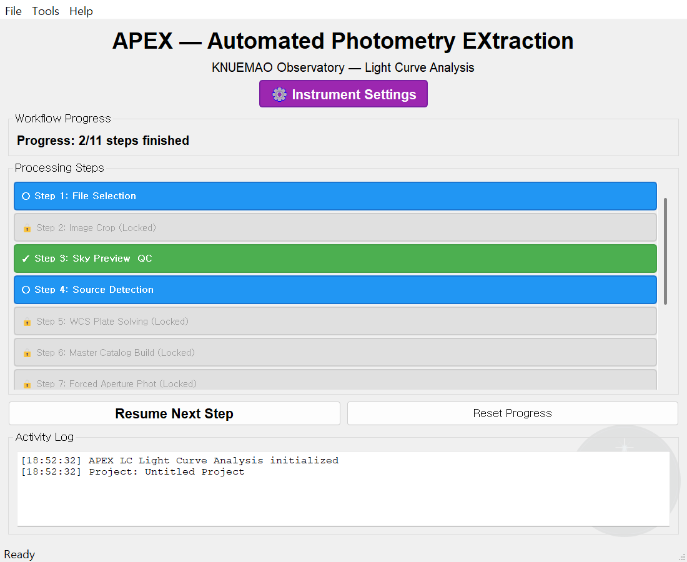
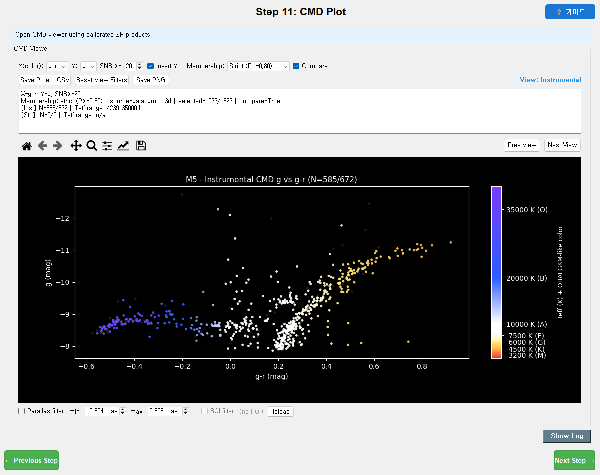

# 1. 시작하기

[← 매뉴얼 목차](index.md) · [다음: 공통 단계 1~7 →](02-shared-steps.md)

이 장에서는 APEX를 **설치·실행**하고, **런처 화면**과 **모든 단계에 공통인 화면 구성**을
익힌 뒤, **장비 설정**과 **`parameters.toml`** 기초를 다룹니다. 여기만 읽어도 어느 모드든
바로 시작할 수 있습니다.

---

## 1.1 설치와 실행

### 방법 A — 배포본(.exe) 사용 (가장 간단)

1. 배포된 `setup-APEX-<버전>.exe`(설치형) 또는 `APEX-Portable-<버전>-x64.zip`(무설치)을 받습니다.
2. 설치형은 실행 후 안내를 따르고, portable은 압축을 풀고 `APEX.exe`를 실행합니다.
3. 관리자 권한은 필요 없습니다(사용자 영역에 설치).

### 방법 B — 소스에서 실행 (Python 3.10+)

PowerShell에서:

```powershell
git clone https://github.com/Diu1773/APEX_AutomatedPhotometryEXtraction.git
cd APEX_AutomatedPhotometryEXtraction

python -m venv .venv
.\.venv\Scripts\Activate.ps1
python -m pip install --upgrade pip
python -m pip install -r requirements.txt

python main.py
```

특정 모드를 바로 열 수도 있습니다.

```powershell
python apex\cmd\main.py          # CMD(성단) 모드 직접 실행
python apex\lightcurve\main.py   # LC(광도곡선) 모드 직접 실행
```

> **처음 실행하면** 작업 폴더에 `parameters.toml`이 자동 생성됩니다(`parameters.example.toml` 복사본).
> 내 환경에 맞는 경로·장비 값은 이 `parameters.toml`에서 바꿉니다. → [1.5절](#15-parameterstoml-기초)

> **외부 WCS 솔버(ASTAP/astrometry.net)와 카탈로그 데이터는 배포본에 포함되지 않습니다.**
> 없어도 내장 Python 솔버로 동작합니다(인터넷 또는 Gaia 캐시 필요). → [Step 5](02-shared-steps.md#step-5--wcs-플레이트-솔빙)

---

## 1.2 런처 화면과 모드 선택

`python main.py`(또는 `APEX.exe`)를 실행하면 모드를 고르는 런처가 열립니다. 모드를 고르면
아래와 같은 **메인 창**이 나타납니다.

### CMD(성단) 모드 메인 창


- 상단 메뉴: **File · Tools · Help**
  - **Tools**: 단계와 별개로 쓰는 분석 도구 모음 → [5. 도구](05-tools.md)
- 부제 **"KNUEMAO Observatory — CMD Cluster Photometry"** 로 현재 모드를 표시합니다.
- 보라색 **`⚙ Instrument Settings`** 버튼 → 망원경·카메라 사양 입력 → [1.3절](#13-장비-설정-instrument-settings)
- **Workflow Progress**: `12/12 steps finished` 처럼 진행도를 표시합니다(CMD는 12단계).
- **Processing Steps**: 단계 목록. 색으로 상태를 구분합니다(아래).
- **`Resume Next Step`**: 다음 해야 할 단계를 엽니다. 단계 막대를 직접 더블클릭해도 그 단계로 갑니다.
- **`Reset Progress`**: 진행 상태를 초기화합니다(결과 파일은 지우지 않음).
- **Activity Log**: 프로젝트 초기화·진행 기록.

### LC(광도곡선) 모드 메인 창 — 단계 상태 색 이해하기



LC 모드(11단계)는 부제가 **"Light Curve Analysis"** 입니다. 위 그림에서 단계 막대의 **색이
곧 상태**입니다 — 이 규칙은 CMD/LC 공통입니다.

| 색 / 표시 | 의미 | 할 수 있는 것 |
| --- | --- | --- |
| 🟢 녹색 **✓** | **완료** | 다시 열어 수정 가능 |
| 🔵 파랑 **○** | **진행 가능(현재 차례)** | 클릭해서 작업 |
| ⚪ 회색 **🔒 (Locked)** | **잠김** | 앞 단계를 끝내야 열림 |

> 즉 **위에서부터 순서대로** 풀어 나가는 구조입니다. 잠긴 단계는 앞 단계의 산출물이 있어야
> 열립니다. 한 번 끝낸 단계는 녹색이 되어 언제든 되돌아가 다시 돌릴 수 있습니다.

---

## 1.3 장비 설정 (Instrument Settings)

측광 오차와 포화 판정은 **카메라 게인·리드노이즈·포화값**에 직접 의존합니다. 분석 전에
보라색 **`⚙ Instrument Settings`** 버튼을 눌러 내 장비 값을 입력하세요. (값은
`parameters.toml`의 `[instrument]` 섹션에 저장됩니다 → [파라미터 레퍼런스](06-parameters-reference.md#instrument--장비).)

| 항목 | TOML 키 | 의미 | 예시 기본값 |
| --- | --- | --- | --- |
| 망원경 초점거리(mm) | `telescope_focal_mm` | 픽셀 스케일 계산에 사용 | 3947.0 |
| 카메라 픽셀 크기(µm) | `camera_pixel_um` | 픽셀 스케일 계산에 사용 | 3.76 |
| 비닝 | `binning` | 2×2면 2 | 2 |
| 게인(e⁻/ADU) | `gain_e_per_adu` | 광자 노이즈 모델 | 0.689 |
| 리드노이즈(e⁻) | `rdnoise_e` | 측광 오차 모델 | 2.5 |
| 포화값(ADU) | `saturation_adu` | 포화 별 제외 기준 | 65000 |
| 측광 유효 하한/상한(ADU) | `datamin_adu` / `datamax_adu` | 비정상 픽셀 컷 | 0.1 / 55000 |
| 초기 영점 | `zp_initial` | 미리보기 등급 표시용 | 25.0 |

> **픽셀 스케일** = 206.265 × (픽셀 µm × 비닝) ÷ 초점거리 mm [arcsec/px]. 이 값이 틀리면
> FWHM(arcsec)·조리개 크기·WCS 힌트가 모두 어긋납니다. 초점거리·픽셀·비닝을 정확히 넣으세요.

---

## 1.4 모든 단계에 공통인 화면 구성

단계 창(Step 창)은 생김새가 조금씩 달라도 **공통 뼈대**를 공유합니다. 한 번 익히면 모든
단계에서 똑같이 동작합니다.

### 제목줄과 `가이드` 버튼

- 창 가운데 위에 **`Step N: 이름`** 제목이 있습니다.
- 오른쪽 위 **`⎘ 가이드`**(고스트 버튼)를 누르면 그 단계 요약 도움말이 팝업으로 뜹니다.



### Run / Stop / Log 바 (Step 4~7, 일부 CMD/LC 단계)

무거운 계산이 있는 단계에는 실행 바가 있습니다.

- **`Run …`**(녹색): 그 단계의 계산을 시작합니다(예: `Run Detection`, `Run Forced Photometry`).
- **`Stop`**(빨강): 실행 중에만 활성화. 누르면 `Stopping…`을 거쳐 중단합니다.
- **`Log` / `Log & Workers`**: 별도 로그 창을 엽니다. 병렬 작업이 있으면 워커별 진행 막대도 표시됩니다.
- 진행 표시줄: `현재/전체 | 경과 | 예상 | W:워커수 | 메시지` 형식.

> Step 1~3은 실행 바가 없습니다(상호작용/미리보기 단계). Step 4~7은 실행 바가 있습니다.

### 하단 이동줄과 캐시 재사용

- 맨 아래 **`← Previous Step`** / **`Next Step →`** 로 단계를 이동합니다.
  - 마지막 단계에서는 `Next Step →` 대신 **`Exit ✕`** 가 표시됩니다.
  - **`Next Step →`는 그 단계가 "유효"해질 때까지 비활성(회색)** 입니다. 즉, 필요한 산출물이
    생기면 자동으로 켜집니다.
- 일부 단계의 **재사용 체크박스**:
  - `Use detection cache`(Step 4) — 이미 검출된 프레임은 건너뜀
  - `Use existing output if complete`(Step 6·7) — 입력·파라미터가 같으면 기존 결과 재사용
  - 체크를 끄면 강제로 다시 계산합니다.

### 창 크기

모든 창은 **내용에 맞게 자동 크기 조절**되고 모니터를 넘지 않도록 자동으로 맞춰집니다.
작은 화면에서도 Save/취소 줄이 잘리지 않습니다.

---

## 1.5 `parameters.toml` 기초

APEX의 모든 수치 설정은 작업 폴더의 **`parameters.toml`** 파일 하나에 모여 있습니다.

- `parameters.example.toml` — 저장소에 들어 있는 **기본값 원본** (건드리지 마세요)
- `parameters.toml` — **내가 쓰는 실제 설정** (이 파일을 수정)
- 마지막으로 쓴 파라미터 파일 경로는 `~/.apex/last_param.txt`에 기억됩니다.

대부분의 값은 **각 단계의 `Parameters` 버튼**에서 GUI로 바꿀 수 있고, 저장하면
`parameters.toml`에도 반영됩니다. 손으로 직접 편집해도 됩니다.

가장 먼저 확인할 항목:

```toml
[io]
data_dir   = "data/example"           # FITS 입력 폴더
result_dir = "data/example/result"    # 결과 출력 루트

[target]
name    = "M13"                        # 대상 이름
ra_deg  = 250.423475                   # 대상 적경(도)
dec_deg = 36.461319                    # 대상 적위(도)

[instrument]
gain_e_per_adu = 0.689                 # 게인
rdnoise_e      = 2.5                   # 리드노이즈
saturation_adu = 65000.0               # 포화값
```

> **경로는 절대경로 또는 프로젝트 기준 상대경로로 일관되게** 쓰는 것이 재현에 안전합니다.
> 모든 섹션의 의미는 [6. 파라미터 레퍼런스](06-parameters-reference.md)에 정리돼 있습니다.

### 설정을 바꾸면 어디서부터 다시 돌려야 하나?

| 바꾼 것 | 다시 시작할 단계 |
| --- | ---: |
| 입력 프레임/필터/크롭 | Step 1~2 |
| 배경/FWHM/검출 | Step 3~4 |
| WCS 솔버/정합/QC | Step 5 |
| 마스터 매칭 | Step 6 |
| 조리개/노이즈/조리개보정 | Step 7 |
| PSF 모델 | CMD Step 8 |
| 보정/색항 | CMD Step 10 |
| 비교성 | LC Step 8~9 |
| 디트렌드/앙상블/SysRem | LC Step 10 |
| 주기 격자/방법/FAP | LC Step 11 |

---

## 1.6 (선택) 명령줄 실행 — `apex` CLI

GUI 없이 헤드리스로도 돌릴 수 있습니다(서버/배치용).

```powershell
apex doctor                       # 파이썬·의존성·외부 솔버 점검
apex config init                  # parameters.example.toml -> parameters.toml
apex run --mode cmd --steps 1     # Step 1(헤더 스캔·타깃 해석) 헤드리스 실행
apex run --mode cmd --dry-run     # 실행 계획만 미리보기
apex gui --mode cmd               # GUI를 모드 지정해 실행
```

현재 Step 1이 완전한 헤드리스로 동작하며 Step 2~7은 점진 이식 중입니다. 일반 사용자는
GUI(`python main.py`)로 진행하면 됩니다.

---

[← 매뉴얼 목차](index.md) · [다음: 공통 단계 1~7 →](02-shared-steps.md)
