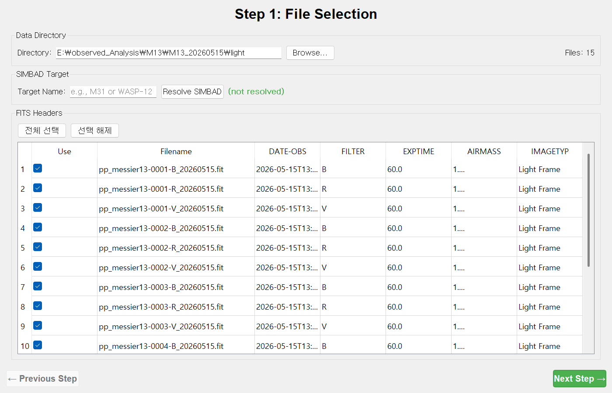
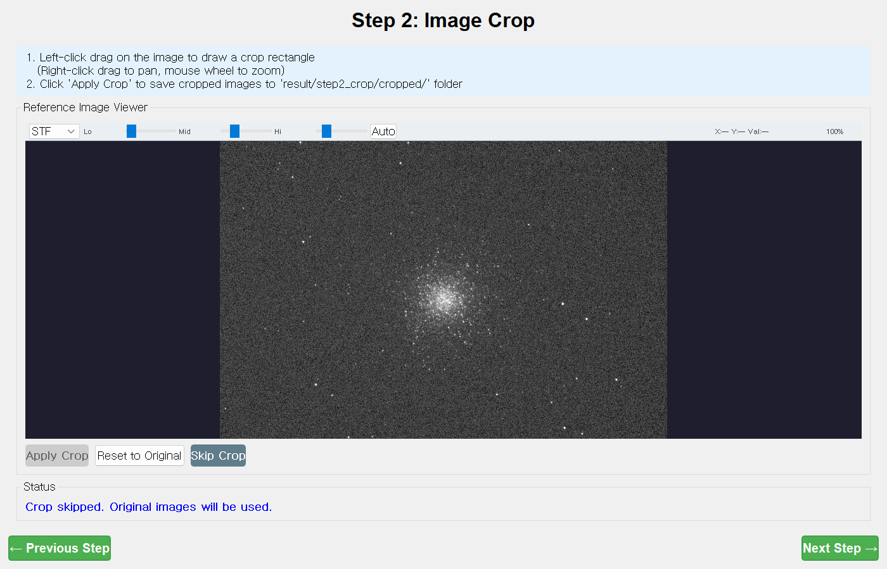
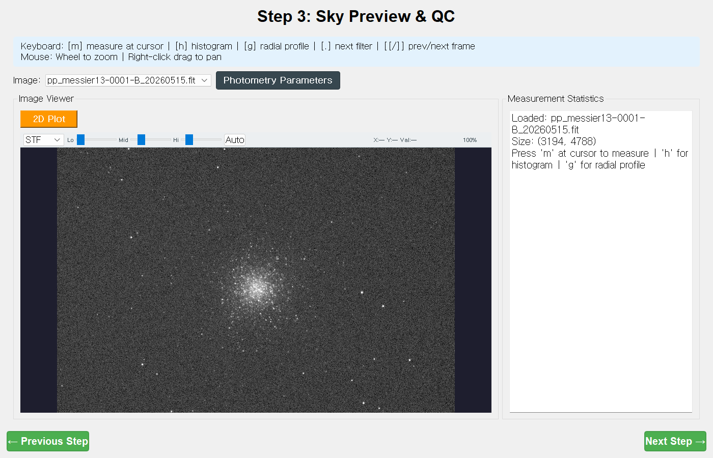
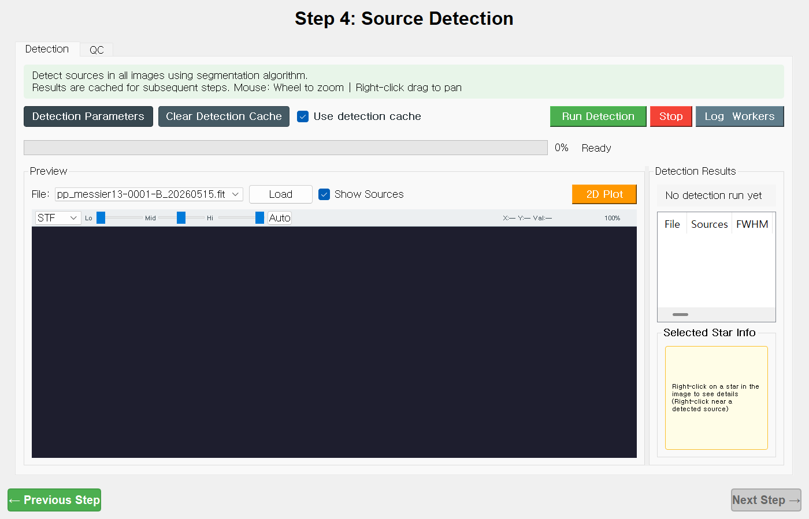
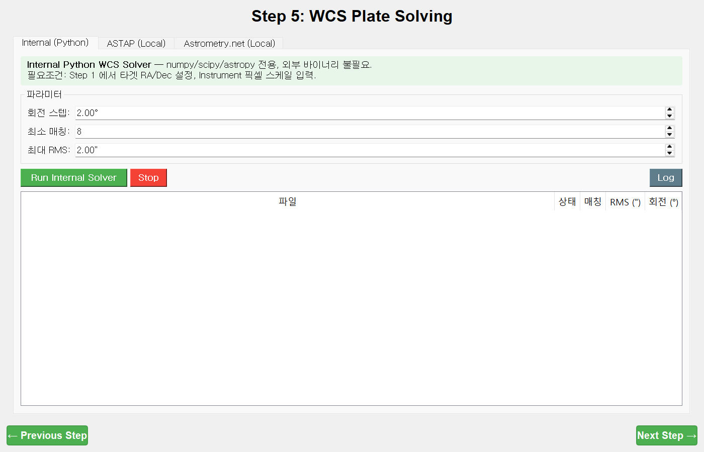
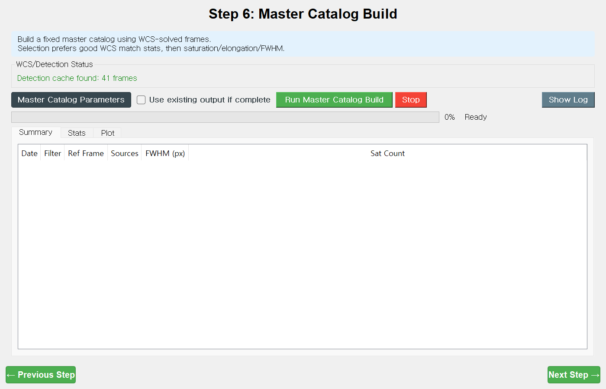
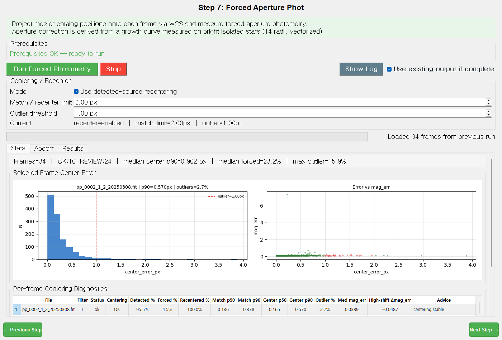

# 2. 공통 단계 — Step 1 ~ 7

[← 시작하기](01-getting-started.md) · [매뉴얼 목차](index.md) · [다음: CMD 모드 →](03-cmd-mode.md)

CMD·LC 어느 모드든 **Step 1~7은 똑같습니다.** "측광을 위한 준비 + 실제 측정"에 해당하며,
여기까지 잘 끝내면 그 뒤(CMD 8~12 / LC 8~11)는 결과를 해석·활용하는 단계입니다.

> **전체 흐름:** 파일 선택 → 크롭 → 스카이/QC → 소스 검출 → WCS → 마스터 카탈로그 → 강제 측광
>
> 각 단계는 앞 단계의 산출물을 입력으로 받습니다. 순서대로 진행하세요.

---

## Step 1 — File Selection (파일 선택)

**한 줄 목적:** 분석할 FITS 폴더를 지정하고, 사용할 프레임을 고르고, 대상의 좌표(RA/Dec)를 확정합니다.

### 화면 구성
- **Data Directory** — 입력 폴더 경로
- **File Filter** — 파일명 접두어 필터(선택)
- **SIMBAD Target** — 대상 이름으로 좌표 받아오기
- **FITS Headers** — 스캔된 파일의 헤더 표(`Use · Filename · DATE-OBS · FILTER · EXPTIME · AIRMASS · OBJECT · RA_DEG · DEC_DEG · IMAGETYP`)

### 따라하기
1. **`Browse…`** 로 FITS가 든 폴더를 선택합니다. 오른쪽 위 **`Files: N`** 에 스캔된 개수가 뜹니다.
2. (선택) 특정 파일만 쓰려면 **`Filename Prefix`** 에 접두어(예: `pp_`)를 넣고 **`Rescan Files`**.
3. 대상 좌표 확정 — 둘 중 하나:
   - **`Target Name`** 에 이름(예: `M13`, `WASP-12`)을 넣고 **`Resolve SIMBAD`** → 초록색으로 `RA, Dec` 표시
   - 또는 **`수동 입력`** 을 눌러 RA/Dec를 직접(시:분:초 또는 도 단위) 입력 후 **`적용`**
   - 헤더에 좌표가 이미 있으면 **`Use Header RA/Dec`** 로 그 값을 채택할 수도 있습니다.
4. **FITS Headers** 표에서 분석할 프레임만 **`Use`** 체크를 남깁니다.
   - **`전체 선택`** / **`선택 해제`** / (행 선택 후) **`선택 행만 사용`** 버튼 활용.
5. **`Next Step →`** (파일이 1개 이상 스캔되면 활성).

### 컨트롤 요약
| 컨트롤 | 하는 일 |
| --- | --- |
| `Browse…` | 입력 폴더 선택 |
| `Rescan Files` | 현재 폴더/접두어로 다시 스캔 |
| `Resolve SIMBAD` | 이름→좌표 조회(인터넷 필요) |
| `Open SIMBAD` | SIMBAD 웹페이지 열기 |
| `수동 입력` / `적용` | RA/Dec 직접 입력 |
| `전체 선택` · `선택 해제` · `선택 행만 사용` | 프레임 `Use` 일괄 토글 |

### 관련 파라미터
| 항목 | TOML 키 | 기본값 |
| --- | --- | --- |
| 입력 폴더 | `io.data_dir` | `data/example` |
| 결과 루트 | `io.result_dir` | `<data_dir>/result` |
| 파일명 접두어 | `io.filename_prefix` | `""` |
| 대상 이름 | `target.name` | `M13` |
| 대상 RA/Dec(도) | `target.ra_deg` / `target.dec_deg` | 250.42 / 36.46 |

### 출력
`step1_file_selection/` → `target_list.txt`, `headers.csv`, `file_path_map.json`

### 팁 & 자주 겪는 문제
- **`Use` 체크된 프레임만** 이후 단계에서 처리됩니다.
- 폴더를 바꾸면 반드시 **`Rescan Files`** 를 눌러야 반영됩니다.
- 대상 좌표를 바꾸면 이후 WCS·카탈로그가 그 좌표를 쓰므로, 뒤 단계를 다시 돌려야 할 수 있습니다.
- (LC 모드의 여러 밤 처리는 이 단계가 확장됩니다 → [4. LC 모드 · Step 1 야간 설정](04-lc-mode.md#lc-step-1--야간-설정-night-setup))

---

## Step 2 — Image Crop (이미지 크롭)

**한 줄 목적:** (선택) 가장자리 노이즈·비네팅을 잘라낼 사각 영역을 정해 모든 프레임에 적용합니다.

### 따라하기
1. 기준 영상 뷰어에서 **마우스 좌클릭-드래그**로 자를 사각형을 그립니다(우클릭-드래그=이동, 휠=확대/축소).
2. **`Apply Crop`**(주황) — 모든 FITS를 잘라 `result/step2_crop/cropped/`에 저장. 진행 후 자동으로 Step 3으로 넘어갑니다.
3. 크롭이 필요 없으면 **`Skip Crop`**(회색) — 원본을 그대로 사용.
4. 다시 그리려면 **`Reset to Original`**.

### 컨트롤 요약
| 컨트롤 | 하는 일 |
| --- | --- |
| `Apply Crop` | 사각형(최소 50×50px)을 모든 프레임에 적용 |
| `Skip Crop` | 크롭 없이 원본 사용 |
| `Reset to Original` | 선택 해제·원본 다시 로드 |

### 관련 파라미터(헤드리스용)
| 항목 | TOML 키 | 기본값 |
| --- | --- | --- |
| 크롭 사용 | `crop.enable` | `false` |
| 픽셀 사각형 | `crop.x0/y0/x1/y1` | (주석) |

> GUI로 그린 사각형은 `step2_crop/crop_rect.json`에 저장되며 TOML보다 우선합니다.

### 출력
`step2_crop/crop_rect.json`, `step2_crop/cropped/<프레임>.fits`

### 팁 & 자주 겪는 문제
- 최소 크기는 **50×50 px**(그보다 작으면 "Too Small" 경고).
- **Step 4 이후에 다시 크롭하면** 픽셀 좌표가 바뀌므로 "Re-crop Warning"이 뜨고 Step 4부터 다시 돌려야 합니다.
- 원본 파일은 절대 수정되지 않습니다(잘린 사본만 생성).

---

## Step 3 — Sky Preview & QC (스카이 미리보기 & 품질 확인)

**한 줄 목적:** 배경(sky)·FWHM·SNR·등급을 별 단위로 직접 찍어 보며 측광 조리개 크기를 미리 맞춥니다.

### 화면 구성
- 왼쪽 **Image Viewer**(확대/축소 FITS 뷰어 + `2D Plot` 스트레치 창)
- 오른쪽 **Measurement Statistics**(측정값 텍스트)
- 보조 팝업: 히스토그램(키 `h`), 방사 프로파일(키 `g`)

### 따라하기
1. **`Image:`** 콤보로 프레임을 고릅니다.
2. 별 위에 커서를 두고 **`m`**(또는 가운데 클릭)으로 측정 — FWHM·SNR·sky·등급이 오른쪽에 표시됩니다.
3. **`Photometry Parameters`** 를 눌러 조리개 배율을 조정하면 **즉시 측정에 반영**됩니다.
4. Step 3은 선택 단계라 **`Next Step →`** 는 항상 활성입니다.

### 키보드/마우스
| 입력 | 동작 |
| --- | --- |
| `m` / 가운데 클릭 | 커서 위치 측정 |
| `h` | 히스토그램 갱신 |
| `g` | 방사 프로파일 갱신 |
| `.` | 같은 프레임의 다음 필터로 |
| `[` / `]` | 같은 필터 내 이전/다음 프레임 |
| 휠 / 우클릭-드래그 | 확대축소 / 이동 |

### 파라미터 — `Photometry Parameters`
| 필드 | TOML 키 | 기본값 |
| --- | --- | --- |
| FWHM Seed (arcsec) | `fwhm.guess_arcsec` | 2.5 |
| Aperture Scale (×FWHM) | `photometry.scales.aperture_scale` | 1.0 |
| Annulus Inner Scale (×FWHM) | `photometry.scales.annulus_scale` | 4.0 |
| Annulus Outer Width (×FWHM) | `photometry.scales.dannulus_scale` | 2.0 |
| Sigma Clipping (σ) | `photometry.radii.sigma_clip` | 3.0 |
| Preview ZP | `instrument.zp_initial` | 25.0 |

### 팁 & 자주 겪는 문제
- 조리개 크기는 **FWHM "시드"(고정값) × 배율**로 계산됩니다(별마다 측정된 FWHM은 표시용).
- FWHM·sky σ가 비정상이면 여기서 배율을 조정하거나, 검출이 잘 안 되면 Step 4의 검출 시그마를 낮춥니다.
- 출력 파일은 없습니다(설정 상태만 저장).

---

## Step 4 — Source Detection (소스 검출)

**한 줄 목적:** 모든 프레임에서 별을 병렬로 검출해 캐시에 저장하고, 프레임 품질 QC로 불량 프레임을 걸러냅니다.

### 화면 구성 — 두 개의 탭
- **`Detection`** 탭: 실행 바 + 미리보기(`File`, `Show Sources`, `2D Plot`) + **Detection Results** 표(`File·N·FWHM·Bkg·Filt·Sig`) + **Selected Star Info**
- **`QC`** 탭: 자동 QC(robust z) 컨트롤 + 검사 플롯(sky·FWHM vs 시간/공기질량)

### 따라하기
1. 필요하면 **`Detection Parameters`** 로 검출 강도를 조정합니다(아래 표).
2. **`Run Detection`**(녹색)을 누릅니다. 진행 막대가 끝나면 "Detection Complete" 요약이 뜨고 자동으로 **`QC`** 탭으로 전환됩니다.
3. QC 탭에서 **`Find Outliers (z)`** → 의심 프레임 확인 → **`Exclude Candidates`** 로 제외 → **`Save`**.
4. 미리보기에서 **`Show Sources`** 로 검출 마커(별=초록, 피크=하늘색)를 확인합니다.

### 핵심 컨트롤
| 컨트롤 | 하는 일 |
| --- | --- |
| `Detection Parameters` | 검출 파라미터 대화상자 |
| `Clear Detection Cache` | 검출 캐시 삭제 |
| `Use detection cache` | 호환되는 캐시가 있으면 그 프레임은 건너뜀 |
| `Run Detection` / `Stop` | 검출 시작/중단 |
| (QC) `Find Outliers (z)` · `Exclude Candidates` · `Clear Exclusions` · `Save` | 불량 프레임 자동 탐지·제외 |

### 파라미터 — `Detection Parameters`(주요 항목)
| 필드 | TOML 키 | 기본값 |
| --- | --- | --- |
| Detection Mode | `detection.mode` | `normal` |
| Detection Engine | `detection.engine` (sep/segm/dao/peak) | `sep` |
| Detection Sigma (base) | `detection.sigma` | 3.2 |
| 필터별 시그마 | `detection.sigma_by_filter` | (자동) |
| Min Area (pixels) | `detection.minarea_pix` | 3 |
| Deblending Enable | `detection.deblend.enable` | `true` |
| Deblend Levels | `detection.deblend.nthresh` | 64 |
| Deblend Contrast | `detection.deblend.contrast` | 0.004 |
| 2D Background Enable | `background.in_detect` | `true` |
| Background Box | `background.box` | 64 |
| DAO refine Enable | `detection.dao.enable` | `false` |
| Peak assist Enable | `detection.peak.enable` | `false` |

> **검출 모드 프리셋:** `Normal(기본)` / `Crowded(혼잡장)` / `Faint(희미한 장)` / `Custom(수동)`.
> 모드를 고르고 **`Apply Preset`** 을 누르면 관련 값이 한 번에 바뀝니다.

### 출력
`step4_detection/` → 프레임별 `detect_*.json`·`.csv`, **`frame_quality.csv`**(QC 결과)

### 팁 & 자주 겪는 문제
- **검출이 너무 적으면** 검출 시그마를 낮추세요(예: 3.2 → 2.5). 너무 많으면 반대로.
- 자동 QC는 **필터당 프레임 ≥ 10개**가 있어야 잘 동작합니다(적으면 경고).
- QC 저장 시 제외된 프레임은 이후 WCS·측광·매칭에서 자동으로 빠집니다.
- 검출 파라미터를 바꾸면 Step 4 이후 결과를 다시 만들어야 합니다.

---

## Step 5 — WCS 플레이트 솔빙

**한 줄 목적:** 각 프레임에 천구 좌표(WCS)를 부여합니다 — 내장 Python 솔버 / ASTAP / astrometry.net 중 선택.

### 화면 구성 — 세 개의 솔버 탭
- **`Internal (Python)`** — 외부 프로그램 없이 동작(Gaia 다운로드 필요)
- **`ASTAP (Local)`** — ASTAP 실행파일 + 별 DB(D80/D50) 필요(빠름)
- **`Astrometry.net (Local)`** — `solve-field` + 인덱스 파일 필요(보통 WSL)

각 탭에 자체 **Parameters** 버튼과 **Run** 바, 결과 표가 있습니다.

### 따라하기
1. 사용할 솔버 탭을 고릅니다. 외부 프로그램이 없으면 **`Internal (Python)`** 으로 충분합니다.
2. 해당 탭의 Parameters로 경로·임계값을 확인합니다(특히 ASTAP는 실행파일 경로·별 DB).
3. **`Run …`**(`Run Internal Solver` / `Run ASTAP` / `Solve All Frames`)를 누릅니다.
4. 상단 배너에 "ok/전체 solved" 집계가 갱신됩니다. 1개 이상 풀리면 다음 단계로 갈 수 있습니다.

### 주요 파라미터
**ASTAP(`WCS Parameters`)**
| 필드 | TOML 키 | 기본값 |
| --- | --- | --- |
| ASTAP CLI Path | `wcs.astap_exe` | `C:/Program Files/astap/astap_cli.exe` |
| Timeout(s) | `wcs.astap_timeout_s` | 120 |
| Search Radius(deg) | `wcs.astap_search_radius_deg` | 8.0 |
| ASTAP Star DB | `wcs.astap_database` | `D80` |
| Refine CRPIX | `wcs_refine.enable` | `true` |
| Gaia Mag Max / WCS Mag Max | `gaia.mag_max` / `gaia.wcs_mag_max` | 25.0 / 18.0 |

**Astrometry.net(`Astrometry.net Parameters`)**
| 필드 | TOML 키 | 기본값 |
| --- | --- | --- |
| Enable Local Solve | `wcs.astnet_local_enable` | `true` |
| Use WSL | `wcs.astnet_local_use_wsl` | `true` |
| solve-field Command | `wcs.astnet_local_command` | `solve-field` |
| Scale Low/High(arcsec/px) | `wcs.astnet_local_scale_low/high` | 0.3 / 0.5 |

> **Internal Parameters**(쿼드 매칭·RANSAC·SIP 정제)는 세션 상태로만 유지되고 TOML에는 저장되지 않습니다.

### 출력
`step5_wcs/wcs_solve_summary.csv` + 각 프레임 헤더에 WCS(CRVAL/CRPIX/CD/SIP) 기록

### 팁 & 자주 겪는 문제
- 솔버 우선순위(대체 체인)는 **ASTAP → astrometry.net → Internal** 입니다.
- 솔버를 바꿔 다시 돌려도 **성공한 프레임만** 갱신됩니다.
- "No frames remain after Step 4 QC filtering" — Step 4에서 너무 많이 제외했는지 확인.
- Gaia 등급 상한(~18)은 TAP 서버 타임아웃을 줄이기 위한 값입니다. 큰 시야에서 너무 어둡게 잡으면 느려집니다.
- ASTAP는 별 DB를, astrometry.net은 인덱스 파일을 **별도 설치**해야 합니다(설치 도움말 링크는 README 참조).

---

## Step 6 — Master Catalog Build (마스터 카탈로그 생성)

**한 줄 목적:** 모든 프레임의 검출을 합쳐 **고정된 별 목록(마스터)** 을 만듭니다 — 이후 모든 측광이 이 마스터 ID를 기준으로 정렬됩니다.

### 화면 구성
- **WCS/Detection Status**(캐시 상태)
- 실행 바 + **`Use existing output if complete`** 체크박스
- 탭: **`Summary`**(날짜·필터·기준프레임·소스수…) / **`Stats`**(프레임 품질 지표) / **`Plot`**(매치율 vs 분리, FWHM vs 포화)

### 따라하기
1. (선택) **`Master Catalog Parameters`** 로 기준 프레임 선정 기준을 확인합니다.
2. **`Run Master Catalog Build`** 를 누릅니다. 끝나면 표·플롯이 채워집니다.
3. 캐시된 결과가 있으면 "Cached Step 6 output loaded"가 표시됩니다.

### 주요 파라미터 — `Master Catalog Build Parameters`
| 필드 | TOML 키 | 기본값 |
| --- | --- | --- |
| Drop top saturation frames | `refbuild.sat_drop_pct` | 20.0 |
| Drop top elongation frames | `refbuild.elong_drop_pct` | 20.0 |
| Per-date reference | `refbuild.per_date` | `true` |
| Union master (all frames) | (유니온 마스터) | `true` |
| Ref catalog min sources | `refbuild.ref_cat_min_sources` | 50 |
| WCS match radius(arcsec) | `refbuild.wcs_match_radius_arcsec` | 2.0 |
| WCS min match rate | `refbuild.wcs_min_match_rate` | 0.2 |
| Gaia G limit (hybrid ID) | `idmatch.gaia_g_limit` | 18.0 |

### 출력
`step6_refbuild/` → `master_catalog.tsv`, `ref_catalog_<필터>.tsv`, `ref_frame_stats.csv`, `ref_build_meta.json`

### 팁 & 자주 겪는 문제
- Step 4(검출 캐시)와 Step 5(WCS)가 끝나 있어야 합니다("Run Source Detection first." 경고 시 앞 단계 확인).
- 기준 프레임은 포화/신장 제외 + WCS-QC 통과 후 매치율·분리·FWHM로 자동 선정됩니다.
- **유니온 마스터**(기본)는 여러 프레임의 검출을 천구 위치로 합칩니다. `Union min detections/star`로 너무 적게 검출된 별을 솎아냅니다.
- Gaia 컬럼은 Step 5에서 `gaia_fov.ecsv`가 생겼을 때만 붙습니다.

---

## Step 7 — Forced Aperture Photometry (강제 조리개 측광)

**한 줄 목적:** 마스터 별 위치를 각 프레임에 WCS로 투영해 **강제 조리개 측광**하고, 밝은 고립성으로 성장곡선 기반 조리개 보정을 계산합니다.

### 화면 구성
- **Prerequisites**(선행 단계 상태) + 실행 바 + **`Use existing output if complete`**
- **Centering / Recenter** 폼(재중심 옵션)
- 탭: **`Stats`**(센터링 통계·오차 플롯) / **`Apcorr`**(성장곡선·조리개보정) / **`Results`**(프레임별 요약)

### 따라하기
1. **Centering / Recenter** 옵션을 확인합니다.
   - **`Use detected-source recentering`** — 검출된 소스로 중심을 다시 잡음(권장)
   - **`Match / recenter limit`** — 재중심 허용 이동 한계(px)
   - **`Outlier threshold`** — 센터링 이상치 기준(px)
2. **`Run Forced Photometry`** 를 누릅니다. 끝나면 "Done — N/M frames OK"가 뜨고 자동으로 **`Stats`** 탭으로.
3. **`Apcorr`** 탭에서 현재 조리개(빨간 선)가 최적 반경 `r_opt`(보라 선)와 가까운지 확인합니다.

### 관련 파라미터
| 항목 | TOML 키 | 기본값 |
| --- | --- | --- |
| 재중심 사용 | `photometry.recenter` | `true` |
| 재중심 한계(px) | `parameters.max_recenter_shift` | 2.0 |
| 센터링 이상치(px) | `parameters.centroid_outlier_px` | 1.0 |
| 조리개 배율 | `photometry.scales.aperture_scale` | 1.0 |
| 환형(annulus) 배율 | `photometry.scales.annulus_scale` / `dannulus_scale` | 4.0 / 2.0 |
| 조리개보정 최소 SNR | `photometry.apcorr.min_snr` | 40.0 |
| 조리개보정 최소 별수 | `photometry.apcorr.min_n` | 12 |

### 출력
`step7_forced_phot/` → 프레임별 `photometry_<프레임>.tsv`, **`photometry_index.csv`**, `apcorr_summary.csv`, `centering_stats.csv`

### 팁 & 자주 겪는 문제
- "No Master Catalog" → Step 6을 먼저 끝내세요.
- **Stats 탭의 센터링 상태**: `OK / REVIEW / CHECK / LOW_MATCH / NO_ON_FRAME` — REVIEW·CHECK가 많으면 WCS나 재중심 한계를 점검.
- 조리개 보정은 **밝고 고립된 별(SNR ≥ 40)** 이 충분해야 정확합니다. `apcorr_summary.csv`의 reject 수를 확인하세요.
- 중간에 **Stop** 하면 서명(signature)이 폐기되어 다음 실행 때 다시 계산합니다.

---

### Step 1~7을 끝냈다면
- **성단 분석**이면 → [3. CMD 모드 (Step 8~12)](03-cmd-mode.md)
- **광도곡선 분석**이면 → [4. LC 모드 (Step 8~11)](04-lc-mode.md)

[← 시작하기](01-getting-started.md) · [매뉴얼 목차](index.md) · [다음: CMD 모드 →](03-cmd-mode.md)
