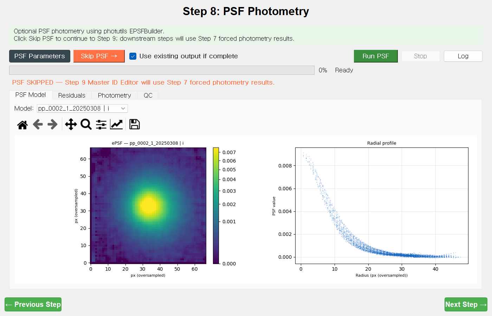
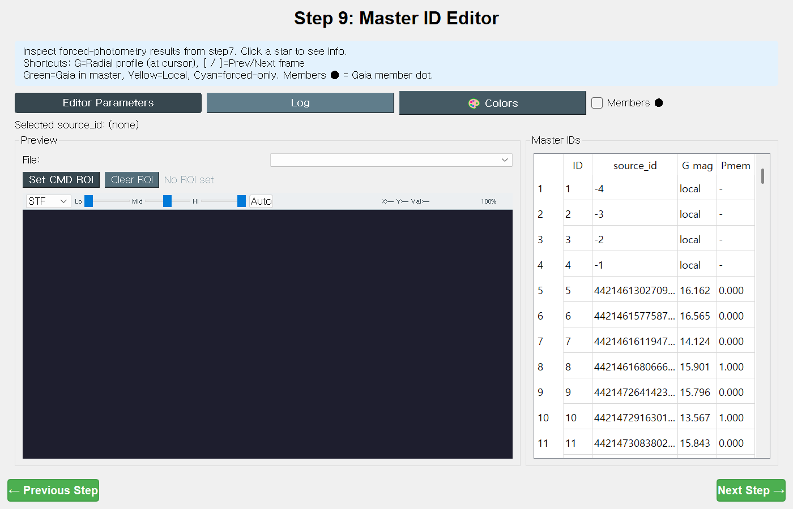
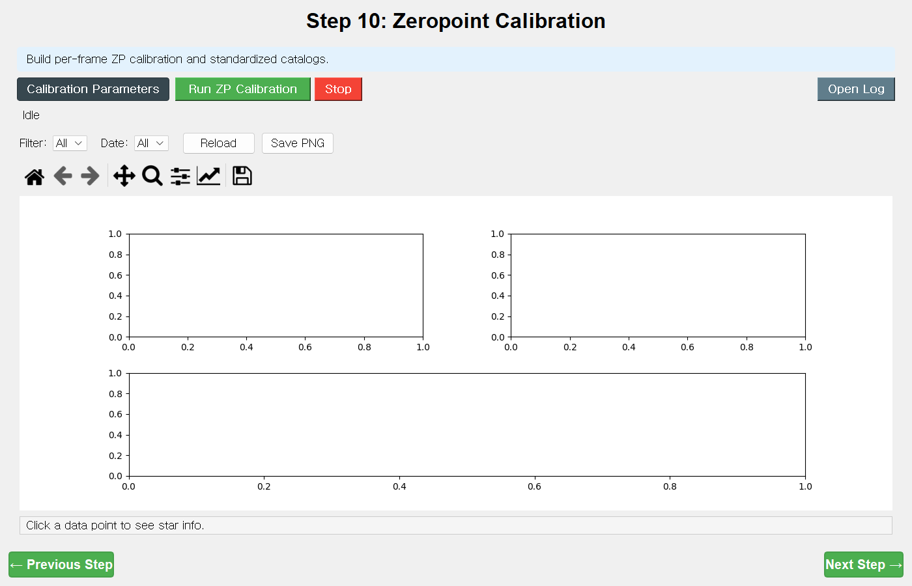
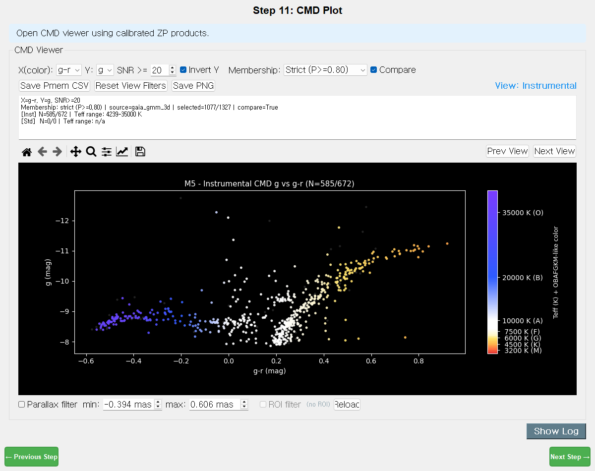
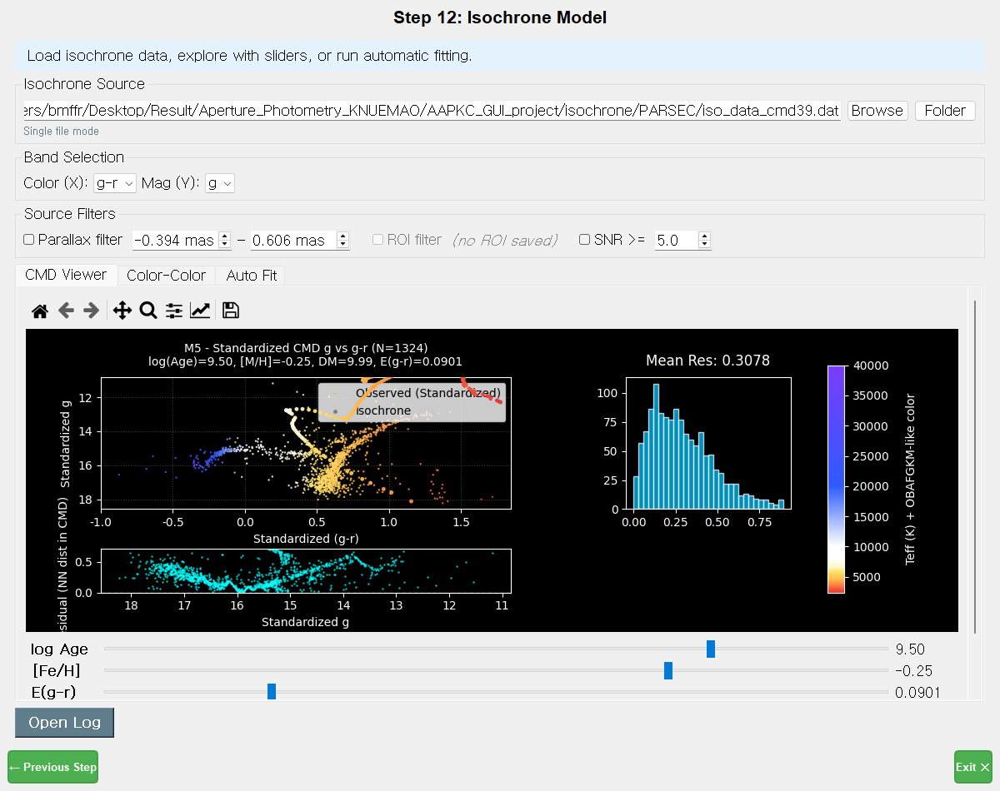
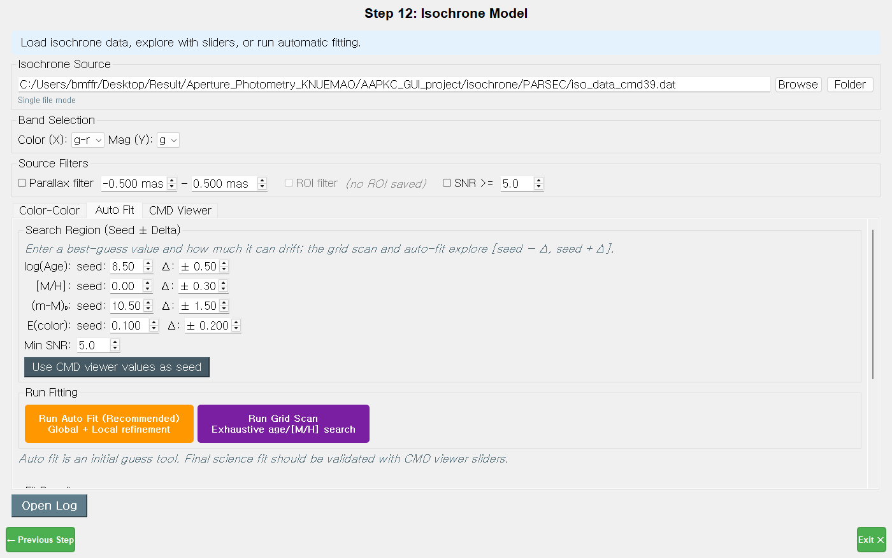

# 3. CMD 모드 — Step 8 ~ 12 (성단 색-등급도·아이소크론)

[← 공통 단계 1~7](02-shared-steps.md) · [매뉴얼 목차](index.md) · [다음: LC 모드 →](04-lc-mode.md)

공통 Step 1~7로 측광을 끝냈다면, CMD 모드의 8~12단계로 **성단의 색-등급도(CMD)** 를 그리고
**이론 등시선(아이소크론)** 을 맞춰 **나이·거리·금속함량·적색화**를 구합니다.

> **흐름:** PSF 측광(선택) → 마스터 ID 편집 → 영점 보정 → CMD 플롯 → 아이소크론 모델

---

## Step 8 — PSF Photometry (PSF 측광, 선택)

**한 줄 목적:** 밀집한 성단 코어에서 더 정밀한 측광이 필요할 때, 경험적 PSF(ePSF)로 별을 분해 측광합니다. **필요 없으면 건너뜁니다.**

### 화면 구성 — 네 개의 탭
- **`PSF Model`** — 필터별 ePSF 모델 그림
- **`Residuals`** — 원본 vs 별 제거 잔차 컷아웃(프레임·반복 선택, ◀/▶로 별 이동)
- **`Photometry`** — 프레임별 측광 결과 표(`Frame·Filter·N_psf·N_goodmag·N_fail·N_new_iter`)
- **`QC`** — PSF 통계 + "Ap vs PSF" 비교 플롯

### 따라하기
1. 코어가 붐비지 않으면 **`Skip PSF →`**(주황)를 눌러 넘어갑니다 — 이후 단계는 Step 7 강제 측광 결과를 씁니다.
2. PSF가 필요하면 **`PSF Parameters`** 로 설정 후 **`Run PSF`**(녹색).
3. **`Residuals`** 탭에서 별이 잔차 없이 깨끗이 빠졌는지 확인합니다.

### 주요 파라미터 — `PSF Parameters`
| 필드 | TOML 키 | 기본값 |
| --- | --- | --- |
| Field mode | `psf.mode` (normal/crowded/faint/custom) | normal |
| Model mode | `psf.model_mode` | per_frame |
| EPSF oversampling | `psf.epsf_oversampling` | 2 |
| EPSF cutout(×FWHM) | `psf.epsf_size_fwhm_mult` | 4.0 |
| Max stars for EPSF | `psf.n_stars_max` | 30 |
| Isolation(×FWHM) | `psf.isolation_fwhm_mult` | 2.0 |
| Fit window(×FWHM) | `psf.fit_shape_fwhm_mult` | 1.2 |
| Max iterations | `psf.max_iter` | 3 |
| Re-detect sigma(base) | `psf.redetect_sigma` | 4.5 |
| PSF workers(0=auto) | `psf.parallel_workers` | 6 |

### 출력
`cmd_psf/` → `photometry_index.csv`, 프레임별 `photometry_*.tsv`, ePSF 모델·잔차 FITS

### 팁 & 자주 겪는 문제
- PSF는 **완전히 선택 사항**입니다 — 대부분의 산개성단/넓은 시야는 Step 7만으로 충분합니다.
- 시잉이 프레임마다 크게(>1px) 흔들리면 "Share EPSF per filter"는 끄세요.
- 2차 반복에서 잔차로 새로 검출된 소스는 음수 ID(로컬 별)로 Step 9에 넘어갑니다.

---

## Step 9 — Master ID Editor (마스터 ID 편집기)

**한 줄 목적:** 검출된 별을 프레임별로 확인하며 마스터 별 목록을 다듬고(추가/제거), 필요하면 성단 영역(ROI)만 남깁니다.

### 화면 구성
- 왼쪽 **Preview**(파일 선택 + ROI 설정 + 오버레이 마커가 있는 이미지 뷰어)
- 오른쪽 **Master IDs** 표(`ID·source_id·G mag·Pmem`)
- 떠다니는 **Overlay Colors** 범례 창

### 오버레이 색 의미
| 색 | 의미 |
| --- | --- |
| 초록 | 마스터·Gaia 매칭 별 |
| 노랑 | 마스터·로컬 별(Gaia 미매칭) |
| 하늘 | 마스터·강제 측광 별 |
| 회색 | D 키로 제거됨(A 키로 복원) |
| 빨강 | 현재 선택 |

### 따라하기
1. **`File:`** 콤보로 프레임을 넘기며(`[` / `]`) 별을 클릭해 선택합니다(가장 가까운 검출 선택).
2. 키보드로 편집:
   - **`A`** = 선택 별을 마스터에 추가
   - **`D`** = 선택 별을 마스터에서 제거 / **`Shift+D`** = 박스 안 별 일괄 제거
   - **`G`** = 커서 위치 방사 프로파일(FWHM 추정)
3. **`Members ●`** 체크 → Gaia 멤버십 확률(Pmem)이 높은 별에 점 표시.
4. (선택) **`Set CMD ROI`** 로 성단 영역 원을 그립니다 — **CMD 표시에만** 영향(측광·보정은 그대로).

### 주요 파라미터 — `Editor Parameters`
| 필드 | TOML 키 | 기본값 |
| --- | --- | --- |
| Search Radius(px) | `master_editor.search_radius_px` | 7.0 |
| Remove Box Size(px) | `master_editor.bulk_drop_box_px` | 24 |
| Gaia Add Max Sep(") | `master_editor.gaia_add_max_sep_arcsec` | 2.0 |
| 멤버십 색 오버레이 | `master_editor.membership_overlay_enable` | `true` |
| 멤버십 P 임계값 | `master_editor.membership_threshold` | 0.5 |

### 출력
`cmd_selection/` → `master_star_ids.csv`, `sourceid_to_ID.csv`, `cmd_roi.json`

### 팁 & 자주 겪는 문제
- ID는 **세션 간 고정**입니다(프레임마다 재번호 매기지 않음).
- 회색(제거됨) 별도 화면엔 보입니다 — **`A`** 로 복원할 수 있습니다.
- ROI는 시각화·CMD 필터용일 뿐, Step 10 보정에는 영향을 주지 않습니다.

---

## Step 10 — Zeropoint Calibration (영점·표준화 보정)

**한 줄 목적:** 기기 등급을 Gaia 기반 표준 등급으로 변환하는 **영점(ZP) + 색항(color term)** 을 필터별로 맞춥니다.

### 따라하기
1. (선택) **`Calibration Parameters`** 로 매칭·영점 피팅·보정성 선택 기준을 확인합니다.
2. **`Run ZP Calibration`** 을 누릅니다.
3. ZP 피팅 진단 플롯에서 잔차·기울기를 확인합니다. 끝나면 표준화 CMD 표가 생성됩니다.

### 주요 파라미터 — `Calibration Parameters`
| 필드 | TOML 키 | 기본값 |
| --- | --- | --- |
| Match tol(px) | `match.tol_px` | 1.0 |
| Min Gaia matches | `match.min_gaia_matches` | 10 |
| CMD calib SNR min | `cmd.snr_calib_min` | 50.0 |
| Frame ZP min refs | `cmd.frame_zp_min_n` | 5 |
| Apply extinction(k·X) | `cmd.apply_extinction` | `false` |
| Extinction mode | `cmd.extinction_mode` (absorb/two_step) | absorb |
| ZP clip sigma | `cmd.zp.clip_sigma` | 3.0 |
| ZP slope abs max | `cmd.zp.slope_absmax` | 1.0 |
| Calib star SNR min | `gaia.snr_calib_min` | 20.0 |
| BP-RP min / max | `gaia.gi_min` / `gaia.gi_max` | -0.5 / 4.5 |

### 출력
`cmd_zeropoint/` → **`median_by_ID_filter_wide_cmd.csv`**(CMD 표), `zp_fit_coefficients.csv`, `frame_zeropoint.csv` 등

### 팁 & 자주 겪는 문제
- "Not enough Gaia matches for calibration." → Gaia 매칭이 `min_gaia_matches`보다 적음. WCS·Gaia 등급 상한을 점검하세요.
- **Johnson B**는 Pancino+ 2022 변환을 사용합니다(주계열 B-V 색 척도 보존). 옛 B 보정이면 Step 12에서 "재실행 경고"가 뜹니다.
- `cmd.snr_calib_min`이 50으로 높은 것은 **희미한 CMD를 깨끗하게** 유지하기 위함입니다(측정 자체의 하한은 `photometry.min_snr_for_mag` = 3).
- 금속함량([M/H])-적색화 축퇴는 **청색/자외선 밴드**가 있어야 풀립니다(문서 §10.9).

---

## Step 11 — CMD Plot (색-등급도)

**한 줄 목적:** 보정된 등급으로 **색-등급도(CMD)** 를 인터랙티브하게 그립니다.

위 그림은 M5의 **기기(Instrumental) CMD** 예시입니다. 점 색은 Teff(유효온도, OBAFGKM 색상표)로,
파란 쪽이 뜨겁고 붉은 쪽이 차갑습니다.

### CMD Viewer 컨트롤
| 컨트롤 | 하는 일 |
| --- | --- |
| `X(color):` / `Y:` | 색축·등급축 밴드 선택(예: X=`g-r`, Y=`g`) |
| `SNR >=` | 표시 SNR 하한(기본 20) |
| `Invert Y` | 등급축 뒤집기(밝은 별 위로) |
| `Manual ZP` | 표시용 영점 가산(기기 뷰 한정, 색에는 영향 없음) |
| `Membership:` | 멤버십 컷 — `Off` / `Loose(P≥0.30)` / `Normal(P≥0.50)` / `Strict(P≥0.80)` |
| `Compare` | 멤버 vs 전체 비교 표시 |
| `Prev View` / `Next View` | 보기 전환 — **Instrumental ↔ Calibrated ↔ All CMDs** |
| `Parallax filter` (min/max mas) | 시차로 전경/배경 별 제거 |
| `ROI filter` | Step 9에서 만든 ROI로 공간 필터 |
| `Save PNG` / `Save Pmem CSV` | 그림·멤버십 표 저장 |

### 따라하기
1. 단계에 들어가면 보정 데이터가 있으면 뷰어가 자동으로 열립니다.
2. `X(color)`·`Y` 밴드를 고르고, `Membership`을 `Normal` 이상으로 두면 성단 멤버만 강조됩니다.
3. `Prev/Next View`로 기기 ↔ 표준화 CMD를 비교합니다.

### 팁 & 자주 겪는 문제
- 이 단계는 **순수 뷰어**입니다. "CMD wide CSV not found"면 Step 10을 다시 돌리세요.
- 보정 CSV가 측광 인덱스보다 오래되면 "재실행" 경고가 로그에 남습니다.

---

## Step 12 — Isochrone Model (아이소크론 모델)

**한 줄 목적:** PARSEC/BaSTI 아이소크론을 CMD 위에 올려 **나이·금속함량·거리·적색화**를 맞춥니다 — 피팅은 **MCMC 우도적합 하나**로 단일화(2026-08-04), 수동 슬라이더는 결과 확인·탐색용.

### 화면 구성
- **Isochrone Source**(아이소크론 파일/폴더) · **Band Selection**(색·등급) · **Source Filters**(시차·ROI·SNR)
- 탭: **`Auto-fit (MCMC)`**(기본 탭, 유일한 자동 피팅) / **`CMD Viewer`**(수동 슬라이더 — 시각 확인용)
- (구판의 `Color-Color`·`Quick Fit (grid)` 탭은 제거됨 — 색-색 정보는 다중색 MCMC 우도에 포함)

위 그림에서 아래쪽 슬라이더가 **log Age=9.50, [Fe/H]=−0.25, E(g-r)=0.0901** 로,
표준화 CMD에 주계열·거성가지를 따라 등시선(붉은 곡선)이 겹쳐져 있습니다.

### 따라하기 (권장 워크플로)
1. **`Browse`** 로 아이소크론 파일을 엽니다(관측 밴드와 **같은 측광 시스템**이어야 함 — 예: Johnson B-V는 Johnson/Bessell 파일).
2. **`Band Selection`** 에서 `Color(X)`·`Mag(Y)` 를 CMD와 같게 맞춥니다.
3. **`Auto-fit (MCMC)`** 탭(기본)에서 색 체크박스를 확인하고, Gaia 멤버십·시차 거리 prior(기본 ON)를 켠 채 **`Run MCMC Auto-Fit`**.
   - 데이터에 **u/U 밴드가 없으면 [M/H]는 분광 prior 가 공식 경로**입니다 — 경고 배너가 뜨면 문헌 [Fe/H](APOGEE 등)를 `[M/H] prior` 에 입력하세요.
   - E(B−V) prior 는 먼지지도(SFD/Bayestar)·성단 카탈로그(Cantat-Gaudin+2020, Dias+2021) 값을 권장.
4. **`CMD Viewer`** 탭에서 적합 결과를 눈으로 확인하고, 필요하면 슬라이더로 주변 파라미터를 탐색합니다.

### 슬라이더·주요 컨트롤
| 컨트롤 | 하는 일 |
| --- | --- |
| `log Age` | 로그 나이(격자에 스냅) |
| `[Fe/H]` | 금속함량(격자에 스냅) |
| `E(color)` | 적색화 E(색) (예: E(g-r)) |
| `Dist. Mod` | 거리 지수 (m−M)₀ |
| `SNR >=` (기본 ON, 20) | CMD 표시·피팅 SNR 게이트 |
| (MCMC) `walkers/steps/burn-in` | MCMC 샘플링 설정 |

### 관련 파라미터 — `[isochrone]`
| 항목 | TOML 키 | 기본값 |
| --- | --- | --- |
| 아이소크론 파일 경로 | `isochrone.file_path` | `""` |
| log Age 초기값 | `isochrone.age_init` | 9.7 |
| [Fe/H] 초기값 | `isochrone.mh_init` | -0.1 |
| E(color) 초기값 | `isochrone.eg_r_init` | 0.0033 |
| Dist. Mod 초기값 | `isochrone.dm_init` | 9.46 |
| 피팅 비율 | `isochrone.fit_fraction` | 0.6 |

### 출력
`cmd_isochrone/` → `isochrone_fit_result.txt`·`.json`(나이/[M/H]/DM/E±오차), `cmd_with_membership.csv`, MCMC 그림(`mcmc_cmd_isochrone.png`, `mcmc_corner.png`)

### 팁 & 자주 겪는 문제
- **측광 시스템이 반드시 맞아야** 합니다. 밴드가 아이소크론 헤더에 없으면 "Isochrone Filter Mismatch" 오류.
- **금속함량은 청색/자외선 색(u-g, U-B)만이** 제대로 제약합니다. gri/BVR만으로는 사실상 "나이 측정기"이므로, 청색 밴드를 쓰거나 [M/H] 사전값을 주세요.
- **SNR-20 기본 게이트**: 희미한 저SNR 점은 주계열 하단 기울기를 왜곡하므로 끄지 마세요(켠 채로 전환점 영역으로 맞추는 것이 정석).
- 빠른 자동 피팅은 "초기 추정 도구"입니다 — 최종 과학값은 슬라이더로 검증하세요.
- Gaia 시차 거리 사전(MCMC 자동)이 gri의 나이-거리 축퇴를 풀어 줍니다.
- 첫 실행은 아이소크론 캐시를 만드느라 잠깐 걸립니다(이후 빠름).

---

[← 공통 단계 1~7](02-shared-steps.md) · [매뉴얼 목차](index.md) · [다음: LC 모드 →](04-lc-mode.md)
