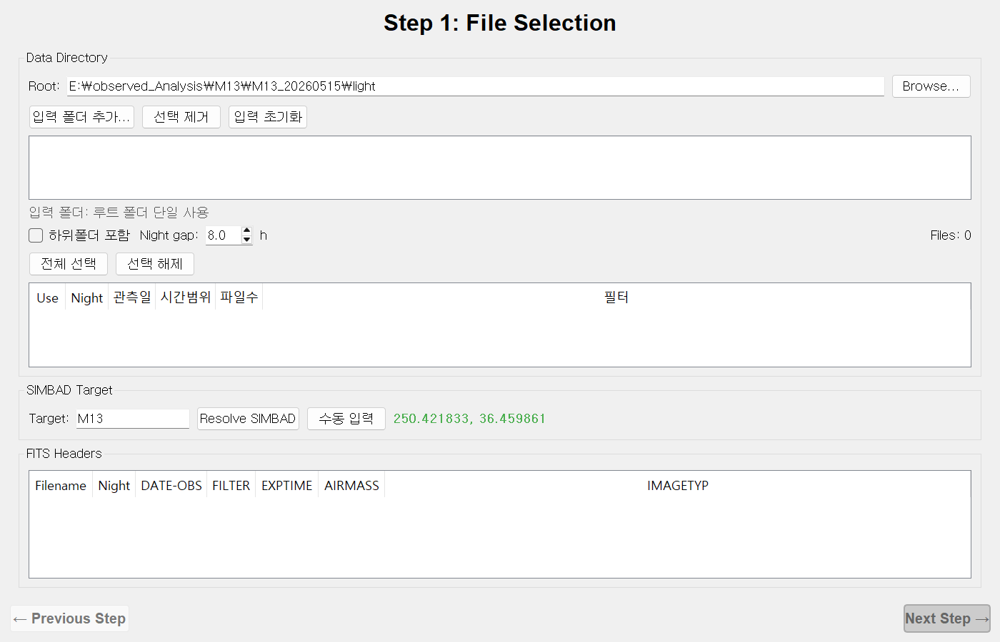
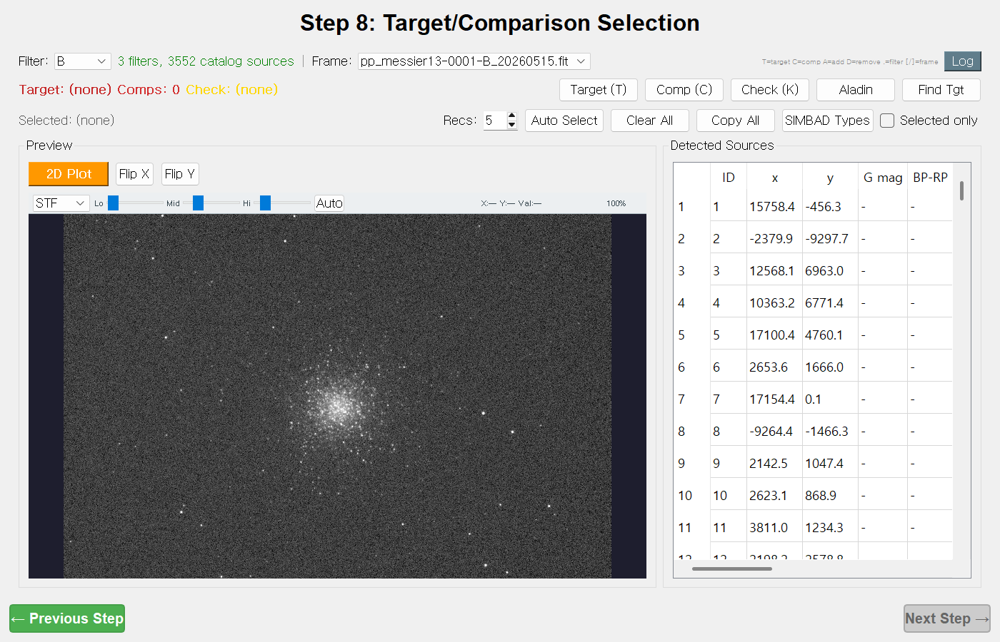
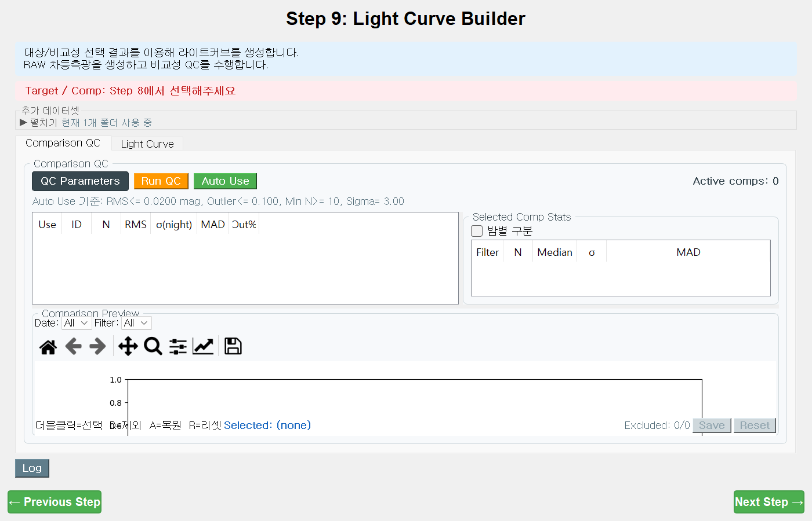
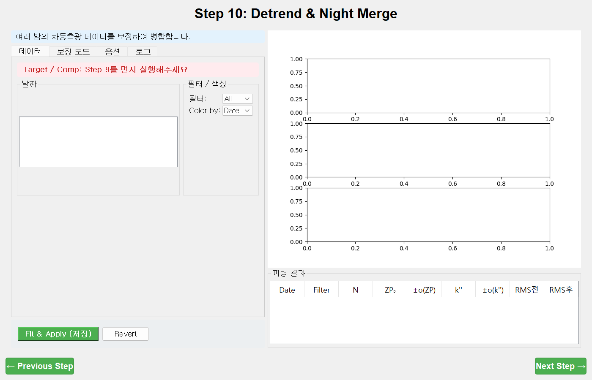
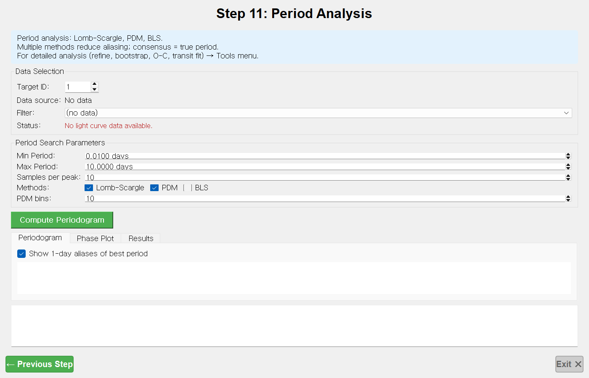

# 4. LC 모드 — 야간 설정 + Step 8 ~ 11 (광도곡선·주기 분석)

[← CMD 모드](03-cmd-mode.md) · [매뉴얼 목차](index.md) · [다음: 분석 도구 →](05-tools.md)

공통 Step 1~7로 측광을 끝냈다면, LC 모드의 8~11단계로 **한 별의 밝기 변화(광도곡선)** 를
만들고 **변광 주기**를 찾습니다. LC 모드는 Step 1이 **여러 밤(night) 처리**로 확장되는 점이 특징입니다.

> **흐름:** (Step 1 야간 설정) → 타겟/비교성 선택 → 라이트커브 → 디트렌드·밤 병합 → 주기 분석

> **LC 단계엔 Run/Stop 바가 없습니다.** 대신 각 단계의 **주 동작 버튼**을 누릅니다:
> Step 9 `Plot && Save`, Step 10 `Fit && Apply (저장)`, Step 11 `Compute Periodogram`.

---

## LC Step 1 — 야간 설정 (Night Setup)

LC 모드의 Step 1은 공통 파일 선택 화면에 **여러 밤 폴더 처리**가 추가됩니다.
(공통 부분은 [공통 Step 1](02-shared-steps.md#step-1--file-selection-파일-선택)과 동일.)

**한 줄 목적:** 여러 밤 폴더를 모아, JD 시간 간격으로 프레임을 밤(night)별로 나누고, 쓸 밤·프레임만 고릅니다.

### 따라하기
1. **단일 밤**: 공통과 동일하게 `Browse…` → `Rescan Files` → 프레임 `Use` 확인.
2. **여러 밤**:
   - **`입력 폴더 추가...`** 로 밤 폴더들을 직접 추가(가장 확실), 또는 **`하위폴더 포함`** 체크로 루트 바로 아래 하위폴더를 각 밤으로 사용.
   - **`Night gap:`** (시간) 으로 밤을 가르는 기준 간격을 정합니다(기본 8h). 한 밤이 둘로 갈리면 값을 키우고 `Rescan Files`.
3. **Night 요약 표**(`Use·Night·관측일·시간범위·파일수·필터`)에서 쓸 밤만 체크합니다(**`전체 선택`** / **`선택 해제`**).

### 컨트롤 요약
| 컨트롤 | 하는 일 |
| --- | --- |
| `입력 폴더 추가...` / `선택 제거` / `입력 초기화` | 밤 폴더 직접 관리 |
| `하위폴더 포함` | 루트 1단계 하위폴더를 각 밤으로 |
| `Night gap:` (h) | 밤을 가르는 JD 간격 |
| `전체 선택` / `선택 해제` | 밤 일괄 토글 |

### 관련 파라미터
| 항목 | TOML 키 | 기본값 |
| --- | --- | --- |
| 밤 구분 간격(h) | `io.night_gap_hours` | 8.0 |

### 출력
`step1_file_selection/night_assignments.json`(프레임→밤 배정) + 공통 출력

### 팁
- 직접 폴더를 추가하는 방식(`입력 폴더 추가...`)이 가장 안정적이며 `하위폴더 포함`보다 우선합니다.
- 밤을 표에서 체크 해제하면 그 밤의 프레임이 전부 빠집니다.
- 밤별 영점·소광 차이 보정은 나중에 **Step 10**에서 합니다(여기선 나누기만).

---

## LC Step 8 — Target/Comparison Selection (타겟/비교성 선택)

**한 줄 목적:** 측광 프레임 위에서 별을 클릭해 **타겟(Target) / 비교성(Comparison) / 체크별(Check)** 역할을 지정합니다.

### 화면 구성
- 상단: `Filter:` · `Frame:` 콤보, 역할 상태(`Target / Comps / Check`), `Log`
- 왼쪽 **Preview**(이미지 뷰어), 오른쪽 **Detected Sources** 표(`ID·x·y·G mag·BP-RP·Status·Role·Gaia Var·SIMBAD`)

### 따라하기
1. **`Filter:`** 로 밴드를 고르고(`.` 키로 순환), 별을 클릭해 선택합니다(가장 가까운 검출).
2. 역할 지정(키보드도 가능):
   - **`Target (T)`** — 변광을 잴 타겟별
   - **`Comp (C)`** — 밝기 기준 비교성(여러 개 = 앙상블)
   - **`Check (K)`** — 독립 점검용 체크별(비교성 앙상블에서 제외)
3. **`Auto Select`** — `Recs:` 개수만큼 비교성을 자동 추천(여러 프레임에 일관되게 검출되고 밝기·색이 비슷한 별, Gaia 변광 플래그 회피).
4. **`Copy All`** — 현재 타겟/비교성을 모든 필터에 복사.

### 컨트롤 요약
| 컨트롤 | 하는 일 |
| --- | --- |
| `Target(T)` / `Comp(C)` / `Check(K)` | 역할 지정 |
| `Auto Select` + `Recs:` | 비교성 자동 추천(개수 지정) |
| `Clear All` / `Copy All` | 역할 초기화 / 전 필터 복사 |
| `SIMBAD Types` | Gaia 매칭 별의 SIMBAD 분류 조회 |
| `Aladin` / `Find Tgt` | Aladin 보기 / SIMBAD 좌표로 타겟 선택 |
| `Selected only` | 선택한 별만 오버레이 |

### 출력 (TOML 아닌 JSON/TSV로 저장)
`lc_selection/` → `selection_<필터>.json`, `master_catalog_<필터>.tsv`, `id_mapping_<필터>.csv`

### 팁 & 자주 겪는 문제
- **좋은 비교성** = ① 변광 없음(`Gaia Var`·`SIMBAD` 확인) ② 타겟과 비슷한 밝기·색 ③ 모든 프레임에 일관 검출.
- 차등 등급 = `타겟 − 비교성 앙상블 평균` 이므로, **변광하는 비교성 하나가 전체를 망칩니다.**
- 이 단계는 Run 버튼이 없고, 역할을 바꿀 때마다 자동 저장됩니다. 타겟이 정해지면 다음 단계로 갈 수 있습니다.

---

## LC Step 9 — Light Curve Builder (라이트커브 생성)

**한 줄 목적:** 선택한 비교성으로 타겟의 **RAW 차등 광도곡선**을 만들고, 비교성 QC로 흔들리는 비교성을 걸러냅니다.

### 화면 구성 — 두 개의 탭
- **`Comparison QC`** 탭: 비교성 품질 표(`Use·ID·N·RMS·σ(night)·MAD·Out%`) + 미리보기
- **`Light Curve`** 탭: 차등 광도곡선 플롯 + 위상 접기(Phase Folding) + 프레임 QC

### 따라하기
1. **`Comparison QC`** 탭 → **`Run QC`**(비교성별 RMS·밤σ·이상치 계산) → **`Auto Use`**(임계값 통과 비교성 자동 선택).
2. 각 비교성 미리보기를 보고, 흔들리는 비교성은 `Use` 체크를 끕니다.
3. **`Light Curve`** 탭 → **`Plot && Save`**(녹색)로 RAW 광도곡선을 만들고 저장합니다.
4. (선택) 구름 낀 프레임은 플롯에서 더블클릭 선택 후 **`D`** 로 제외, **`Save`**.
5. (여러 밤/폴더) **`추가 데이터셋`** 패널에서 **`폴더 추가`** 로 다른 결과 폴더를 합쳐 쓸 수 있습니다.

### 컨트롤 요약
| 컨트롤 | 하는 일 |
| --- | --- |
| `Run QC` | 비교성 품질 지표 계산 |
| `Auto Use` | 임계값 통과 비교성 자동 체크 |
| `Plot && Save` | RAW 차등 광도곡선 생성·저장 |
| `X축:` (Time/Phase) | 시간축 ↔ 위상축 |
| `Phase Folding` (Period/T0 슬라이더) | 위상 접기 미리보기 |
| 프레임 QC: `D`/`A`/`R` | 프레임 제외/복원/리셋 |

### 파라미터 — `QC Parameters` / `Light Curve Parameters` (프로젝트 상태로 저장)
| 항목 | 기본값 |
| --- | --- |
| RMS 최대(mag) | 0.02 |
| Outlier sigma(MAD) | 3.0 |
| Outlier frac 최대 | 0.1 |
| 최소 포인트 | 10 |
| Period 최소/최대(days) | 0.01 / 10.0 |

### 출력
`lc_lightcurve/` → `lightcurve_ID{타겟}_raw.csv`(또는 `_combined_`), `comp_selection.json`

### 팁 & 자주 겪는 문제
- 비교성 QC가 이 단계의 핵심입니다 — `Run QC` → `Auto Use` 후에도 **각 비교성 미리보기를 눈으로** 확인하세요.
- 차등 등급은 `m_타겟 − 평균(비교성 앙상블)` 이라, 비교성 하나가 변광이면 전체가 오염됩니다.
- 여러 밤은 여기서 데이터셋만 합치고, **밤 간 영점차 보정은 Step 10**에서 합니다.

---

## LC Step 10 — Detrend & Night Merge (디트렌드 & 밤 병합)

**한 줄 목적:** 밤마다 다른 영점·대기 소광을 보정해 여러 밤 광도곡선을 매끄럽게 이어 붙이고, 보정 전후 RMS를 비교합니다.

### 화면 구성
- 왼쪽: 탭(`데이터` / `보정 모드` / `옵션` / `로그`) + **`Fit && Apply (저장)`** / **`Revert`**
- 오른쪽: 3단 플롯(원본·보정·진단) + **`피팅 결과`** 표(`Date·Filter·N·ZP₀·±σ·k''·±σ·RMS전·RMS후`)

### 보정 모드 4가지
| 모드 | 수식 | 언제 |
| --- | --- | --- |
| **Offset Only (ZP₀)** | `Δm − ZP₀` | 기본. 밤별 영점만 보정 |
| **Color-dependent (ZP₀ + k''·ΔC·X)** | 색×공기질량 항 제거 | 색 범위·공기질량 범위가 충분할 때 |
| **Global Ensemble (Method C)** | 프레임 영점 Zₜ + 비교성 평균 동시 최소제곱 | 비교성 다수의 전역 보정 |
| **SYSREM (Tamuz+2005)** | 공통 계통오차 벡터 반복 제거 | 계통 트렌드 제거 |

### 따라하기
1. **`데이터`** 탭에서 사용할 날짜를 체크합니다.
2. **`보정 모드`** 탭에서 모드를 고릅니다(상단 **`데이터 분석 결과`** 가 Offset/Color를 추천).
3. (선택) **`옵션`** 탭에서 Sigma Clipping·위상 접기·Global Ensemble 세부값 조정.
4. **`Fit && Apply (저장)`**(녹색)을 누릅니다 — 보정·저장 동시.
5. **`피팅 결과`** 표의 **RMS전 → RMS후** 가 줄었는지 확인합니다. 되돌리려면 **`Revert`**.

### SYSREM 옵션
| 항목 | 기본값 |
| --- | --- |
| 반복 수(추출할 성분) | 5 |
| 적용 수(타겟에 적용) | 3 |

### 출력
`lc_detrend/` → `lightcurve_ID{타겟}_current.csv`(`diff_mag_corr` 포함), `summary_*.txt`, `plot_*.png`

### 팁 & 자주 겪는 문제
- Color 모드는 **색 범위(|ΔC|≥0.3)와 공기질량 범위(ΔX≥0.3)가 둘 다** 있어야 안정적입니다(아니면 Offset로 자동 폴백).
- `ZP₀`는 밤별 기준선일 뿐 절대영점이 아닙니다 — Offset 모드는 **장기 변광을 흡수**할 수 있으니 주의.
- Global/SysRem은 Step 7 원자료를 다시 읽으므로, 변광 비교성이 섞이면 무너집니다.
- 보정 효과는 **체크별 광도곡선이 평평해지는지**로 검증하세요.

---

## LC Step 11 — Period Analysis (주기 분석)

**한 줄 목적:** Lomb-Scargle·PDM·BLS로 변광 주기를 빠르게 탐색하고, FAP·위상 접기로 검증합니다.

### 화면 구성
- **Data Selection**(타겟 ID·데이터 소스·필터)
- **Period Search Parameters**(주기 범위·샘플·방법·PDM bins)
- **`Compute Periodogram`** + 탭(`Periodogram` / `Phase Plot` / `Results`)

### 따라하기
1. **`Target ID:`** 와 **`Filter:`** 를 확인합니다(보통 Step 9/8에서 자동 설정).
2. **`Min/Max Period`** 와 **`Methods`**(Lomb-Scargle·PDM·BLS)를 정합니다.
3. **`Compute Periodogram`**(녹색)을 누릅니다.
4. **`Results`** 탭의 peak 표(`Method·Best Period·Power·FAP·Alias?·Top 3`)에서 **여러 방법의 최적 주기가 일치하는지** 봅니다.
5. **`Phase Plot`** 탭에서 그 주기로 위상 접기(phase-fold)를 확인합니다.
6. (선택) **`Bootstrap FAP 계산`** 으로 LS의 거짓경보확률을 부트스트랩 추정.

### 파라미터 요약
| 항목 | 기본값 |
| --- | --- |
| Min / Max Period(days) | 0.01 / 10.0 |
| Samples per peak | 10 |
| Methods | Lomb-Scargle ✓, PDM ✓, BLS ✗ |
| PDM bins | 10 |
| Bootstrap FAP 횟수 | 1000 |

### 출력
`lc_period/` → `period_analysis_*.json`(요약)

### 팁 & 자주 겪는 문제
- **여러 방법의 일치**가 진짜 주기의 가장 강한 증거입니다. 1일 별칭(alias)은 `Alias?` 열·주황 보조선으로 표시됩니다.
- 지상 관측·불균일 샘플링에는 **PDM**이 보통 더 안정적입니다.
- FAP는 낮을수록 유의합니다. 해석적 LS FAP는 가우시안 가정이라, 짧거나 불균일·상관 있는 자료엔 **Bootstrap FAP**를 쓰세요.
- 유효 포인트가 10개 미만이면 오류가 납니다.
- **정밀 분석**(O-C, 다중모드, 트랜짓·식쌍성 피팅)은 **Tools 메뉴**에 있습니다 → [5. 도구](05-tools.md).

---

[← CMD 모드](03-cmd-mode.md) · [매뉴얼 목차](index.md) · [다음: 분석 도구 →](05-tools.md)
