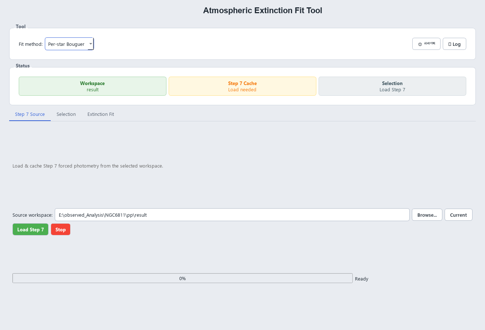
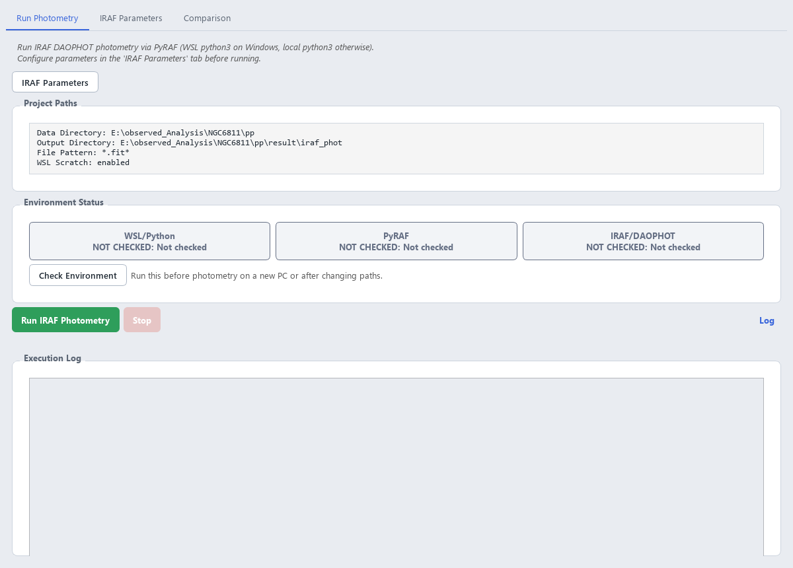
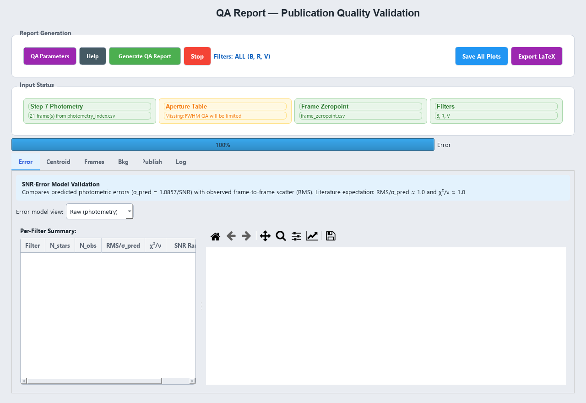
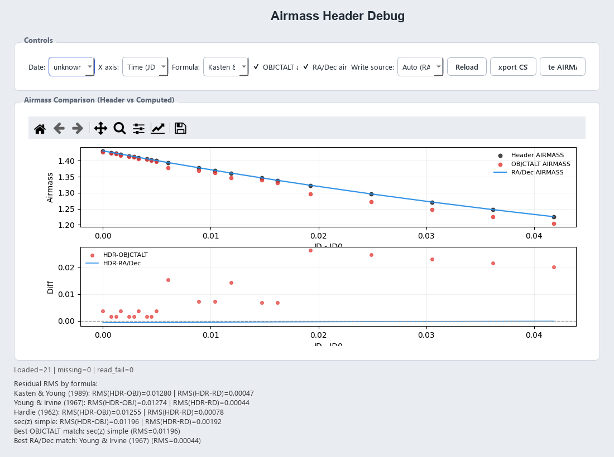
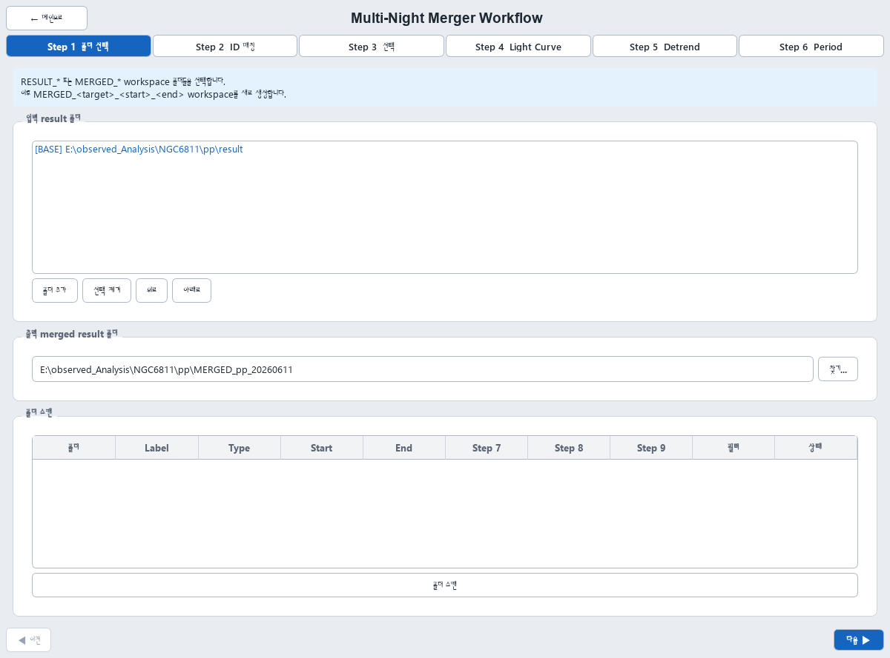
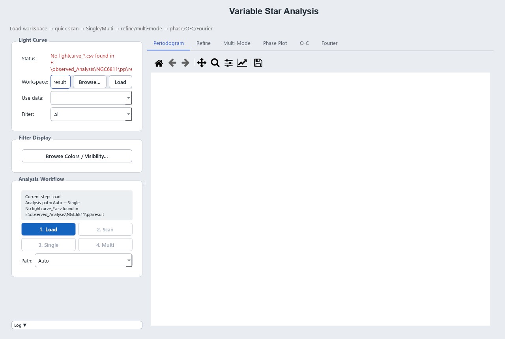
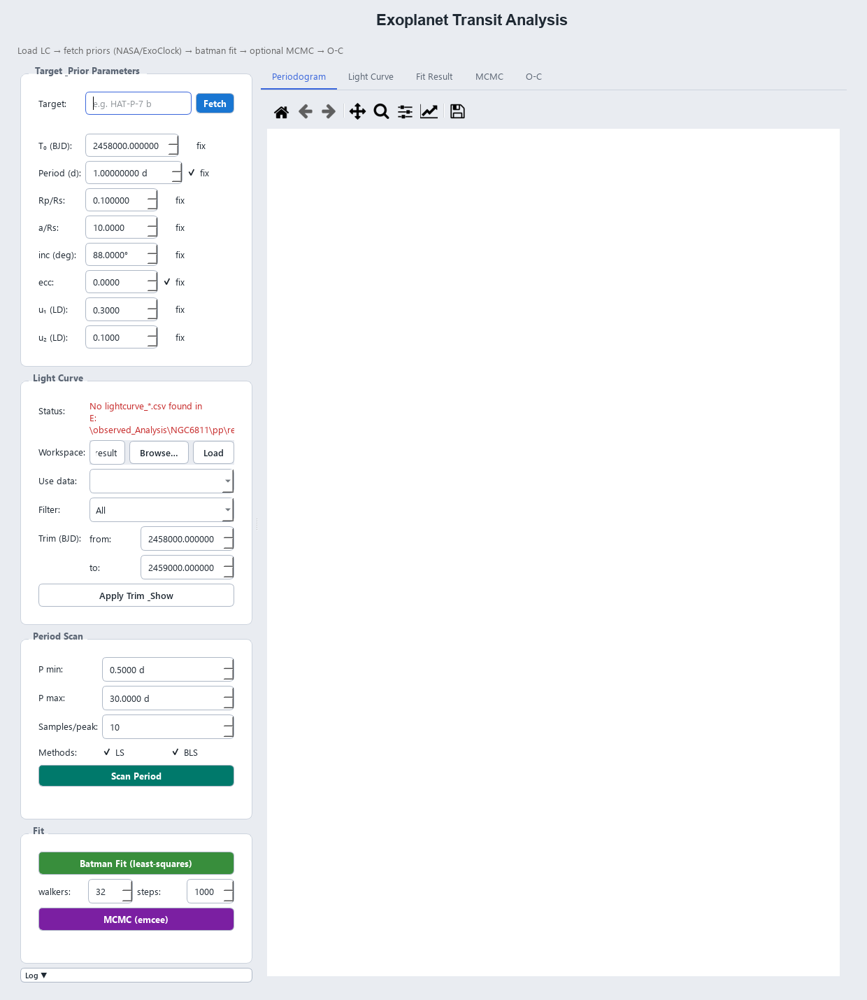
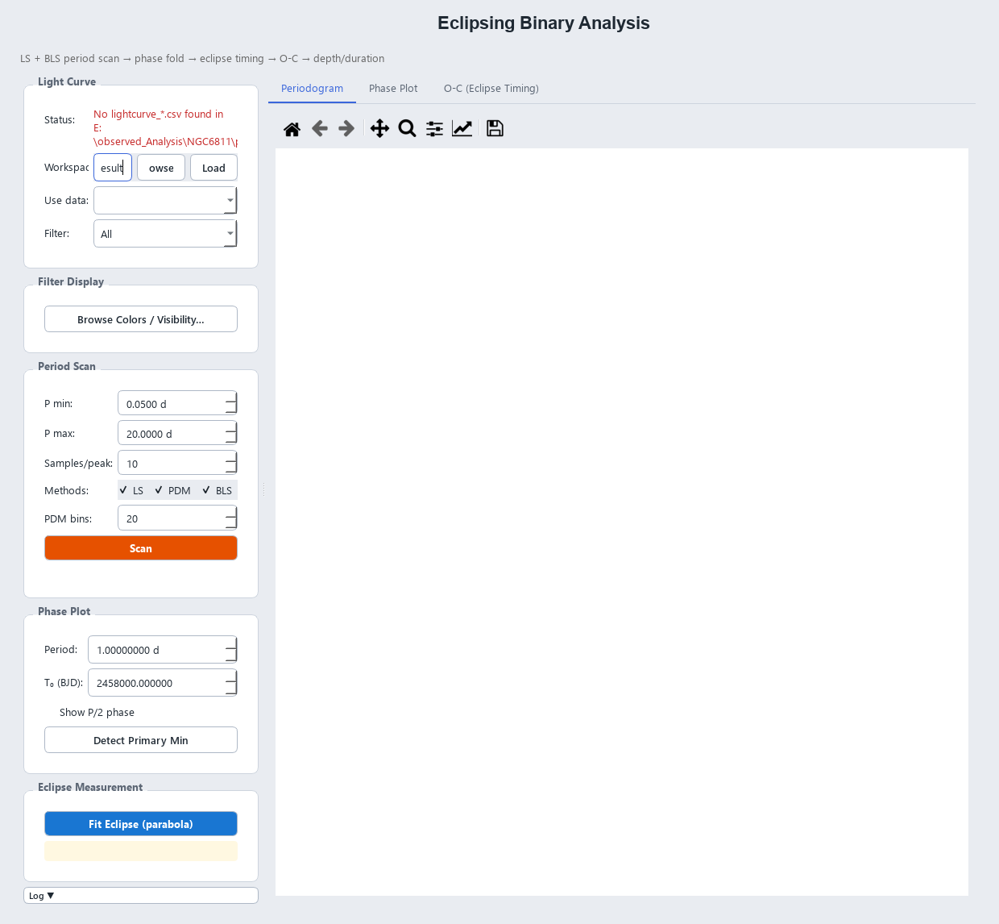
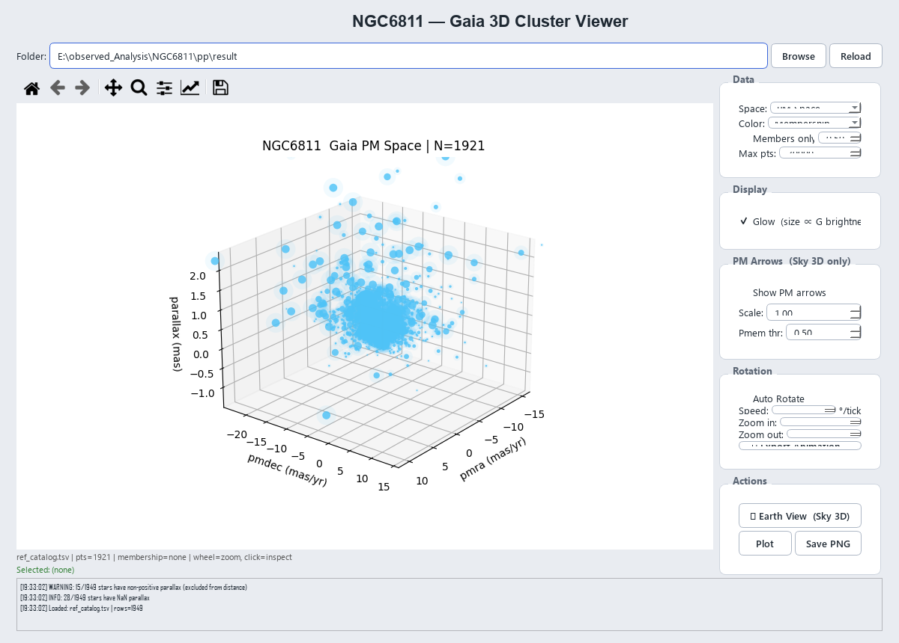
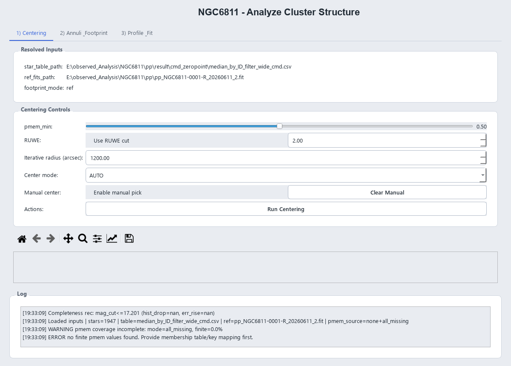

# 5. 분석 도구 (Tools)

[← LC 모드](04-lc-mode.md) · [매뉴얼 목차](index.md) · [다음: 파라미터 레퍼런스 →](06-parameters-reference.md)

도구는 단계(Step)와 별개로, 측광 결과를 더 깊이 검증·분석할 때 씁니다. 메인 창 상단의
**Tools** 메뉴에서 엽니다. 현재 모드에 맞는 도구만 메뉴에 보입니다.

> 대부분 비모달(메인 창과 동시 사용 가능)입니다. **단, Multi-Night Merger는 메인 창을 숨기고
> 전체를 차지**하며 `← 메인으로` 로 돌아옵니다.

---

## 도구 메뉴 한눈에 보기

| 메뉴 이름 | 모드 | 단축키 | 한 줄 용도 |
| --- | --- | --- | --- |
| **QA Reports** | CMD+LC | Ctrl+R | Step 7 측광이 논문 품질인지 검증(오차모델·센터링·프레임·배경·포화·조리개보정) |
| **IRAF/DAOPHOT Tool** | CMD+LC | Ctrl+I | IRAF DAOPHOT 측광 실행 후 APEX와 교차 비교 |
| **Extinction (Airmass Fit)** | CMD+LC | Ctrl+E | 필터별 대기 소광계수 k1 피팅(기기등급 vs 공기질량) |
| **Airmass Header Debug** | LC | — | 헤더 AIRMASS vs 계산 공기질량 비교·재기록 |
| **Multi-Night LC Merger** | LC | Ctrl+M | 여러 단일밤 워크스페이스를 하나로 병합(ID 통일) |
| **Variable Star Analysis** | LC | Ctrl+Shift+V | 변광성: 주기→정밀화→다중모드 푸리에→위상→O-C |
| **Exoplanet Transit Analysis** | LC | Ctrl+Shift+T | 외계행성 트랜짓: 사전값→batman 피팅(LSQ/MCMC)→O-C |
| **Eclipsing Binary Analysis** | LC | Ctrl+Shift+B | 식쌍성: 주기→위상→식 시각→O-C→깊이/지속 |
| **Gaia 3D Cluster Viewer** | CMD | — | 성단 멤버를 3D Gaia 공간에 시각화·애니메이션 |
| **Analyze Cluster Structure** | CMD | — | 성단 공간 구조(밀도·반경) 분석 |

> 도구 산출물은 보통 `<result_dir>/` 아래 전용 하위폴더에 저장됩니다
> (예: `tool_extinction/`, `qa_report/`, `iraf_comparison/`, `variable_star_tool/`).

---

## 5.1 Extinction (Airmass Fit) — 대기 소광 피팅

**용도:** Step 7 측광에서 기기등급 vs 공기질량 기울기로 **1차 소광계수 k1(mag/airmass)** 을 필터별로 구합니다.

- **입력:** 워크스페이스의 `step7_forced_phot/`. **`Browse…`** 또는 **`Current`** 로 지정.
- **탭:** `Step 7 Source`(데이터 로드) / `Selection`(피팅에 쓸 별 선택) / `Extinction Fit`(피팅·진단)
- **방법(Fit method):** `Per-star Bouguer` / `Ensemble` / `Median subtract` / `Gaia absolute`

### 따라하기
1. `Step 7 Source` 탭 → **`Load Step 7`**(녹색).
2. `Selection` 탭 → 별을 클릭하거나 **`Auto Pick`** → `Use`/`Reject`로 선별(**Per-star Bouguer 모드에서만** 수동 선택이 반영됨).
3. `Extinction Fit` 탭 → **`Run Fit`** → 필터별 k1·산포·N이 표에 표시.

### 주요 파라미터 — `Extinction Parameters`
| 필드 | TOML 키 | 기본값 |
| --- | --- | --- |
| SNR min | `extinction_snr_min` | 10.0 |
| Fit clip sigma | `extfit_clip_sigma` | 3.0 |
| Min points | `extfit_min_points` | 10 (예제 5) |
| ΔX min | `extinction_delta_x_min` | 0.3 |
| Per-star RMS max | `extinction_star_rms_max` | 0.10 |

### 출력
`tool_extinction/` → `per_star_extinction_by_filter.csv`, `extinction_fit_by_filter.csv`(하류에서 사용), `*_plot.png`

> 공기질량 범위 ΔX가 `extinction_delta_x_min`보다 작은 그룹은 건너뜁니다. "Load Step 7" 성공 후에만 "Run Fit" 가능.

---

## 5.2 IRAF/DAOPHOT Tool — IRAF 측광·교차검증

**용도:** IRAF DAOPHOT(daofind→phot→txdump)를 PyRAF로 돌려 APEX Step 4/7과 교차 비교합니다.

- **요구:** Windows에서는 **WSL + PyRAF/IRAF/DAOPHOT** 필요. 먼저 **`Check Environment`** 로 점검.
- **탭:** `Run Photometry` / `IRAF Parameters`(DATAPARS·FINDPARS·CENTERPARS·FITSKYPARS·PHOTPARS 하위탭) / `Comparison`
- **`Sync From APEX Step 4/7`** 로 필터별 FWHM·시그마·임계값을 APEX에서 가져옵니다.
- 파라미터는 `[tools.iraf.params]`·`[tools.iraf.filters.*]`에 자동 저장됩니다.

### 출력
프레임별 `<stem>.txt/.coo/.mag`; 비교는 `iraf_comparison/iraf_compare_all.csv`·`iraf_compare_summary.csv`

> 미지의 필터는 `default` 밴드 값으로 폴백합니다. 별도 모달 대화상자 없이 하위탭에서 편집·자동저장.

---

## 5.3 QA Reports — 측광 품질 검증

**용도:** Step 7 측광이 **논문 품질**인지 종합 검증합니다.

- **입력:** `step7_forced_phot/`(자동 스캔). 파라미터는 `parameters.toml`.
- **탭(6):** `Error`(SNR-오차 모델) / `Centroid` / `Frames`(프레임 품질·제외) / `Bkg` / `Publish`(판정·LaTeX) / `Log`

### 따라하기
1. **`Generate QA Report`**(녹색) → 각 탭이 채워집니다.
2. `Publish` 탭의 판정 확인: **✅ PASS / ⚠️ MARGINAL / ❌ FAIL**.
3. (선택) `Frames` 탭에서 불량 프레임 제외 → **`Apply & Regenerate`**.
4. **`Save All Plots`** / **`Export LaTeX`** 로 산출물 저장.

### 주요 파라미터 — `QA Parameters` (`[tools.qa_report]`)
| 필드 | 키 | 기본값 |
| --- | --- | --- |
| Min frames per star | `min_n_frames` | 5 (코드 3) |
| Min SNR | `min_snr` | 20.0 (코드 5) |
| Max χ²/ν | `max_chi2_nu` | 5.0 |
| Exclude saturated | `exclude_saturated` | `true` |
| Use for Publish | `error_model_source` (raw/zp) | raw |

> 판정 PASS 기준: 0.8 ≤ RMS/σ_pred ≤ 1.2 **그리고** 0.7 ≤ χ²/ν ≤ 1.3.
> "Frame ZP corrected" 오차모델은 Step 9/10 프레임 영점 CSV가 있어야 보입니다.

### 출력
`qa_report/` → 오차모델 CSV/JSON, `qa_frame_quality.csv`, 플롯 PNG, `qa_table.tex`

---

## 5.4 Airmass Header Debug — 공기질량 헤더 점검 (LC)

**용도:** FITS 헤더 `AIRMASS`를, `OBJCTALT` 또는 RA/Dec+시각으로 다시 계산한 값과 비교하고, 필요하면 헤더를 다시 씁니다.

- **컨트롤:** `Date:`·`X axis:`·`Formula:`·`Write source:` 콤보, `OBJCTALT airmass`/`RA/Dec airmass` 체크, **`Reload`**/**`Export CSV`**/**`Write AIRMASS`**
- **사이트 좌표 필요:** `[site] lat_deg/lon_deg/alt_m` (헤더에 없으면 이 값 사용)

### 출력
`Export CSV` → 비교표 CSV; `Write AIRMASS` → **FITS 헤더 직접 수정(되돌리기 없음 — 주의)**

> RA/Dec 공기질량은 사이트 위경도가 있어야 계산됩니다. `OBJCTALT`가 일정하면 "looks constant" 경고(고정/불량 ALT 의심).

---

## 5.5 Multi-Night LC Merger — 다중밤 광도곡선 병합 (LC)

**용도:** 여러 단일밤 워크스페이스(`RESULT_*`)를 하나의 `MERGED_*` 워크스페이스로 병합하고 ID를 통일한 뒤, 그 안에서 Step 8~11을 그대로 진행합니다.

- **요구:** Step 7/8/9가 모두 있는 **같은 타겟** 워크스페이스 **2개 이상**.
- **6단계:** `폴더 선택` → `ID 매칭` → `선택` → `Light Curve` → `Detrend` → `Period`
- **`Position match radius (arcsec)`**(기본 2.0)로 위치 기반 ID 매칭. 우선순위: Gaia source_id → 기존 canonical ID → 반경 내 위치.

### 따라하기
1. **`폴더 추가`** 로 워크스페이스 2개+ 추가(첫 폴더가 `[BASE]` = 기준 ID 체계).
2. **`폴더 스캔`** → 표에서 Step 7/8/9 보유 확인.
3. `ID 매칭` 단계 → 반경 선택 → **`ID 매칭 실행`**.
4. 이후 `선택`~`Period`는 병합 워크스페이스에서 일반 LC 단계와 동일.

> 메인 창은 숨겨지고, **`← 메인으로`** 로 복귀합니다. 자세한 설명은 `docs/multi-night-merger.md` 참고.

---

## 5.6 Variable Star Analysis — 변광성 분석 (LC)

**용도:** 변광성의 주기를 찾고(스캔→정밀화+부트스트랩 오차), 다중모드 푸리에로 특성화하고, 위상 접기·O-C까지.

- **입력:** 워크스페이스의 광도곡선 CSV(`Use data:`·`Filter:` 콤보로 선택)
- **탭:** `Periodogram` / `Refine` / `Multi-Mode` / `Phase Plot` / `O-C` / `Fourier`
- **워크플로:** Load → Scan → Single/Multi → refine/fit → phase/O-C/Fourier

### 핵심 컨트롤
| 그룹 | 컨트롤 |
| --- | --- |
| Period Scan | `P min/max`·`Samples/peak`·`LS/PDM/BLS`·`Scan` |
| Refine | `Center P`·`N bootstrap`·`Refine & Bootstrap` |
| Multi-Mode | 모드 주기 입력·`Top Peaks`·`Fit Multi-Mode`·`Detect Residual Peaks` |
| O-C | `T₀`·`P`·`Fit:`(Linear/Parabola/Para+Sine)·`Fit & Plot` |

### 출력
`variable_star_tool/` → 다중모드 history/modes/candidates CSV + summary; O-C CSV(버튼)

> 작업 버튼은 선행 조건이 충족돼야 활성화됩니다. "Detect Residual Peaks"는 "Fit Multi-Mode" 후에. O-C 피팅은 ≥3점(Para+Sine은 ≥6점).

---

## 5.7 Exoplanet Transit Analysis — 외계행성 트랜짓 (LC)

**용도:** 트랜짓 사전값을 받아 batman 모델을 최소제곱·MCMC로 피팅하고, O-C 트랜짓 타이밍을 분석합니다.

- **`Target:`** 입력 + **`Fetch`**(NASA Exoplanet Archive → ExoClock 폴백)로 사전값 자동 입력.
- **사전값 스핀박스**(각각 `fix` 체크): T₀·Period·Rp/Rs·a/Rs·inc·ecc·u₁·u₂
- **피팅:** **`Batman Fit (least-squares)`** → (선택) **`MCMC (emcee)`**(walkers/steps 지정)
- **탭:** `Periodogram` / `Light Curve` / `Fit Result` / `MCMC` / `O-C`

> `batman-package`·`emcee`는 선택 의존성입니다(없으면 한국어 안내 오류). 기본 자유 파라미터: t0·rp·a·inc·u1·u2 / 고정: per·ecc·w.

---

## 5.8 Eclipsing Binary Analysis — 식쌍성 분석 (LC)

**용도:** 식쌍성의 주기(LS+PDM+BLS)→위상 접기→식 시각→O-C→식 깊이/지속을 분석합니다.

- **탭:** `Periodogram` / `Phase Plot` / `O-C (Eclipse Timing)`
- **컨트롤:** `Scan`(LS/PDM/BLS), `Detect Primary Min`, **`Fit Eclipse (parabola)`**, O-C `Eclipse:`(Primary/Secondary)
- **`Show P/2 phase`** 로 주기를 반으로 접어 이차식(secondary)을 위상 0.5에서 확인.

> BLS>LS>PDM 순으로 최적 주기를 선호. 포물선 식 피팅은 1차 최소 ±0.15 위상 범위에서 동작. O-C 피팅 ≥3점(Para+Sine ≥6점).

---

## 5.9 Gaia 3D Cluster Viewer — Gaia 3D 성단 뷰어 (CMD)

**용도:** 성단 멤버를 3D Gaia 공간(고유운동 공간 또는 하늘+거리)에서 회전 시각화하고 GIF/MP4로 내보냅니다.

- **입력:** `result_dir`에서 자동 로드(`ref_catalog.tsv`, 멤버십·CMD 색 등).
- **컨트롤:** `Space:`(PM Space/Sky 3D), `Color:`(Membership/G mag/Parallax/Teff/…), `Members only`+`Pmem threshold`, `Auto Rotate`, **`🎬 Export Animation…`**, **`Save PNG`**
- 캔버스 더블클릭으로 별 선택, 휠로 줌.

### 출력
`gaia_cluster_3d.png`(170dpi), `cluster_3d.gif`(Pillow) 또는 `cluster_3d.mp4`(ffmpeg 필요)

> Gaia 천체측정 컬럼이 있어야 합니다. PM 화살표는 Sky 3D 전용(금색=멤버). MP4는 PATH에 ffmpeg 필요(없으면 GIF 권장).

---

## 5.10 Analyze Cluster Structure — 성단 구조 분석 (CMD)

**용도:** 성단의 공간 밀도 분포·반경 구조를 분석합니다(밀도 프로파일, 멤버 분포 점검 등).

- **입력:** CMD 모드 결과(마스터 카탈로그·멤버십).
- 멤버십·공간 분포를 시각화해 성단 영역·갭(gap)을 점검하는 데 사용합니다.

---

[← LC 모드](04-lc-mode.md) · [매뉴얼 목차](index.md) · [다음: 파라미터 레퍼런스 →](06-parameters-reference.md)
