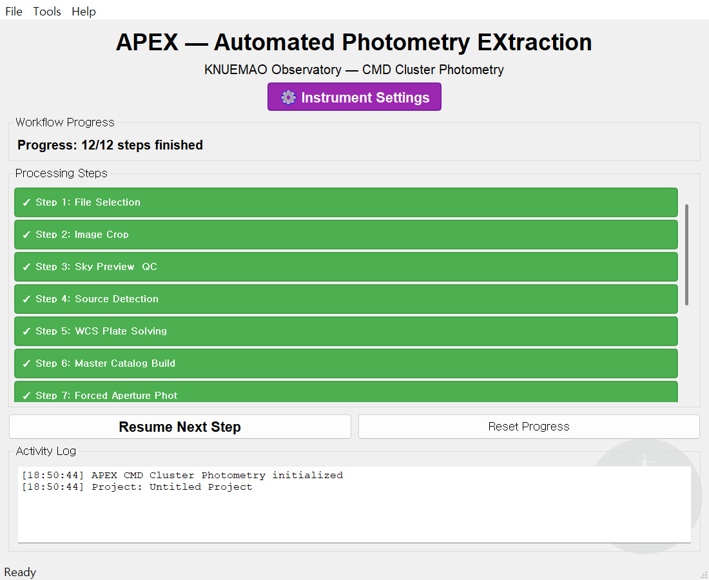

# APEX 사용자 매뉴얼

**APEX — Automated Photometry EXtraction**
FITS 관측 영상에서 측광 결과(색-등급도·광도곡선·주기)까지, 단계별로 따라 하는 천체 측광 프로그램입니다.

이 매뉴얼은 **실제로 화면을 보며 그대로 따라 할 수 있도록** 모든 단계의 스크린샷과
버튼·파라미터 설명을 담았습니다. 천문 측광을 처음 다루는 분도 순서대로 클릭하면
결과가 나오도록 구성했습니다.

<p align="center">
  <a href="https://github.com/Diu1773/APEX_AutomatedPhotometryEXtraction/releases/latest" class="md-button md-button--primary">⬇️ APEX 내려받기 (Windows)</a>
  <a href="https://github.com/Diu1773/APEX_AutomatedPhotometryEXtraction" class="md-button">GitHub 저장소</a>
</p>



> **다운로드 안내** — 설치형 `setup-APEX-<버전>.exe` 또는 무설치 `APEX-Portable-<버전>-x64.zip`을
> 위 **내려받기** 버튼(최신 릴리스)에서 받으세요. 관리자 권한이 필요 없습니다.
> 외부 WCS 솔버(ASTAP/astrometry.net)는 포함되지 않습니다(없어도 내장 솔버로 동작). → [시작하기](01-getting-started.md)

---

## 이 매뉴얼을 읽는 법

APEX는 두 가지 분석 모드가 있고, 두 모드는 **Step 1~7을 공유**합니다.

| 내가 하려는 것 | 읽을 순서 |
| --- | --- |
| **성단 색-등급도(CMD)·나이/거리 측정** | 시작하기 → 공통 1~7 → **CMD 8~12** |
| **변광성·외계행성 광도곡선·주기 분석** | 시작하기 → 공통 1~7 → **LC 8~11** |
| 파라미터 의미만 빠르게 찾고 싶다 | **파라미터 레퍼런스** |
| 막혔을 때 | **문제 해결 / FAQ** |

> 💡 화면 오른쪽 위의 **`⎘ 가이드`** 버튼은 그 단계에서 무엇을 해야 하는지 1~2줄로 알려줍니다.
> 매뉴얼이 손에 없을 때 가장 먼저 누르세요.

---

## 목차

1. **[시작하기](01-getting-started.md)** — 설치, 실행, 런처 화면, 모드 선택, 장비 설정, 공통 화면 구성, `parameters.toml` 기초
2. **[공통 단계 Step 1~7](02-shared-steps.md)** — 파일 선택 → 크롭 → 스카이/QC → 소스 검출 → WCS → 마스터 카탈로그 → 강제 측광
3. **[CMD 모드 Step 8~12](03-cmd-mode.md)** — PSF 측광 → 마스터 ID 편집 → 영점 보정 → CMD 플롯 → 아이소크론 피팅
4. **[LC 모드 Step 1·8~11](04-lc-mode.md)** — 야간 설정 → 타겟/비교성 선택 → 라이트커브 → 디트렌드/병합 → 주기 분석
5. **[분석 도구 (Tools)](05-tools.md)** — 소광 피팅, IRAF/DAOPHOT, QA 리포트, 다중밤 병합, 변광성·외계행성·식쌍성, Gaia 3D 뷰어
6. **[파라미터 레퍼런스](06-parameters-reference.md)** — `parameters.toml`의 모든 섹션·키·기본값
7. **[문제 해결 / FAQ](07-troubleshooting.md)** — 자주 막히는 지점과 해결법

---

## 30초 요약 — 전체 흐름

```
                     ┌─────────────── 공통 Step 1~7 ───────────────┐
 FITS 폴더 ─▶ 파일선택 ─▶ 크롭 ─▶ 스카이/QC ─▶ 소스검출 ─▶ WCS ─▶ 마스터카탈로그 ─▶ 강제측광
                                                                          │
                            ┌─────────────────────────────────────────────┴───────────┐
                       CMD 모드                                                     LC 모드
              PSF측광 ─▶ ID편집 ─▶ 영점보정 ─▶ CMD플롯 ─▶ 아이소크론          타겟/비교성 ─▶ 라이트커브 ─▶ 디트렌드/병합 ─▶ 주기분석
              (성단 나이·거리·금속함량)                                      (변광 주기·트랜짓·식쌍성)
```

- **공통 1~7**: 어떤 분석이든 똑같이 거치는 "측광 준비 + 측정" 단계입니다.
- **CMD 8~12**: 성단을 색-등급도로 그리고 이론 등시선(아이소크론)을 맞춰 나이·거리를 구합니다.
- **LC 8~11**: 한 별의 밝기 변화를 시간에 따라 추적해 주기를 찾습니다.

---

## 준비물 체크리스트

- [ ] APEX 설치 또는 소스 실행 환경 (Windows x64, Python 3.10+) — [시작하기](01-getting-started.md) 참고
- [ ] 분석할 **FITS 파일**이 한 폴더에 정리되어 있을 것 (헤더에 `FILTER`, `EXPTIME`, `DATE-OBS` 권장)
- [ ] 망원경·카메라 사양 (초점거리, 픽셀 크기, 게인, 리드노이즈) — [장비 설정](01-getting-started.md#13-장비-설정-instrument-settings)에서 입력
- [ ] (선택) WCS 외부 솔버 — ASTAP 또는 astrometry.net. 없으면 내장 Python 솔버 사용
- [ ] (CMD) 아이소크론 파일 (PARSEC/BaSTI) — Step 12에서 사용

> 이 매뉴얼의 스크린샷은 교본 데이터셋(성단 **M5 · M13 · NGC6811**)으로 캡처했습니다.
> 화면의 파일명·수치는 예시이며, 여러분의 데이터에서는 다르게 보입니다.
