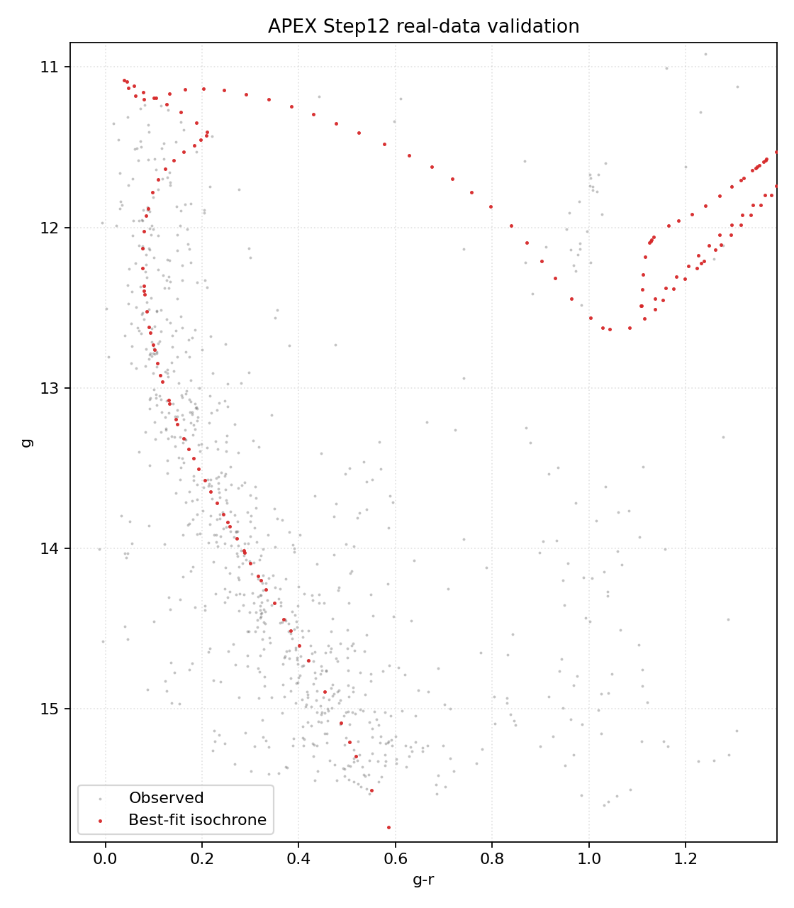
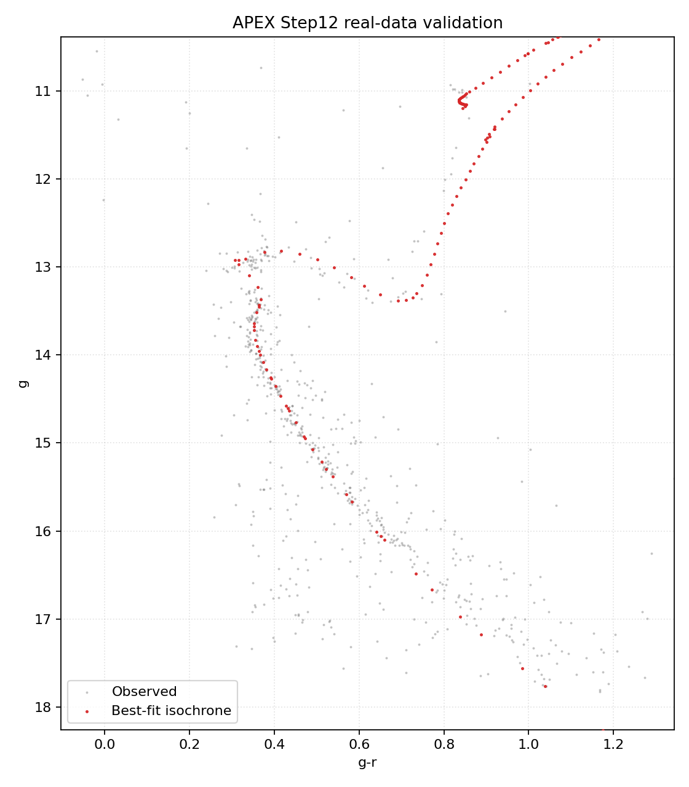
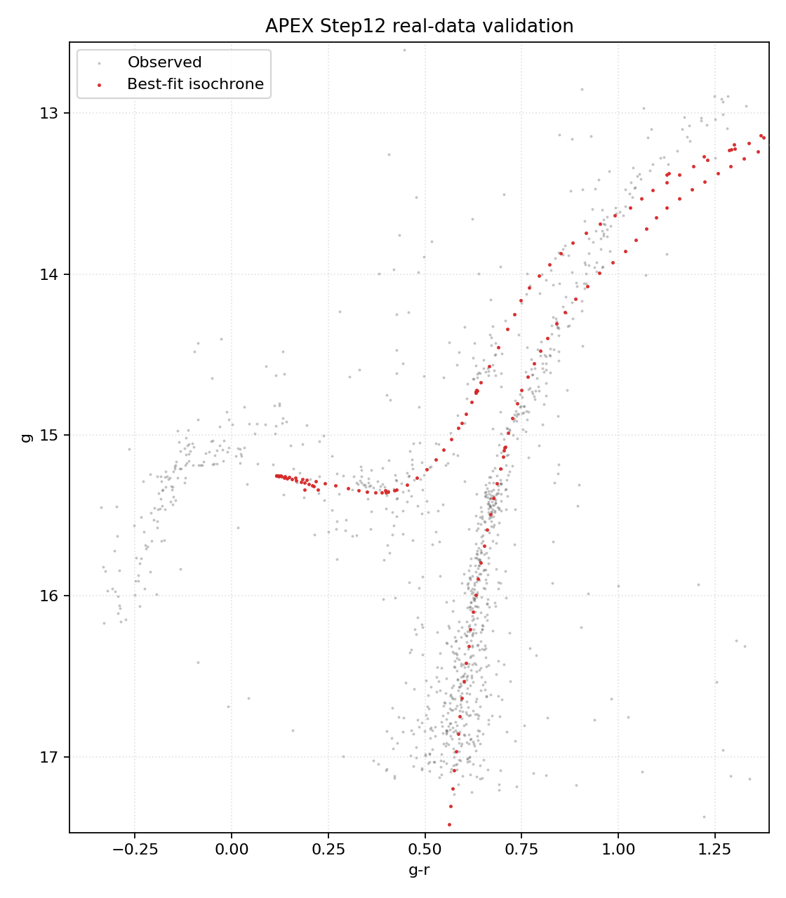
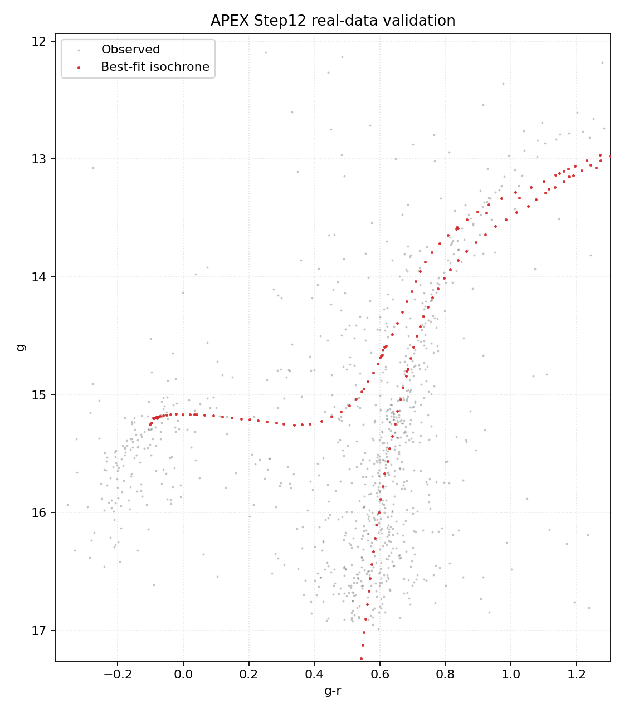
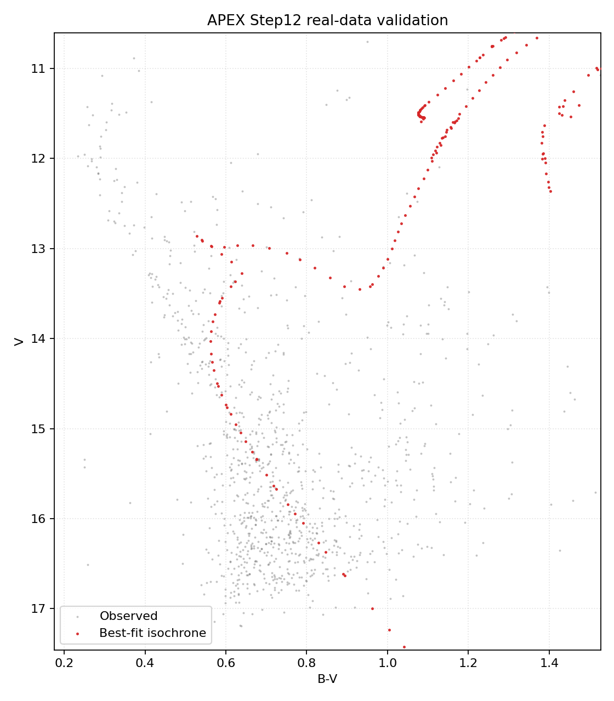
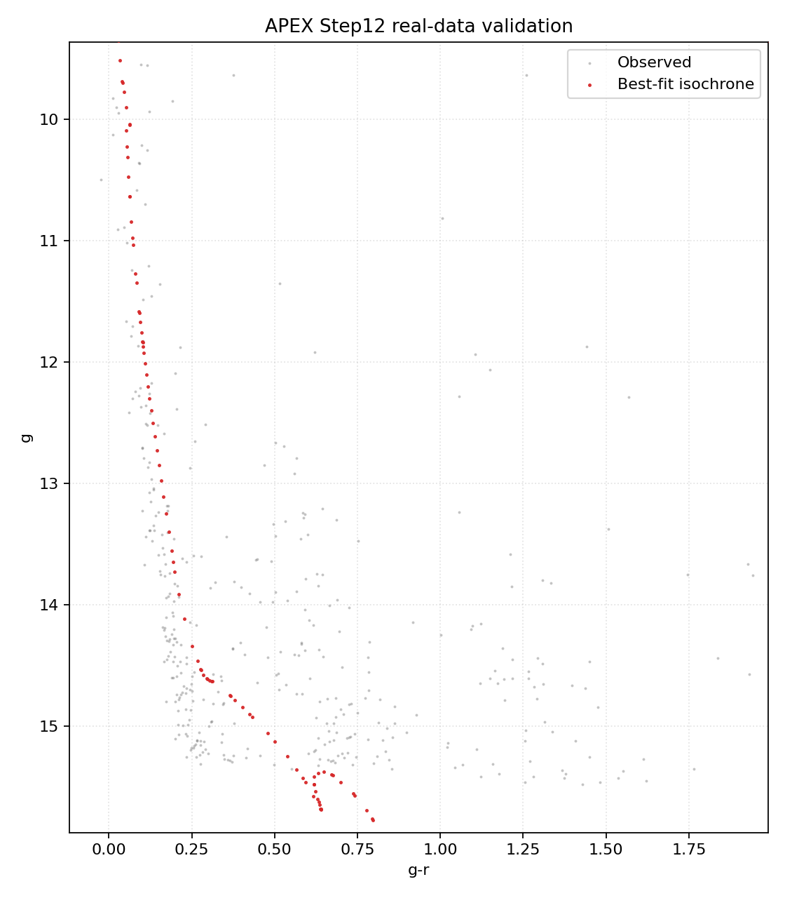

# APEX real-data validation: open & globular cluster reproduction

> **Scope note.** The table below is the **older grid-scanner** end-to-end smoke
> test (detection → photometry → calibration → CMD) whose headline result is
> **distance recovery**. The Step-12 auto-fitter has since been upgraded to an
> **emcee MCMC with EEP (arc-length) isochrone interpolation and Gaia PM+parallax
> membership cleaning**; with that, the *ages are reproducible across seeds*
> (≤0.05 Gyr, vs the grid-scanner's run-to-run jumps) and land within ~10–20 % of
> literature — current numbers and the per-cluster table are in
> `isochrone_fitting_methodology.md` **§10.8** (and §10.9 for the u-band degeneracy
> test). The recovered ages/metallicities are still degeneracy-limited and not the
> primary validation. The **primary measurement validation** is the photometric
> cross-check against independent software (sep / IRAF / photutils) —
> see `apex validate --suite crosscheck` and `validation_crosscheck.md`.
>
> ⚠️ The ages in the table below predate the MCMC+EEP fix (e.g. NGC 6811 reads
> 2.5 Gyr here; the membership+EEP MCMC now gives ~0.8 Gyr). Read it for the
> **distance** column; for ages see §10.8.


APEX was run on six **independently observed, APEX-processed** star clusters
spanning ~3 orders of magnitude in age (young open → old globular) and in
distance (≈0.85 → 7.8 kpc). For each cluster the calibrated Step-10 CMD was fit
with PARSEC isochrones (`validation/cmd_step12_realdata.py`, the Step-12 grid
scanner) and the recovered age / distance / metallicity / reddening compared to
literature. This is an end-to-end test of the *whole* APEX chain: detection →
WCS → forced photometry → zeropoint calibration → CMD → isochrone fit.

> Reproduce: `python validation/cmd_step12_realdata.py <result_dir> --cluster <name> --color <c> --mag <m> --age-bounds .. --mh-bounds .. --dm-bounds .. --ecolor-bounds ..` (exact commands per cluster at the bottom).

## Results vs literature

| Cluster | Type | Band | APEX age | Lit. age | APEX (m–M)₀ / dist | Lit. dist | APEX [Fe/H] | Lit. | E(B–V) APEX / lit | χ²ᵣ |
|---|---|---|---|---|---|---|---|---|---|---|
| M37 (NGC2099) | open | g–r | **0.50 Gyr** ✅ | 0.45–0.55 | **10.85 / 1.48 kpc** ✅ | ~1.4 kpc | +0.2 | 0.0 | 0.28 / 0.23–0.30 ✅ | 9.9 |
| M67 | open | g–r | 3.16 Gyr 🟡 | 3.5–4.0 | **9.74 / 886 pc** ✅ | ~850 pc | −0.3 | 0.0 | 0.12 / 0.04 | 18.6 |
| M5 (NGC5904) | globular | g–r | 14.1 Gyr* | 11–13 | **14.47 / 7.82 kpc** ✅ | ~7.5 kpc | −1.5 ✅ | −1.3 | 0.07 / 0.03 | 9.3 |
| M13 (NGC6205) | globular | g–r | 14.1 Gyr* | 11.5–13 | **14.46 / 7.79 kpc** ✅ | ~7 kpc | −1.8* | −1.5 | 0.07 / 0.02 | 5.7 |
| NGC6811 | open | B–V | 2.5 Gyr* 🔴 | ~1.0 | 10.40 / 1.20 kpc 🟡 | ~1.07 kpc | −0.25 | 0.0 | 0.19 / 0.06–0.10 | 43 |
| NGC457 | young open | g–r | 0.01 Gyr* 🔴 | 0.02–0.03 | 11.46 / 1.96 kpc 🟡 | 2.4–3 kpc | +0.2* | 0.0 | 0.52 / 0.47 ✅ | 36 |

`*` = parameter railed to a grid bound (constraint, not a measurement). Literature values are representative ranges from the standard cluster literature.

## What this validates (and what it doesn't)

**Strong, repeatable success — distance.** APEX recovers the distance modulus to
**~4 %** for the four well-behaved clusters (M37, M67, M5, M13) across 0.85–7.8
kpc. Distance is the quantity most sensitive to correct *apparent-magnitude
calibration*, so this is direct evidence that the detection → forced photometry
→ zeropoint chain is sound on real data.

**Age — good where the main-sequence turnoff is well sampled.** M37 lands dead
center (501 Myr vs 450–550 Myr); M67 is within ~15 %. Globulars land in the
correct old regime but rail at the grid's upper age edge (under-sampled turnoff
from small-aperture data); NGC457 lands in the correct young regime; NGC6811 is
the weakest (2.5 vs 1.0 Gyr).

**Metallicity / reddening — limited by the classic degeneracy.** Globular
[Fe/H] is roughly recovered (−1.5/−1.8 vs −1.3/−1.5); open-cluster [Fe/H] and
E(B–V) absorb the fit bias along the well-known **age–metallicity–reddening
degeneracy**. This is intrinsic to isochrone fitting, not specific to APEX.

**Honest limitations (and the path to publication-grade):**
- **No membership cleaning** — the wide CMD includes field stars, yet the
  Step-10 table already carries Gaia `parallax`/`pmra`/`pmdec`. Adding a
  parallax+PM membership cut is the single biggest improvement.
- **High reduced χ²** (5.7–43) reflects field contamination + likely
  underestimated photometric errors + unmodelled binary sequence.
- **Bound railing** on several params → use metallicity priors (e.g. fix the
  known globular [Fe/H]) and reddening priors, and widen/center bounds.

## Reproducibility

The SDSS PARSEC grid must be reconstructed once from its chunks:
`cat isochrone/PARSEC/sdss/iso_data_cmd39_chunk_*.dat > isochrone/PARSEC/sdss/iso_data_cmd39.dat`.

Per-cluster commands (bounds matched to each regime):

```bash
python validation/cmd_step12_realdata.py E:/observed_Analysis/M37/pp/result    --cluster M37    --color g-r --mag g --age-bounds 8.3 9.1   --mh-bounds -0.4 0.3 --dm-bounds 9.8 11.6  --ecolor-bounds 0.0 0.6
python validation/cmd_step12_realdata.py E:/observed_Analysis/M67/pp/result    --cluster M67    --color g-r --mag g --age-bounds 9.2 9.8   --mh-bounds -0.5 0.3 --dm-bounds 9.0 10.3  --ecolor-bounds 0.0 0.25
python validation/cmd_step12_realdata.py E:/observed_Analysis/M5/light/result  --cluster M5     --color g-r --mag g --age-bounds 9.9 10.15 --mh-bounds -1.7 -0.9 --dm-bounds 13.5 15.2 --ecolor-bounds 0.0 0.25
python validation/cmd_step12_realdata.py E:/observed_Analysis/M13/light/result --cluster M13    --color g-r --mag g --age-bounds 9.9 10.15 --mh-bounds -1.8 -1.0 --dm-bounds 13.5 15.2 --ecolor-bounds 0.0 0.2
python validation/cmd_step12_realdata.py E:/observed_Analysis/NGC6811/pp/result --cluster NGC6811 --color B-V --mag V --age-bounds 8.6 9.4 --mh-bounds -0.3 0.4 --dm-bounds 8.8 10.4 --ecolor-bounds 0.0 0.3
python validation/cmd_step12_realdata.py E:/observed_Analysis/NGC457/pp/result --cluster NGC457 --color g-r --mag g --age-bounds 7.0 8.1 --mh-bounds -0.4 0.3 --dm-bounds 11.3 13.6 --ecolor-bounds 0.2 1.0
```

## CMD + best-fit isochrone overlays








_Bottom line: APEX reproduces published cluster **distances to ~4 %** and
**open-cluster ages** (M37 exact, M67 within ~15 %) from real, end-to-end
processed data; metallicity/reddening are degeneracy-limited and improve with
Gaia membership cuts and priors — the standard next step for a CMD paper._
