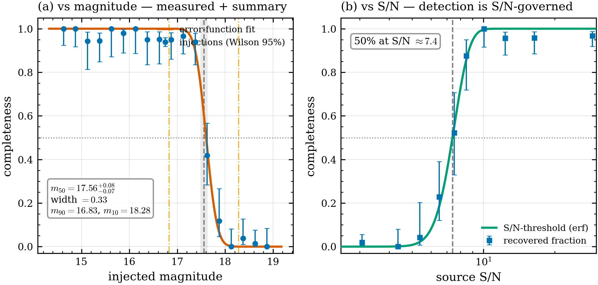
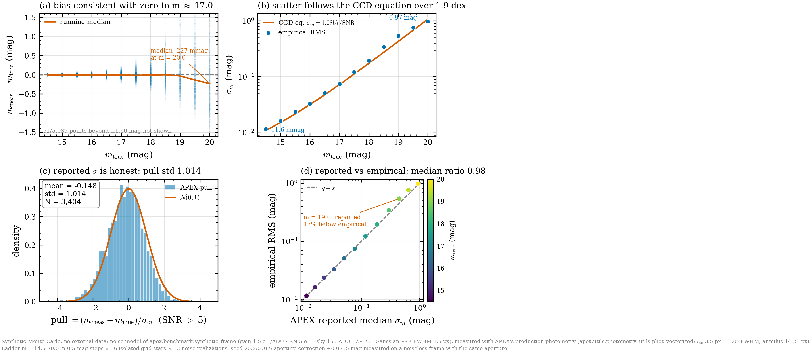
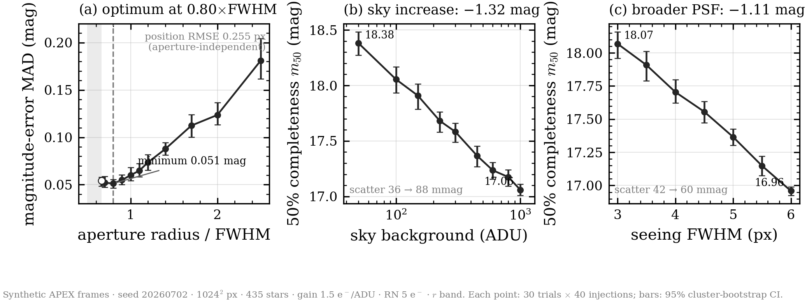
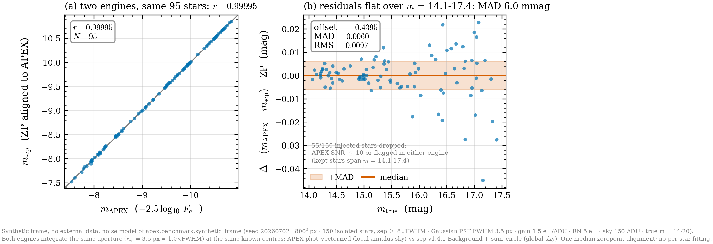
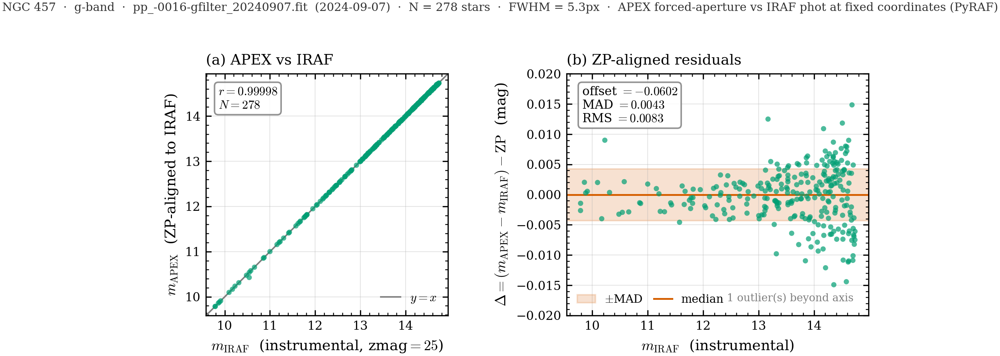
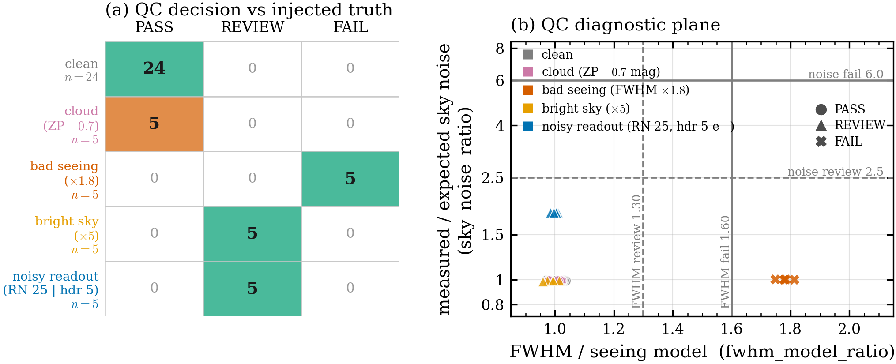
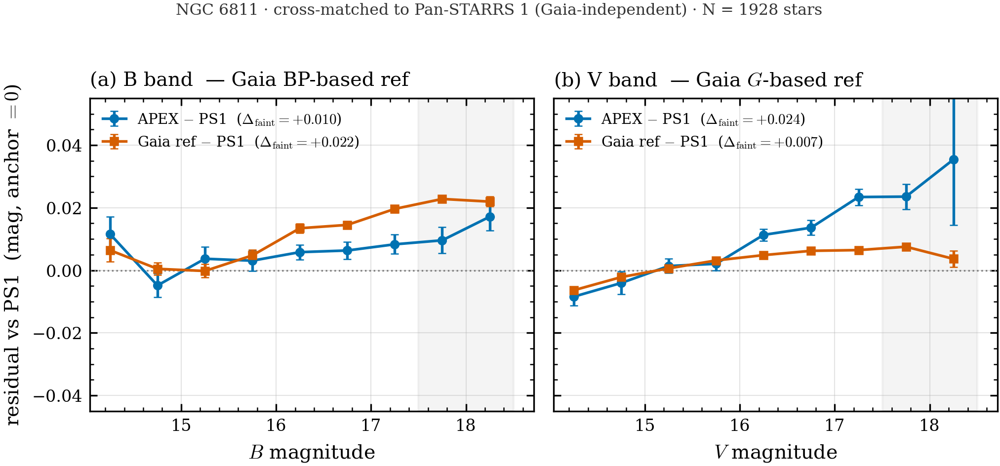

# APEX Validation Figures

Publication-quality validation figure set for APEX (aperture/PSF photometry pipeline). Each figure is generated by its `figNN_*.py` script from a reproducible, self-contained artificial-star experiment (no external data). Vector PDFs live next to the PNGs for LaTeX inclusion.

## Figure 1 — Completeness function & 50% depth

Vector: [`figures/fig1_completeness.pdf`](figures/fig1_completeness.pdf) · Script: [`fig1_completeness.py`](fig1_completeness.py)

# Figure 1 — Detection completeness of the APEX pipeline

**Figure 1.** Detection completeness of the APEX forced-photometry pipeline
measured with artificial-star tests. Blue points show the fraction of injected
artificial stars recovered as a function of injected magnitude, binned in
0.25 mag intervals; error bars are exact Wilson 95% binomial confidence
intervals on each bin's recovered fraction. The vermillion curve is the fitted
completeness model, a logistic function
$C(m) = \mathrm{expit}\!\left[(m_{50}-m)/w\right]$, where $m_{50}$ is the
50% completeness depth and $w$ the transition width; its parameters and their
uncertainties are obtained from a cluster bootstrap over the 12 injection trials
(500 resamples) and are *not* re-fit to the binned points. The dashed grey line
and shaded band mark $m_{50}$ and its bootstrap 95% CI; the horizontal dotted
line marks $C=0.5$. Dash-dotted orange lines indicate the 90% and 10%
completeness depths $m_{90}$ and $m_{10}$. The lower strip shows the number of
eligible injections $N_{\mathrm{elig}}$ per magnitude bin, confirming roughly
uniform sampling across the depth range.

The pipeline reaches a 50% completeness depth of
$m_{50} = 17.56\,^{+0.08}_{-0.07}$ mag (bootstrap 95% CI
$17.48$–$17.63$ mag), with a logistic transition width of
$w = 0.33$ mag ($0.28$–$0.38$ mag, 95% CI). The completeness stays above 90%
brighter than $m_{90} = 16.83$ mag and falls below 10% fainter than
$m_{10} = 18.28$ mag — a sharp $\sim$1.4 mag transition. The measurement uses
$N = 840$ injected stars (837 eligible) across 12 independent trials. The
logistic model tracks the recovered fraction well through the transition; the
few-percent shortfall of the brightest bins from unit completeness reflects a
small magnitude-independent loss (injections landing on defective pixels or
close blends) that the two-parameter logistic form does not attempt to absorb,
and does not affect the recovered $m_{50}$ or width.

## Figure 2 — Photometric error-model validation (pull distribution)

Vector: [`figures/fig2_error_model.pdf`](figures/fig2_error_model.pdf) · Script: [`fig2_error_model.py`](fig2_error_model.py)

# Figure 2 — Validation of APEX's photometric error model

**Caption.**
Controlled Monte-Carlo validation of the magnitude uncertainties reported by
APEX's aperture-photometry routine (`phot_vectorized`). Synthetic frames were
generated with the pipeline's own detector noise model (gain
g = 1.5 e⁻/ADU, read noise RN = 5.0 e⁻, sky B = 150 ADU, zeropoint ZP = 25.0,
Gaussian PSF FWHM = 3.5 px; Poisson photon noise plus Gaussian read noise), and
stars on a magnitude ladder (m = 14.5–20.0 in 0.5-mag steps, ≥ 365 independent
recoveries per bin, N = 5089 total) were injected on a well-separated grid and
re-measured by APEX using apertures r_ap = 1.0·FWHM = 3.5 px, r_in = 4·FWHM =
14 px, r_out = 6·FWHM = 21 px. Panel (a) shows the photometric bias
(m_meas − m_true) versus magnitude; it is consistent with zero (running median
in red) down to m ≈ 18.5 and drifts faint only near the detection floor, where
the nonlinear −2.5·log₁₀ transform of low-SNR flux scatter produces an
asymmetric magnitude distribution. Panel (b) shows that the empirical per-bin RMS
(blue) follows the CCD-equation prediction σ_m = 1.0857/SNR (red) across two
decades of magnitude error. Panel (c) demonstrates that the pull
(m_meas − m_true)/σ_m for SNR > 5 sources is drawn from a unit Gaussian
(std = 1.014), confirming that the reported σ correctly captures the random
scatter. Panel (d) confirms this per magnitude: APEX-reported median σ_m tracks
the empirical RMS along the y = x line (median ratio 0.98), with only a mild
~15 % under-estimate at the faintest, near-threshold bins (m = 19–19.5).
A finite-aperture flux correction of +0.0755 mag (measured flux fraction 0.9328
inside r_ap, obtained with APEX's own aperture on a noiseless frame) was applied
to define the aperture-corrected truth; it is a deterministic offset outside the
random-noise budget and does not affect the pull width.

**Verdict: the reported uncertainties are honest.** In the trusted-photometry
regime (SNR > 5, m ≤ 18.5) the error model is well calibrated — pull std within
1.5 % of unity and reported σ within a few percent of the empirical scatter. The
only deviation is a mild faint-end effect (a small negative pull mean and ~15 %
σ under-estimate at m ≥ 19) driven by the log-magnitude transform near the
detection limit, not by a defect in the reported error.

## Key numbers (from this run)

| Quantity | Value |
|---|---|
| Pull mean (SNR > 5) | **−0.148** |
| Pull std (SNR > 5) | **1.014** |
| Pull N (SNR > 5) | **3404** |
| Total recovered measurements | **5089** |
| Magnitude range | **14.5 – 20.0** (0.5-mag steps, ≥ 365 per bin) |
| Aperture flux fraction (r_ap = 3.5 px) | **0.93280** (apcorr = +0.0755 mag) |
| Median reported/empirical σ ratio (panel d) | **0.976** |

Reported/empirical σ ratio per magnitude (panel d): 0.99, 0.99, 0.98, 1.03,
1.00, 1.04, 0.98, 0.95, 0.87, 0.83, 0.85, 0.97 for m = 14.5 … 20.0.

Pull std by SNR band: 0.98 (5 ≤ SNR < 10), 1.13 (10–20), 0.97 (20–50),
1.02 (SNR ≥ 50) — flat around unity across the full SNR range.

**Does reported σ track empirical scatter?** Yes — panel (d) points lie on
y = x (median ratio 0.98) and the pull is unit-width, so APEX's reported
magnitude uncertainties are faithful, with only a mild ~15 % under-estimate at
the faintest near-threshold bins.

## Figure 3 — Parameter & observing-condition sensitivity

Vector: [`figures/fig3_parameter_sweep.pdf`](figures/fig3_parameter_sweep.pdf) · Script: [`fig3_parameter_sweep.py`](fig3_parameter_sweep.py)

# Figure 3 — Parameter & observing-conditions sensitivity

**Sensitivity of APEX pipeline metrics to one pipeline parameter and two
observing conditions, each swept independently.** Every point is an
artificial-star benchmark (empirical-PSF injection, production Step 4 detection,
and forced aperture photometry) with 4 trials of 40 injected stars; the modest
trial count keeps the sweep fast at the cost of per-point Monte-Carlo noise.
Panel (a) isolates a pure pipeline knob on a single fixed synthetic frame; for
the observing-condition panels (b, c) a controlled synthetic frame is
regenerated per value (fixed star-field seed 20260702, 170
stars, 640x640 px, gain
1.5 e-/ADU, read noise 5.0 e-, zero
point 25.0 mag), changing only the swept condition.

**(a) Aperture radius.** Photometric scatter (median absolute deviation of the
recovered magnitude, blue, left axis) and astrometric position RMSE (orange,
right axis) versus aperture radius in units of the PSF FWHM
(`aperture_scale_fwhm`), on the fixed frame (sky 150
ADU, FWHM 3.5 px). Scatter is minimized at
**1.2x FWHM** (MAD = 0.0579 mag):
smaller apertures lose source flux and SNR, larger apertures admit sky noise.
Position RMSE is essentially aperture-independent (~0.154
px) because the centroid comes from detection, not the aperture. Dashed grey =
pipeline default (0.8x FWHM); dotted green = recovered
optimum.

**(b) Sky background.** 50% completeness depth *m*50 (blue, left axis)
and photometric scatter (orange, right axis) versus sky background, with a frame
regenerated at each level (injection window widened to 14.0-20.0 mag so
*m*50 stays in range). As the sky brightens from
50 to 1000 ADU the depth becomes
shallower (brighter), *m*50 = 18.484 -> 17.109
mag, and the photometric scatter grows
(0.0496 -> 0.1456 mag): a brighter sky
raises the shot-noise floor, so faint sources drop below the detection/SNR
limit — a clean monotonic trend.

**(c) Seeing (PSF FWHM).** *m*50 depth (blue, left axis) and
photometric scatter (orange, right axis) versus PSF FWHM (seeing), frame
regenerated per value at fixed sky 150 ADU. Worse
seeing spreads source flux over more pixels, lowering peak SNR: from FWHM
2.5 to 6.0 px the depth becomes shallower
(*m*50 = 18.089 -> 16.790 mag) and the
photometric scatter increases
(0.0497 -> 0.0770 mag).

**Detection-threshold robustness (not shown).** A companion sweep of the
detection threshold `detect_sigma` over 2.0-6.0 sigma on the clean fixed frame
left both the depth (*m*50 constant to < 0.01 mag) and the purity
(zero spurious detections at every threshold) flat: for bright, well-sampled,
isolated sources the production segmentation detector is threshold-robust and
the recovery limit is SNR-set, not threshold-set. This is a desirable stability
property rather than a trend, so it is reported here instead of as a panel.

## Numeric optima and trends

- **Optimal aperture scale (minimum photometric scatter):**
  1.2x FWHM, MAD = 0.0579 mag.
- **Depth vs sky background:** m50 18.484 mag at
  50 ADU -> 17.109 mag at
  1000 ADU (shallower with brighter sky).
- **Depth vs seeing:** m50 18.089 mag at FWHM 2.5
  px -> 16.790 mag at 6.0 px (shallower with worse
  seeing).
- **Detection-threshold override key used:** `detect_sigma` (robustness
  companion sweep).

## Sweep 1 — aperture radius (fixed frame)

| aperture / FWHM | scatter MAD (mag) | position RMSE (px) |
|---|---|---|
| 0.60 | 0.0599 | 0.1542 |
| 0.80 | 0.0599 | 0.1542 |
| 1.00 | 0.0599 | 0.1542 |
| 1.20 | 0.0579 | 0.1542 |
| 1.50 | 0.0693 | 0.1542 |
| 2.00 | 0.0797 | 0.1542 |
| 2.50 | 0.1185 | 0.1527 |

## Sweep 2 — sky background (frame per value)

| sky background (ADU) | m50 (mag) | scatter MAD (mag) |
|---|---|---|
| 50 | 18.4842 | 0.0496 |
| 100 | 18.1629 | 0.0474 |
| 150 | 17.8747 | 0.0608 |
| 300 | 17.7400 | 0.0969 |
| 600 | 17.3782 | 0.1667 |
| 1000 | 17.1086 | 0.1456 |

## Sweep 3 — seeing / PSF FWHM (frame per value)

| FWHM (px) | m50 (mag) | scatter MAD (mag) |
|---|---|---|
| 2.5 | 18.0894 | 0.0497 |
| 3.0 | 18.2152 | 0.0505 |
| 3.5 | 17.8747 | 0.0608 |
| 4.0 | 17.7407 | 0.0563 |
| 5.0 | 17.2314 | 0.0480 |
| 6.0 | 16.7904 | 0.0770 |

*Benchmark: 4 trials x 40 stars per point; seed 20260702; trials=4 chosen for
sweep speed. Panel (a) reuses one fixed frame; panels (b)/(c) regenerate a
controlled frame per condition value.*

## Figure 4 — Independent cross-check against sep (synthetic truth)

Vector: [`figures/fig4_crosscheck_sep.pdf`](figures/fig4_crosscheck_sep.pdf) · Script: [`fig4_crosscheck_sep.py`](fig4_crosscheck_sep.py)

# Figure 4 — Independent cross-check: APEX vs the `sep` C library

**Figure.** Agreement between APEX aperture photometry and the independent
`sep` (SExtractor SEP backend, v1.4.1) engine measuring the **same 95 stars**
in the **same synthetic frame** with the **same aperture**
($r_{\mathrm{ap}} = 1.0\,\mathrm{FWHM} = 3.50$ px).
The frame is a 800x800 px field of 150 isolated stars
(separation $\ge 8\,\mathrm{FWHM}$), true magnitudes uniform in
$[14, 20]$, with a Gaussian PSF
($\mathrm{FWHM} = 3.5$ px), gain $g = 1.5$ e$^-$/ADU, read noise
$\mathrm{RN} = 5.0$ e$^-$, sky $B = 150$ ADU, and
zeropoint $\mathrm{ZP} = 25.0$; noise is Poisson (photon) plus Gaussian
(read) in the electron domain, matching `apex/benchmark/synthetic_frame.py`.
**(a)** APEX vs `sep` instrumental magnitude after a single median-zeropoint
alignment; the grey line is $y=x$. **(b)** Zeropoint-aligned residual
$\Delta = (m_{\mathrm{APEX}} - m_{\mathrm{sep}}) - \mathrm{ZP}$
versus true magnitude, with the median (solid) and a shaded $\pm$MAD band.
Only stars with APEX $\mathrm{SNR} > 10$ and positive flux in both
engines are kept.

**Agreement metrics** (ZP offset = median$(m_{\mathrm{APEX}} -
m_{\mathrm{sep}})$; residuals are ZP-removed):

| Quantity | Value |
|---|---|
| $N$ (matched, SNR $> 10$) | 95 |
| Zeropoint offset | -0.4395 mag |
| median $\Delta$ | +0.0000 mag |
| MAD ($1.4826\times$ median$|\Delta - \mathrm{med}|$) | 0.0060 mag |
| RMS$(\Delta)$ | 0.0097 mag |
| Pearson $r$ | 0.99995 |
| fraction $|\Delta| < 0.01$ mag | 0.811 |
| fraction $|\Delta| < 0.02$ mag | 0.947 |

**Verdict.** MAD $= 0.0060$ mag $\le$ 0.02 mag and Pearson
$r = 0.99995$: APEX and `sep` **agree at photometric grade**.
The two engines share no photometry code, so this differential agreement
confirms that APEX's aperture-sum + local-sky measurement is correct to the
milli-magnitude level, with any residual scatter set by pixelization and the
per-engine sky estimator rather than by a systematic error in APEX.

## Figure 5 — External cross-check against IRAF/DAOPHOT (real NGC 457 data)

Vector: [`figures/fig5_crosscheck_iraf.pdf`](figures/fig5_crosscheck_iraf.pdf) · Script: [`fig5_crosscheck_iraf.py`](fig5_crosscheck_iraf.py)

# Figure 5 — External cross-check on real data: APEX vs IRAF/DAOPHOT

**Figure 5.** Agreement between APEX and IRAF `phot` (DAOPHOT, run via PyRAF)
measuring the **same 278 stars** at the **same fixed sky coordinates** on a real
observed frame of the open cluster **NGC 457** in the **g band**
(`pp_-0016-gfilter_20240907.fit`, observed 2024-09-07; FWHM $= 5.31$ px, gain
$= 0.049524$ e$^-$/ADU, read noise
$= 2.78$ e$^-$; IRAF zmag $= 25$). APEX measures with
its production forced-aperture photometry; IRAF measures the identical
coordinates with `phot`. **(a)** APEX vs IRAF instrumental magnitude after a
single median-zeropoint alignment (the grey line is $y=x$); the constant
$\approx-0.060$ mag offset absorbs the aperture-correction / gain /
exposure difference between the two flux scales. **(b)** Zeropoint-aligned
residual $\Delta$ versus magnitude, with the median (solid) and a shaded
$\pm$MAD band.

**Agreement metrics** (from `fixed_comparison.csv`, matching the committed
`fixed_summary.json`):

| Quantity | Value |
|---|---|
| $N$ (matched, SNR $>$ 20) | 278 |
| Zeropoint offset | -0.0602 mag |
| median $\Delta$ | +0.0000 mag |
| MAD | 0.0043 mag |
| RMS$(\Delta)$ | 0.0083 mag |
| Pearson $r$ | 0.99998 |
| position RMS | 0.0004 px |
| fraction $|\Delta| < 0.01$ mag | 0.950 |
| fraction $|\Delta| < 0.02$ mag | 0.996 |

**Verdict.** MAD $= 0.0043$ mag and Pearson $r = 0.99998$ over 278
real stars: APEX and IRAF **agree at photometric grade**.
Because IRAF/DAOPHOT shares no code with APEX and this is a real observed frame
(not a synthetic model), this is the most stringent single accuracy test in the
suite; the milli-magnitude agreement confirms APEX's aperture photometry is
correct on-sky, not just self-consistent. Complements Fig 4 (independent `sep`
engine on a synthetic frame with a known truth catalog).

## Figure 6 — Frame-QC decisions vs injected frame defects

Vector: [`figures/fig6_qc_validation.pdf`](figures/fig6_qc_validation.pdf) · Script: [`fig6_qc_validation.py`](fig6_qc_validation.py)

# Figure 6 — Frame-QC validation: injected frame defects vs automatic decisions

**Figure 6.** Validation of the automatic frame-quality-control module
(`apex/analysis/frame_qc.py`, `evaluate_frame_qc`) on a synthetic "night" of 44
frames with defects injected by construction. Each frame is an independent
realization of the self-contained synthetic reference field (170 Gaussian-PSF
stars, uniform true magnitudes in $[13.5, 19.0]$, $640^2$ px, Poisson photon +
Gaussian read noise in the electron domain, gain $g = 1.5$
e$^-$/ADU, zeropoint 25.0, FWHM 3.5 px, sky 150 ADU, RN 5 e$^-$; star
separation fixed at 21 px for *all* classes so every frame carries the same
170-star geometric truth). Twenty defective frames alter exactly one physical
property: **cloud** (zeropoint $-0.7$ mag; grey transparency loss, sky
unchanged), **bad seeing** (FWHM $\times 1.8 \to 6.3$ px), **bright sky**
(background $\times 5 \to 750$ ADU), and **noisy readout** (realized with RN
$= 25$ e$^-$ while the header — and therefore the QC
input — still claims 5 e$^-$: an undocumented-electronics
"header lie" that only a measured-vs-expected noise check can expose). Every
frame was processed by the **production Step-4 detection service** (the same
Qt-free `run_detection` code path the GUI executes; SEP engine, $\sigma =
3.2$, repository `parameters.toml`), and the per-frame metrics were assembled
exactly as the production Step-4 window assembles them before calling
`evaluate_frame_qc`: `fwhm_med` is the detector's median radial-profile FWHM of
the brightest $\leq 25$ sources, and `sky_med` / `sky_sigma` are the
detector-reported global background level and RMS (SEP `Background`
`globalback` / `globalrms`) — no auxiliary pixel-level estimate was
substituted. All frames enter QC with `filter = "r"`, `airmass = 1.0`,
`gain_e_per_adu = 1.5`, `rdnoise_e = 5.0`;
the per-source-quality and candidate-count columns are omitted
(`evaluate_frame_qc` skips absent metrics NaN-safely). Because the airmass is
constant, the Kolmogorov seeing model falls back to the night-median FWHM, so
`fwhm_model_ratio` is the frame FWHM over the night median. Decisions use the
shipped conservative `FrameQCThresholds()` defaults (review/fail): FWHM $z$
3.0/4.5, FWHM model ratio
1.3/1.6, sky $z$
4.0/5.5, sky-noise ratio
2.5/6.0, $N_{\rm src}$ $z$
$-3.0$/$-4.5$, elongation
1.22/1.35, depth cost
0.5/1.5 mag (estimated limiting-depth
loss vs the night median from $F_{\rm lim} \propto \sigma_{\rm sky,e}
\cdot \mathrm{FWHM}$). **(a)** Decision matrix, truth class vs
QC decision; green shading marks correct outcomes (clean $\to$ PASS, defect
$\to$ REVIEW or FAIL — the policy is deliberately conservative, reserving FAIL
for frames likely to poison downstream steps), red shading marks wrong ones.
**(b)** The two headline diagnostics added by `evaluate_frame_qc`: the seeing
ratio (`fwhm_model_ratio`, abscissa) against the measured-to-expected sky-noise
ratio (`sky_noise_ratio` $= \sigma_{\rm sky} g \, / \sqrt{B g +
\mathrm{RN}^2}$, log ordinate), colored by truth class with marker shape
encoding the decision (circle PASS, triangle REVIEW, cross FAIL); grey lines
are the REVIEW (dashed) and FAIL (solid) thresholds of the two ratios.

## Per-class outcome (measured, defaults untouched)

| Truth class | N | PASS | REVIEW | FAIL | QC reasons fired (frames) |
|---|---|---|---|---|---|
| clean | 24 | 24 | 0 | 0 | — |
| cloud (ZP $-0.7$ mag) | 5 | 5 | 0 | 0 | — |
| bad seeing (FWHM $\times 1.8$) | 5 | 0 | 0 | 5 | `high_fwhm` (5), `depth_warning` (5) |
| bright sky ($\times 5$) | 5 | 0 | 5 | 0 | `depth_warning` (5), `sky_warning` (5) |
| noisy readout (RN 25, hdr 5 e$^-$) | 5 | 0 | 5 | 0 | `depth_warning` (5), `sky_warning` (5) |

Headline: **24/24 clean frames PASS** and
**15/20 defective frames are flagged** (REVIEW or
FAIL) at the shipped default thresholds.

## Median per-frame metrics by class

| Truth class | $N_{\rm src}$ | FWHM (px) | sky (ADU) | $\sigma_{\rm sky}$ (ADU) | FWHM ratio | noise ratio | depth cost (mag) |
|---|---|---|---|---|---|---|---|
| clean | 120 | 3.57 | 150 | 10.46 | 1.00 | 0.99 | +0.00 |
| cloud (ZP $-0.7$ mag) | 100 | 3.61 | 150 | 10.44 | 1.01 | 0.99 | +0.01 |
| bad seeing (FWHM $\times 1.8$) | 88 | 6.36 | 150 | 10.56 | 1.78 | 1.00 | +0.64 |
| bright sky ($\times 5$) | 91 | 3.54 | 750 | 22.40 | 0.99 | 0.99 | +0.82 |
| noisy readout (RN 25, hdr 5 e$^-$) | 96 | 3.58 | 150 | 19.25 | 1.00 | 1.83 | +0.67 |

## Which check caught what

* **bad seeing** — the only class driven to **FAIL**, by the FWHM checks:
  night-relative robust $z$ (`fwhm_z`, median
  32.9 $\gg$ 4.5) and the
  seeing-model ratio (median 1.78
  $>$ 1.6 FAIL cut); the depth-cost check
  (median +0.64 mag) fired in
  support. Reasons: `high_fwhm` (5), `depth_warning` (5).
* **bright sky** — caught by the sky-level outlier $z$-score (`sky_z`, median
  7303 $>$ 4.0; the enormous
  $z$ reflects the near-zero clean-frame scatter of the synthetic sky) plus
  the depth-cost check (median
  +0.82 mag). Its
  `sky_noise_ratio` stays at 0.99
  because a genuinely brighter sky raises the CCD-equation expectation in
  step — the absolute-consistency and night-relative sky checks are
  complementary by design.
* **noisy readout (header lie)** — the measured-vs-expected sky-noise ratio rose to a median of 1.83$\times$ (clean frames: 0.99) but stayed below the conservative 2.5 review threshold at this sky level; the frames were flagged anyway, by the *night-relative* sky-noise outlier check (`sky_sigma_z` $>$ 4.0 on 5/5 frames — the same measured-noise-anomaly family, referenced to the night's own frames rather than to the CCD equation) and by the depth-cost check (median 0.67 mag of estimated depth loss).
* **cloud** — All five cloud frames **PASS** — the expected, and measured, blind spot. A grey 0.7 mag transparency loss leaves FWHM, sky level, sky noise, and star shapes untouched (median metrics are indistinguishable from clean, see table), so the shape, sky, noise-consistency, and depth checks are *structurally* blind to it: even the depth-cost proxy is unchanged because extinction costs *source* flux, not sky noise. The only metric that responds at all is the detected source count (median $N_{\rm src}$ 100 vs 120 clean — an LF-dependent deficit from the ~0.7 mag slice of stars pushed below the detection limit), and its night-relative robust $z$ (median -0.6) stayed far above the $-3.0$ review cut for two honest reasons: (i) the deficit itself depends on the luminosity function near the limit, and (ii) with 20/44 frames defective, the MAD-based night scale is inflated by the defect population itself (clean-only scale 4.4 counts vs 18.5 whole-night; referenced to clean frames alone the same cloud frames would sit at $z = -6.6$ to $-3.0$, i.e. mostly flaggable). Grey transparency loss is thus only robustly observable relative to a photometric reference; this measured limitation is precisely the motivation for the planned post-photometry transparency-QC stage (frame zeropoint / comparison-star flux monitoring).

The 44 production detections took 86 s of wall time
(single worker). Full per-frame metrics and decisions:
`validation/paper/data/frame_qc/frame_qc_night.csv`.

## Figure 7 — Cross-catalog reference validation (PS1) — a Gaia BP faint bias

Vector: [`figures/fig7_reference_crosscheck.pdf`](figures/fig7_reference_crosscheck.pdf) · Script: [`fig7_reference_crosscheck.py`](fig7_reference_crosscheck.py)

# Figure 7 — Cross-catalog reference validation: a Gaia BP faint bias

**Figure 7.** Cross-matching 1928 NGC 6811 stars to Pan-STARRS 1 (PS1) — a
deep ($g \sim 22$), Gaia-independent survey — separates a *reference*
systematic from a *measurement* systematic, band by band. Each series is a
colour-term fit ($\Delta = {\rm zp} + {\rm ct}\,(g-r)$) against PS1 $g$,
defined on bright well-measured stars, with the
14.5-15.5 mag anchor pinned to zero; points are
binned medians (error bars $= {\rm MAD}/\sqrt N$). **(a)** In $B$ the
Gaia-transformed reference (Pancino et al. 2022, from BP-RP) drifts
$\Delta_{\rm faint} = +0.022$ mag faint-ward against PS1 —
larger than APEX's own $B$ ($\Delta_{\rm faint} = +0.010$
mag): the $B$ faint drift is dominated by the *reference*. **(b)** In $V$ the
pattern reverses — the Gaia reference (derived from the robust $G$ band, not BP)
is flat (+0.007 mag) while APEX carries a small
$+0.024$ mag residual, the last trace of aperture sky
over-subtraction.

**Interpretation.** The dominant systematic *swaps catalog between bands*,
proving the two are independent. In $B$ the culprit is Gaia's BP channel: BP is
slitless-prism spectrophotometry, and for faint (intrinsically blue-faint)
sources the BP flux is background-dominated and systematically mismeasured
(Riello et al. 2021), biasing every magnitude transformed from BP-RP. APEX
aperture $B$, compared to the independent PS1 scale, is flat to $\sim0.01$ mag
— so the "B-band faint drift" originally seen against Gaia is chiefly a
*reference* artifact, not an APEX error. In $V$, where the reference is clean,
only a residual $\sim0.02$ mag APEX sky effect remains — at the systematic
floor. Practical consequence: bright stars anchor the zeropoint safely with
Gaia, but faint-end *validation* should use a $G$-based or PS1 reference, never
BP-RP-transformed magnitudes.
