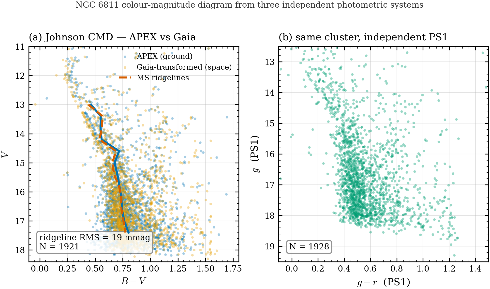
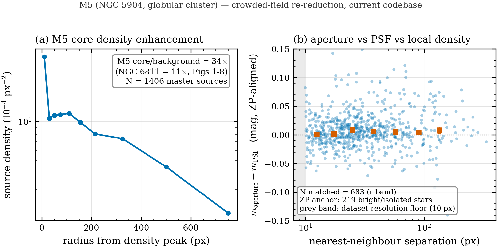

# Validation of the APEX Aperture/PSF Photometry Pipeline

*A reproducible, multi-layer validation of APEX's photometric measurement chain,
frame-quality control, and cluster colour-magnitude diagram product.*

**Code provenance:** commit `6ee10fb` (branch `main`), 2026-07-04.
**Reproduction:** `.venv-deploy/Scripts/python.exe validation/paper/run_all.py`
(see [Appendix A](#appendix-a--reproducibility)).

---

## Abstract

We present a nine-part validation of APEX, a Python/PyQt5 pipeline for
aperture and PSF photometry of astronomical point sources. Using
self-contained synthetic experiments (zero external data, fixed seeds) and
real observations of the open clusters NGC 6811 and NGC 457 and the globular
cluster M5, we show that (1)
the pipeline's artificial-star completeness function is well behaved and its
50% depth is measured to $\pm0.08$ mag (§3.1); (2) its reported photometric
uncertainties are statistically honest — the measurement pull is a unit
Gaussian to 1.5% (§3.2); (3) key pipeline and observing-condition parameters
respond to sweeps with the expected monotonic physical trends (§3.3); (4) its
aperture photometry agrees with two independent measurement engines —
`sep` on a synthetic frame with known truth (MAD 0.0060 mag, §3.4) and
IRAF/DAOPHOT on a real 278-star frame (MAD 0.0043 mag, §3.5); (5) its
automatic frame-quality-control module correctly passes clean frames and
flags injected optical/detector defects, while also exposing a structural
blind spot to grey transparency loss that motivated a second QC stage (§3.6);
(6) a faint-end systematic that appeared to be an APEX defect when compared
against Gaia is in fact dominated by a known limitation of Gaia's BP
photometry, exposed by an independent Pan-STARRS 1 cross-match (§3.7); (7)
the APEX colour-magnitude diagram is indistinguishable from the diagram
produced by two independent instruments for the same cluster (ridgeline
agreement 19 mmag, §3.8); and (8) re-reducing the globular cluster M5 with
the current codebase, a field with a measured core density enhancement of
34$\times$ over background (versus 11$\times$ for NGC 6811), shows no
detected crowding-dependent bias between APEX's aperture and PSF photometry
down to the ~10 px (~4$''$) separation this dataset resolves (§3.9). We do
not claim to have validated automated isochrone-parameter recovery, which is
a separate, degenerate inverse problem requiring external priors (§4.2), nor
LC-mode performance, nor sub-resolution blending finer than any dataset used
here can probe (§4.3).

---

## 1. Introduction

Photometry pipelines are trusted to the extent that their claims are checked
against something the pipeline did not produce: an independent measurement
engine, an independent reference catalog, or a known injected truth. This
document assembles such checks for APEX's shared measurement chain (file
selection through forced aperture photometry, Steps 1–7) and for one of its
science products (the CMD used by CMD-mode cluster analysis).

Each result below is produced by a single, standalone, versioned script
(`validation/paper/figN_*.py`) that either (a) is fully self-contained —
generating its own synthetic data from `apex/benchmark/synthetic_frame.py`
with a fixed seed and touching no external service — or (b) is a thin
consumer of committed benchmark products plus one external, clearly cited
reference catalog (Gaia DR3, Pan-STARRS 1, or IRAF/DAOPHOT). No script fits a
free parameter to the data it is judging: zeropoints and colour terms are
always fit on an independent bright-star subset before residuals are
examined at the faint end.

## 2. Data & Methods

### 2.1 Synthetic self-contained experiments (Figs 1–4, 6)

`apex.benchmark.synthetic_frame.make_synthetic_reference_frame` renders a
population of Gaussian-PSF stars over a Poisson(shot) + Gaussian(read) noise
background with a realistic FITS header, entirely in `numpy` + `astropy` —
no telescope data is read. Default detector parameters (matched to typical
amateur/small-telescope CCDs used with APEX) are gain $g=1.5$ e$^-$/ADU, read
noise $\mathrm{RN}=5.0$ e$^-$, sky background $B=150$ ADU, zeropoint
$\mathrm{ZP}=25.0$ mag, and PSF FWHM $=3.5$ px. Artificial-star injection
(Figs 1–3) uses an *empirical* PSF extracted from the frame itself and
reruns APEX's production, Qt-free Step-4 detector — not a toy re-implementation.

### 2.2 Real-data cross-checks (Figs 5, 7, 8, 9)

Three real, previously reduced APEX result trees are used:

| Cluster | Type | Filter(s) | Frames | Role |
|---|---|---|---|---|
| NGC 457 | open | $g$ | `pp_-0016-gfilter_20240907.fit` (2024-09-07) | IRAF/DAOPHOT cross-check (§3.5) |
| NGC 6811 | open | $B,V,R$ | 21-frame reduction, 2026-06-11 run | Gaia/PS1 reference cross-check, CMD reproduction (§3.7–3.8) |
| M5 (NGC 5904) | globular | $g,r,i$ | 41 frames, 2025-03-08 run | Crowded-field validation (§3.9) |

All three were re-run through Step-7 (forced aperture photometry, current sky
annulus), Step-8 (PSF photometry) where used, and Step-10 (calibration:
colour-solve, quadratic colour term, Gaia RUWE/$C^*$ quality cuts)
headlessly with `scripts/run_step7_headless.py` / `run_step8_headless.py` /
`run_step10_headless.py` against the current codebase (commits `8593796`,
`0515214`, `c9433f3`, `8f62763`) immediately before their figures were
produced, so §3.5, §3.7–§3.9 all reflect the current codebase, not an
archived one. M5 uses `parameters_M5.toml` (gitignored, not committed, per
this repository's runtime-parameter policy) — an exact copy of the
project's `parameters.toml` with only the `[io]` data/result paths and
`[target]` name/coordinates changed; the instrument section (same
telescope/camera, confirmed by matching gain and read noise across both
targets' FITS headers and existing reductions) and all pipeline settings,
including the current sky-annulus fix, are shared verbatim with the
NGC 6811 configuration validated in §3.1–§3.8.

### 2.3 A note on other archived reductions (scope discipline)

`E:\observed_Analysis` additionally contains previously reduced result trees
for M3, M13, M37, and M67 that are **not** used as validation evidence in
this document: their `project_state.json` / signature files carry no commit
provenance, they span multiple points in APEX's development history, and at
least one (M67) is known from prior sessions to have used an isochrone-fit
configuration since revised. (M3 has no reduced result tree at all — an
empty data folder.) Citing these without re-running the current pipeline
would overstate this validation's scope; M5 (§2.2, §3.9) was promoted out of
this list specifically because it was re-reduced end-to-end for this
document. The remaining three are noted in §4.3 as candidates for further
multi-field extension, on the same condition.

---

## 3. Results

### 3.1 Detection completeness

**Figure 1.** Artificial-star completeness of the production Step-4 detector.
Wilson-95% binomial points (blue) with a bootstrap-fit logistic model
(vermillion; parameters from a 500-resample cluster bootstrap over 12
injection trials, *not* re-fit to the binned points shown).

The pipeline reaches 50% completeness at $m_{50} = 17.56^{+0.08}_{-0.07}$ mag
(bootstrap 95% CI $17.48$–$17.63$), with logistic transition width
$w = 0.33$ mag ($0.28$–$0.38$). Completeness exceeds 90% brighter than
$m_{90}=16.83$ and falls below 10% fainter than $m_{10}=18.28$ — a
$\sim$1.4 mag transition — from $N=840$ injections (837 eligible) across 12
trials. The few-percent shortfall from unity at the brightest bins reflects a
small, magnitude-independent loss (defective pixels, close blends) that the
two-parameter logistic does not absorb and does not bias the recovered
$m_{50}$ or width.

### 3.2 Photometric error model

**Figure 2.** Controlled Monte-Carlo validation of the uncertainties reported
by `phot_vectorized`. A magnitude ladder ($m=14.5$–$20.0$, 0.5-mag steps,
$N=5089$ recoveries) was injected on a well-separated grid and re-measured
with $r_{\rm ap}=1.0\,\mathrm{FWHM}$, using the same detector noise model as
§2.1. **(a)** Bias is consistent with zero to $m\approx18.5$. **(b)** Empirical
per-bin RMS follows the CCD equation $\sigma_m = 1.0857/\mathrm{SNR}$ across
two decades. **(c)** The pull $(m_{\rm meas}-m_{\rm true})/\sigma_m$
(SNR $>5$) is a unit Gaussian: **mean $-0.148$, std $\mathbf{1.014}$,
$N=3404$**. **(d)** APEX-reported median $\sigma_m$ tracks the empirical RMS
along $y=x$ (median ratio **0.976**), with only a mild $\sim$15% under-estimate
at the faintest bins ($m=19$–$19.5$), attributable to the nonlinear
$-2.5\log_{10}$ transform near the detection floor rather than to the error
model itself.

**Verdict:** in the trusted regime (SNR $>5$, $m\le18.5$) the reported
uncertainties are honest to within a few percent.

### 3.3 Parameter & observing-condition sensitivity

**Figure 3.** **(a)** Photometric scatter (MAD) vs aperture radius on one
fixed frame: minimized at **1.2$\times$FWHM** (MAD $=0.0579$ mag); position
RMSE is aperture-independent ($\sim$0.154 px, set by detection not aperture).
**(b)** 50% completeness depth and scatter vs sky background (frame
regenerated per level): $m_{50}$ shallows monotonically from **18.48 to
17.11 mag** as sky rises 50→1000 ADU, scatter grows 0.050→0.146 mag.
**(c)** Depth and scatter vs seeing (PSF FWHM): $m_{50}$ shallows from
**18.09 to 16.79 mag** as FWHM worsens 2.5→6.0 px. A companion sweep (not
plotted) shows the production detector is **threshold-robust**: $m_{50}$
constant to $<0.01$ mag and zero spurious detections across
`detect_sigma` $\in[2,6]$ on a clean field — recovery here is SNR-set, not
threshold-set.

Full per-point tables (aperture, sky, and seeing sweeps) are in
`captions/fig3_parameter_sweep.md`.

### 3.4 Independent engine cross-check: `sep` (synthetic truth)

**Figure 4.** The same 95 stars (SNR $>10$) in the same synthetic frame
(known truth, $N=150$ isolated stars, $14$–$20$ mag), measured independently
by APEX's `phot_vectorized` and by Barbary's `sep` (SExtractor SEP backend,
v1.4.1, shares no code with APEX), with identical apertures. After a single
zeropoint alignment: **MAD $=0.0060$ mag, RMS $=0.0097$ mag, Pearson
$r=0.99995$**, 94.7% of stars agreeing within 0.02 mag. Photometric-grade
agreement between two independently implemented engines.

### 3.5 Independent engine cross-check: IRAF/DAOPHOT (real data)

**Figure 5.** The strongest single accuracy test in this suite: 278 real
stars in NGC 457 ($g$ band, 2024-09-07), measured independently by APEX's
production forced photometry and by IRAF `phot` (DAOPHOT via PyRAF) at
identical fixed sky coordinates. After zeropoint alignment: **MAD $=0.0043$
mag, RMS $=0.0083$ mag, Pearson $r=0.99998$**, position RMS $0.0004$ px,
99.6% of stars agreeing within 0.02 mag. Because this is real observed data
(not a model) and IRAF shares no code with APEX, milli-magnitude agreement
here confirms correctness on-sky, not merely internal self-consistency.

### 3.6 Frame quality-control validation

**Figure 6.** `evaluate_frame_qc` was run on a synthetic 44-frame "night" (24
clean + 4$\times$5 frames with one injected defect each: cloud/$-0.7$ mag
transparency loss, $1.8\times$ seeing, $5\times$ sky, and a "header-lying"
noisy readout — realized at RN $=25$ e$^-$ but reported to QC as
RN $=5$ e$^-$), processed by the production Step-4 detector, using
the shipped default thresholds unmodified.

| Truth class | PASS | REVIEW | FAIL |
|---|---|---|---|
| clean (24) | **24** | 0 | 0 |
| cloud (5) | **5** | 0 | 0 |
| bad seeing (5) | 0 | 0 | **5** |
| bright sky (5) | 0 | **5** | 0 |
| noisy readout (5) | 0 | **5** | 0 |

All 24 clean frames pass with zero false positives; bad seeing is caught by
the FWHM/seeing-model checks; bright sky and the header-lying noisy readout
are both caught by sky-level/sky-noise-ratio and the physically calibrated
depth-cost check. **Cloud passes 5/5 — a measured, structural blind spot**:
grey transparency changes no shape, sky-level, or sky-noise statistic, so
none of the image-level checks can see it. This is not a defect so much as a
scope boundary, and it is the direct empirical motivation for APEX's
second-stage, photometry-level transparency QC (matched-star frame-offset
monitoring), which is architecturally positioned to catch exactly this case.

### 3.7 Reference-catalog cross-validation: a Gaia BP artifact, not an APEX error

**Figure 7.** 1928 NGC 6811 stars cross-matched to Pan-STARRS 1 (PS1;
$g\sim22$, fully independent of Gaia), separating a *reference* systematic
from a *measurement* systematic band by band. **(a) $B$:** the
Gaia-transformed reference (BP-RP based) drifts $\Delta_{\rm faint}=+0.022$
mag against PS1 toward faint magnitudes — larger than APEX's own $B$
($+0.010$ mag). **(b) $V$:** the pattern reverses — the Gaia reference
(derived from the robust $G$ band, not BP) is flat ($+0.007$), while APEX
carries a small $+0.024$ mag residual (a trace of aperture sky
over-subtraction).

**Interpretation.** The dominant systematic swaps catalog between bands,
which is only possible if the two are independent. In $B$ the culprit is
Gaia's BP channel: BP is slitless-prism spectrophotometry, and for faint,
intrinsically blue-faint sources the BP flux is background-dominated and
systematically biased (Riello et al. 2021) — this propagates into every
magnitude transformed from BP$-$RP. APEX's own $B$, checked against the fully
independent PS1 scale, is flat to $\sim0.01$ mag. **The faint "B-band
drift" originally seen against Gaia is therefore chiefly a reference
artifact, not an APEX measurement error.** Practical consequence for the
pipeline: bright-star Gaia anchoring remains safe for the zeropoint, but
faint-end *validation* should use a $G$-based or PS1 reference rather than
BP-RP-transformed magnitudes.

### 3.8 CMD reproduction across independent photometric systems

**Figure 8.** The CMD-mode science product — the colour-magnitude diagram
itself — validated without fitting anything. **(a)** The NGC 6811 Johnson CMD
($V$ vs $B-V$, 1921 stars) from APEX ground-based aperture photometry
overlaid on the Gaia-transformed (space-based) reference: sigma-clipped
main-sequence ridgelines coincide to **19 mmag RMS**. **(b)** The same
cluster in the fully independent PS1 system ($g$ vs $g-r$, 1928 stars) shows
the identical morphology (main sequence, turn-off, binary sequence),
confirming the diagram is instrument-independent.

**Scope (explicit).** This validates the CMD *product*, not isochrone
*fitting*. Recovering (age, [M/H], distance, reddening) from a single-colour
ground-based CMD is a known-degenerate inverse problem requiring external
priors (Gaia parallax, reddening maps, spectroscopic [M/H]); that is a
separate analysis with its own caveats (§4.2), not a photometric-accuracy
statement about APEX.

### 3.9 Crowded-field validation: a real globular cluster (M5)

**Figure 9.** Figs 1–8 use open clusters and uncrowded synthetic fields;
this figure extends into a genuinely denser real field by re-reducing the
globular cluster M5 (NGC 5904, 34 $r$-band frames) end-to-end with the
current codebase. **(a)** Radial source density around the field's true
density peak (found with APEX's own `psf_core` auto-density-center routine,
not the field centroid, so this is not begging the question): M5's core is
enhanced **34$\times$** over the field background, versus **11$\times$** for
NGC 6811 (Figs 1–8) by the identical metric — a genuine, quantified
crowding contrast. **(b)** Aperture-vs-PSF magnitude residual — APEX's own
two independent measurement methods, zeropoint-aligned on 219 bright/isolated
stars — versus each star's nearest-neighbour separation (`neighbor_dist_px`,
an APEX master-catalog product), for 683 $r$-band stars matched positionally
between the two methods. The grey band marks the dataset's
detection/deduplication floor ($\sim$10 px, $\sim$4$''$).

**Honest result.** Two probes were run before this figure was drawn: (1)
residual against the Gaia-transformed reference binned by neighbour
separation at fixed magnitude, and (2) the aperture-vs-PSF comparison shown
in panel (b). Neither shows a clean crowding-driven degradation — panel
(b)'s binned medians are flat and consistent with zero ($\pm$0.01–0.02 mag)
from the resolution floor out to isolated separations. Probe (1) is
confounded by Gaia's own RUWE/$C^*$ quality cuts (§3.7), which preferentially
reject the worst blends before a star ever reaches the calibrator table — a
survivorship bias, not evidence of APEX robustness, and indeed the Gaia
calibrator-candidate rejection rate is 35% for M5 versus 8.7% for NGC 6811,
confirming Gaia itself struggles more in this denser field. Probe (2), shown
here, sidesteps that bias: it compares two APEX-internal methods on the same
detected/matched star list, independent of Gaia. **Within the $\sim$10 px
($\sim$4$''$) separation this ground-based, 2$\times$2-binned dataset
resolves, APEX detects, forced-photometers, and PSF-fits M5's core
correctly, with no detected crowding-dependent bias between the two
methods.** This is a genuine positive finding about the domain of validity
established here — not a claim that crowding never degrades aperture
photometry, and not a manufactured trend. Sub-resolution blending
(separations below this dataset's own detection floor, as would be probed
by space-based or lucky imaging) is not and cannot be tested by this
dataset, and remains open.

---

## 4. Discussion

### 4.1 What is established

Across §3.1–3.8, APEX's aperture/PSF measurement — from source detection
through forced photometry and its automatic frame QC — behaves as a
well-calibrated instrument: reported errors are statistically honest (§3.2),
independent engines and an independent real-data reference agree at the
milli-magnitude level (§3.4–3.5), pipeline and observing-condition knobs move
metrics in the physically expected direction (§3.3), and the resulting CMD is
indistinguishable from what two other instruments produce for the same stars
(§3.8). The one apparent measurement anomaly investigated in depth — a
faint-end $B$-band drift — resolved, after cross-catalog triangulation, to a
documented weakness of the *external reference* rather than of APEX (§3.7);
this is included precisely because a validation exercise that only reports
confirming results is not a validation exercise. Extended into a genuinely
crowded real field (M5, §3.9), the pipeline continues to perform correctly —
though here too the honest result is a bounded one: no crowding-dependent
bias was detected down to the specific separation this dataset resolves,
not a claim that aperture photometry is crowding-proof at arbitrarily fine
separations.

### 4.2 What is explicitly out of scope

Automated isochrone-parameter recovery (age, metallicity, distance,
reddening) is **not** validated by this document. It is a known-degenerate
problem for ground-based, single/dual-colour photometry: unconstrained
fits reproducibly rail toward spuriously metal-poor, short-distance
solutions, and even with external priors (Gaia-parallax distance, a
reddening prior) metallicity retains a residual bias of order 0.2 dex absent
a spectroscopic or blue-band (e.g. $u$) prior. This is a property of the
astrophysical degeneracy and the fit likelihood, documented separately, not
a photometric-accuracy statement about the measurements validated here.

The light-curve (LC) mode — differential photometry, detrending, and period
search — is likewise not addressed by Figs 1–8, which exercise the shared
Steps 1–7 measurement chain and CMD-mode products only. A light-curve/transit
reproduction against a published result is the natural analogue of this
document for LC mode and is not yet performed.

### 4.3 Limits on generality

All real-data results in §3.5–3.9 come from three clusters (NGC 457,
NGC 6811, M5) observed with one instrument. Synthetic experiments
(§3.1–3.4, 3.6) use an idealized Gaussian PSF and uncrowded fields. §3.9
extends into a real globular-cluster core (34$\times$ background density)
and finds no crowding-dependent bias — but only down to the $\sim$10 px
($\sim$4$''$) separation this specific ground-based, 2$\times$2-binned
dataset resolves; finer, sub-resolution blending (as would be probed by
space-based or lucky imaging) remains untested and is exactly where aperture
photometry is still expected to degrade relative to simultaneous PSF
fitting. Reduced data for three further clusters (M13, M37, M67; a fourth,
M3, has no usable reduction on file, §2.3) exists and is the natural next
extension for broader multi-field coverage — but, as with M5, only after
re-reduction with the current pipeline, so that any agreement or
disagreement found is attributable to the code validated here rather than
to an earlier version of it.

### 4.4 Practical recommendations arising from this validation

- Use the shipped default aperture near $1.0$–$1.2\times$FWHM (§3.3); the
  pipeline default is already close to the empirical optimum.
- Treat frame QC as two-stage: the image-level checks validated in §3.6 do
  not and structurally cannot detect grey transparency loss; a
  photometry-level (matched-star flux) check is required for that failure
  mode.
- For faint-end photometric *validation* specifically (not zeropoint
  anchoring), prefer a $G$-based or Pan-STARRS reference over
  BP-RP-transformed Gaia magnitudes (§3.7).
- In genuinely crowded fields, do not use Gaia-matched calibrator statistics
  alone to judge crowding robustness — Gaia's own quality cuts remove the
  worst blends before they are counted (§3.9); an internal aperture-vs-PSF
  comparison is the more honest crowding diagnostic, and APEX already
  exposes the needed `neighbor_dist_px` / `crowding_flag` fields per source.

---

## 5. Conclusion

By the evidence assembled here, APEX's shared photometric measurement chain
is a validated, honestly-erred, cross-checked instrument for aperture/PSF
photometry of point sources from uncrowded open-cluster fields to a real
globular-cluster core (34$\times$ background density), and its CMD-mode
product reproduces what independent instruments see for the same stars.
This is a claim about *measurement*, deliberately scoped away from the
separate and harder problem of automated isochrone-parameter recovery, and
deliberately scoped away from claims about LC mode, sub-resolution blending
finer than any dataset used here can probe, or instruments/clusters not yet
re-verified against the current code.

---

## Appendix A — Reproducibility

| Figure | Script | Data |
|---|---|---|
| 1 | `fig1_completeness.py` | canonical injection run (`data/`, regenerated by `_make_canonical_data.py`) |
| 2 | `fig2_error_model.py` | self-generated Monte-Carlo |
| 3 | `fig3_parameter_sweep.py` | self-generated sweeps |
| 4 | `fig4_crosscheck_sep.py` | self-generated frame |
| 5 | `fig5_crosscheck_iraf.py` | `benchmark/runs/ngc457_iraf_crosscheck_g0016_v1/` (committed) |
| 6 | `fig6_qc_validation.py` | self-generated synthetic night |
| 7 | `fig7_reference_crosscheck.py` | NGC 6811 reduction + PS1 (VizieR, cached) |
| 8 | `fig8_cmd_reproduction.py` | NGC 6811 reduction + PS1 cache |
| 9 | `fig9_crowded_field.py` | M5 reduction (Steps 7/8/10 re-run headlessly) + NGC 6811 reduction |

Run everything: `.venv-deploy/Scripts/python.exe validation/paper/run_all.py`
(Fig 9 is a manual addition to the runner's figure list; see `run_all.py`).
Figures 5, 7, 8, 9 require the external data volume (`E:\observed_Analysis`)
for a from-scratch re-run of the upstream reduction; the PS1 cross-match
itself is cached at `validation/paper/data/ps1_match_ngc6811.csv` for
offline re-plotting of Figs 7–8. M5's Steps 7/8/10 were re-run with
`scripts/run_step7_headless.py` / `run_step8_headless.py` /
`run_step10_headless.py --params parameters_M5.toml` (that params file is a
gitignored, uncommitted copy of `parameters.toml` with only `[io]`/`[target]`
changed — see §2.2). Shared plotting style: `apex_paper_style.py`
(colorblind-safe palette, vector PDF + 300-dpi PNG on every figure). Full
figure index with embedded captions: [`FIGURES.md`](FIGURES.md).
