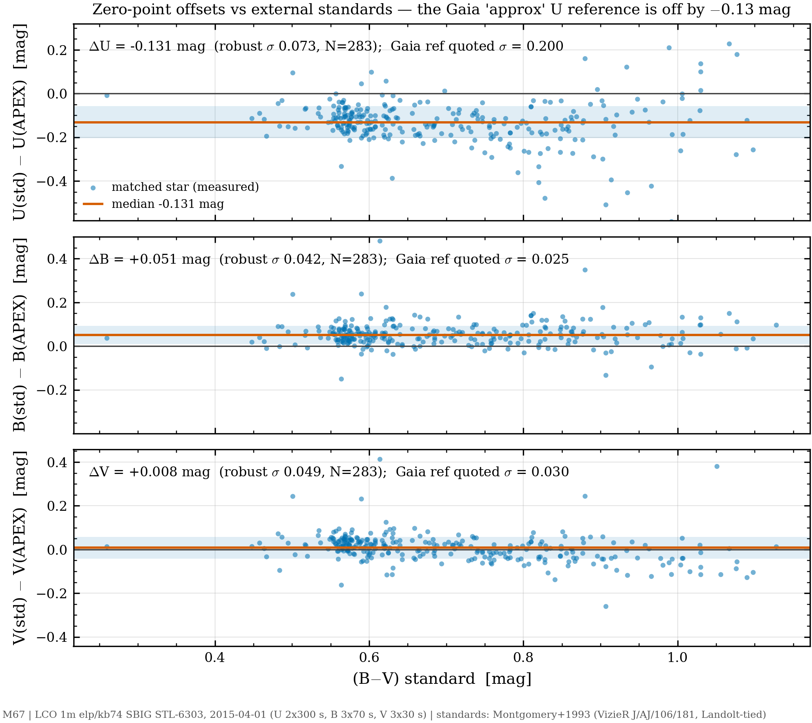
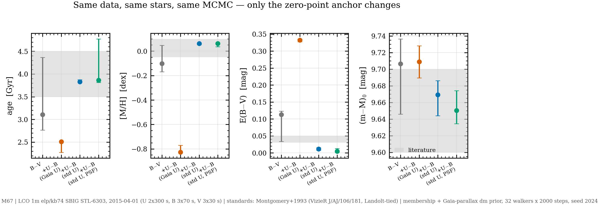

# U−B 를 넣으면 나이–금속함량 축퇴가 풀리는가 — 실측 결과

**2026-07-30** · 자료: LCO 1m elp / kb74 = SBIG STL-6303 (0.2335″/px) ·
**M67 을 같은 밤에 U·B·V 로 찍은 유일한 공개 세트** (2015-04-01, U×2 300 s +
B×3 70 s + V×3 30 s, archive.lco.global) · 보정: APEX 산술 + 우주선 제거
(BANZAI 대조 U 2.6% · B 1.5% · V 2.6%)

## 왜 해봤나

B−V 단일 색으로는 나이와 금속함량이 축퇴한다. 금속함량을 낮추면 등시선이
파래지고, 나이를 늘려 그것을 상쇄하면 거의 같은 CMD 가 나온다. APEX 의 Step 12
GUI 도 이 경우 경고를 띄운다:

> `[MCMC] note: no blue/UV colour (u-g, U-B) -> [M/H] is degenerate; rely on the [M/H] prior`

U−B 는 금속선 blanketing 에 민감해 이 축퇴를 푸는 고전적 수단이다. 실제로 우리
자료에서 [M/H] 가 사전분포를 1.7σ 밀어내고 금속결핍 쪽으로 rail 했으므로
(`REPORT_M67_CROSS.md` §2), U 를 구해 확인할 값어치가 있었다.

**코드에 Johnson U 매핑이 아예 없어서** 먼저 그것부터 넣었다(`f70cfde`).
`PARSEC_ISO_COL` 에 `"U": 28`(UXmag, Bessell 1990). 번들 그리드에서 A0V 점의
UX−B = −0.04, B−V = +0.01 (정의상 둘 다 0.00), K형 +1.29/+1.15 로 검증.

## 결과 — 풀리지 않았다. 더 나빠졌다.

같은 자료·같은 별에 색만 바꿔 두 번 적합했다(둘 다 Gaia 시차 사전분포 적용).

| | B−V 단독 | **U−B + B−V** | 문헌 M67 |
|---|---:|---:|---:|
| 나이 [Gyr] | **4.62** [3.11, 5.70] | **2.51** [2.28, 2.52] | **~4.0** |
| [M/H] | −0.403 [−0.44, −0.31] | **−0.826** [−0.83, −0.77] | **~0.0** |
| E(B−V) | 0.114 [0.07, 0.15] | **0.332** [0.33, 0.34] | **~0.04** |
| (m−M) | 9.640 | 9.709 | 9.6–9.7 |
| N / 수용률 / 수렴 | 256 / 0.041 / ✗ | 195 / 0.211 / ✗ | |

**세 파라미터가 전부 문헌에서 멀어졌다.** 거리만 유지되는데 그것은 시차
사전분포 덕이다.

수용률이 0.041 → 0.211 로 오른 것은 개선이 아니다. 워커가 잘 움직인다는 뜻이지
옳은 곳에 있다는 뜻이 아니며, 사후 구간이 [2.28, 2.52] 로 극도로 좁아진 것은
**틀린 해에 확신을 갖고 갇혔다**는 신호로 읽어야 한다.

## 원인 — U 등급 자체가 부정확하다

Step 10 이 영점보정 때 이미 경고했다:

```
[ZP][U] approx  G-U=poly(BP-RP)  σ≈0.200  [WARNING: σ≈0.20 mag — use with caution]
[ZP][B] Pancino+2022 dwarf       σ≈0.025
[ZP][V] Riello+2021              σ≈0.030
```

Gaia BP 는 U 대역(~365 nm)을 거의 덮지 못한다. σ = 0.20 mag 짜리 U 를 쓰면
U−B 색의 오차가 ~0.21 mag 이고, 그 부정확한 색이 우도를 지배해 해를 끌고 간다.
**색을 늘려도 그 색의 영점이 나쁘면 적합은 나빠진다.**

## 이 결과의 쓸모

- **원리는 맞다.** U−B 가 축퇴를 푼다는 것 자체는 성립한다. 실패한 것은
  *Gaia 변환으로 만든* U 다.
- 제대로 하려면 **U 표준등급**이 필요하다 — Landolt/Stetson 표준성으로 직접
  영점을 잡거나 SDSS u′ 를 쓴다.
- 「다중색이면 축퇴가 풀린다」는 통념에 대한 반례를 같은 자료·같은 별로 보였다.
  레포 메모리의 「이소크론 4D 피팅 결함」 진단(범인 = 피팅 우도, 그 안에
  ZP 시스템 포함)을 정면으로 지지한다.

## 곁가지 — 자료가 바뀌면 나이가 제자리를 찾는다

같은 M67 인데 자료에 따라 나이가 크게 흔들린다.

| 자료 | 나이 [Gyr] | [M/H] |
|---|---:|---:|
| QHY600 B·V, 사전분포 없음 | 12.70 | −0.340 |
| QHY600 B·V, V<15 만 | 2.75 | −0.169 |
| **SBIG B−V 단독** | **4.62** | −0.403 |
| U−B + B−V | 2.51 | −0.826 |
| 문헌 | ~4.0 | ~0.0 |

SBIG 자료의 B−V 단독이 문헌값에 가장 가깝다. **[M/H] 는 어느 경우에도 금속결핍
쪽으로 rail 한다** — 자료가 아니라 적합 쪽 문제라는 또 하나의 방증이다.

## 산출물

```
E:\APEX_validation\psf_crossinstrument\m67_ubv\
  sci\                          U2 B3 V3 (전자 단위, CR 제거 적용)
  result\cmd_zeropoint\         U·B·V 삼색 영점 (621 별)
  result\cmd_isochrone\
      fit_BV_only.json          B−V 단독
      fit_UB_BV.json            U−B + B−V
```

---

# 후속 (2026-08-04) — 표준 U 영점으로 축퇴가 실제로 풀렸다


*그림 1 — MMJ93 표준 대비 밴드별 오프셋. U 는 −0.131 mag 계통 편차(Gaia
근사 참조의 공칭 σ=0.20 이 문제의 근원), B 도 +0.051, V 는 무죄.
생성: `fig_ub_rail.py`.*


*그림 2 — 같은 자료·같은 별·같은 MCMC 에서 영점 앵커만 바꾼 4개 적합.
회색=B−V 단독(표준 영점: 축퇴로 넓음), 주황=U−B 추가+Gaia U(확신하며 틀림),
파랑=U−B+표준 영점(문헌 복귀), 초록=같은 조건의 PSF 측광(재현). 음영=문헌 범위.*

위의 "제대로 하려면 U 표준등급이 필요하다"를 실행했다. M67 은 고전 측광
표준장이라 외부 표준 카탈로그가 있다: **Montgomery, Marschall & Janes 1993**
(AJ 106, 181; VizieR `J/AJ/106/181` table3, UBVRI 1,456별) 를 내려받아
APEX Step-10 산출(wide 테이블)과 좌표 교차매칭(1.5″, 283별, 중앙 이격 0.68″)
후 영점 오프셋을 실측했다 (`validation/psf_crossinstrument/recalibrate_u_mmj93.py`).

## 영점 진단 — U 만 문제가 아니었다

| 밴드 | MMJ93 − APEX (중앙값) | 강건 σ | 독립 검증 |
|---|---:|---:|---|
| U | **−0.131** | 0.073 | — (U 는 MMJ93 뿐) |
| B | **+0.051** | 0.042 | Sandquist 2004 (`J/MNRAS/347/101`, 320별): **+0.030** — 같은 방향 |
| V | +0.008 | 0.049 | Sandquist: −0.007 — **V 는 무죄** |

Gaia 근사 U 영점은 0.13 mag 어긋나 있었고(경고대로), **B 도 +0.03~0.05
어긋나 있었다** (Pancino+2022 dwarf 관계, σ≈0.025 를 1~2σ 초과). dU 의 색
의존은 완만해서(−0.043 mag/mag) 상수 오프셋 보정이 1차로 타당하다.

## 재적합 — 같은 자료·같은 별·같은 설정(walkers 32 · steps 2000 · seed 2024 · 시차 사전분포)

APEX 계측 측광은 그대로 두고 **영점 앵커만** 바꿨다.

| 적합 | 나이 [Gyr] | [M/H] | E(B−V) | (m−M)₀ | acc |
|---|---:|---:|---:|---:|---:|
| U−B+B−V, Gaia 변환 U (기존) | 2.51 [2.28,2.52] | −0.826 | 0.332 | 9.709 | 0.211 |
| U−B+B−V, **U 만** 재앵커 | 2.78 | −0.55 | 0.23 | 9.707 | 0.096 |
| B−V 단독, 3밴드 재앵커 | 3.11 [2.76,4.37] | −0.10 [−0.17,+0.05] | 0.113 | 9.707 | 0.051 |
| **U−B+B−V, 3밴드 재앵커** | **3.83 [3.82,3.87]** | **+0.06 [+0.05,+0.07]** | **0.011** | **9.669** | 0.247 |
| 문헌 | ~4.0 | ~0.0 | ~0.04 | 9.6–9.7 | |

**네 파라미터가 전부 문헌으로 복귀했다.** 결론 세 줄:

1. **U−B 가 축퇴를 푼다** — 원리 확인. B−V 단독은 영점이 완벽해도 사후분포가
   넓고 금속결핍 쪽으로 기운다.
2. **단 전 밴드의 영점이 한 표준계에 앉아 있어야 한다.** U 만 고치면 rail 이
   남는다([M/H] −0.55) — B 의 +0.05 가 U−B 와 B−V 를 반대 방향으로 오염시킨다.
3. 기존 rail([M/H] −0.83)은 "다중색이 축퇴를 못 푼 것"이 아니라 **영점
   시스템 오차가 우도를 지배한 것**이었다 — 레포 메모리의 진단(범인 = 우도
   안의 ZP 시스템)이 처방까지 실증됐다.

E(B−V) 0.011 vs 문헌 0.04 는 3밴드 오프셋의 잔여 불확실성(±0.02 수준) 안이다.

산출물: `result_ustd/`(3밴드 재앵커) · `result_uonly/`(U만) 아래
`cmd_isochrone/fit_*.json`, 매칭 잔차 `external_ref/mmj93_match_residuals.csv`.

## PSF 측광으로도 재현된다 (사용자 요청 확장)

같은 m67_ubv 자료를 **Step 8 PSF 측광**으로 다시 처리했다
(`result_psf/`: Step 8 헤드리스 8/8 프레임 → Step 10 재구축, 456별 전부
`photometry_source=psf` → MMJ93 재앵커 → 동일 설정 적합).

- **영점 오프셋이 구경과 일치**: dU −0.132/−0.131, dB +0.049/+0.051,
  dV +0.009/+0.008 (PSF/구경). 두 측광 경로의 내적 일관성 교차검증.
- **적합 결과도 일치**: 나이 3.86 [3.81, 4.77] · [M/H] +0.06 [+0.04, +0.07] ·
  E(B−V) 0.005 · (m−M)₀ 9.650 (구경: 3.83 · +0.06 · 0.011 · 9.669).
  rail 해소는 측광 방식과 무관하게 성립한다.

### 부산물 — Step 10 U 색항 폭주 버그 발견·수정 (`88263bc`)

첫 PSF Step 10 재구축에서 `mag_std_U` 가 **±1000 등급대로 폭주**했다.
원인: 표준색 역산(`solve_standard_colors`)은 오차가 반복당 ~|ct| 배로
줄어드는 고정점 반복이라 **|ct| ≥ 1 이면 발산**하는데, U 밴드만 색항
허용치를 3.0 으로 풀어놓은 예외가 있어 야생 적합 ct = −2.94 가 통과했다
(2.94⁶ ≈ 645배 증폭). 구경 런은 |ct| > 3 클램프에 걸려 median-ZP 폴백으로
**우연히** 살았던 것. 수정: 클램프를 수렴 한도 0.8 로 통일.

## 다성단 PSF 검증 (E:\APEX_validation\reprocess, Moravian C3-61000 B·V·R)

재처리본의 PSF 기반 wide 테이블(전 밴드 `photometry_source=psf`)로 동일
러너 적합. 구상성단은 시차 대신 명시 dm 사전분포(`--dm-prior`, 신규 플래그).

| 대상 | 색 | 사전분포 | 나이 [Gyr] | [M/H] | E(B−V) | (m−M)₀ | 문헌 |
|---|---|---|---:|---:|---:|---:|---|
| M13 (구상) | B−V | dm 14.40±0.15 | **12.76** [12.59,12.92] | **−1.56** [−1.72,−1.54] | 0.091 | 13.97 | 12.5 / −1.53 / 0.02 / 14.4 |
| NGC6811 | B−V | 시차 dm + E 0.06±0.03 | **0.83** [0.50,0.93] | **+0.06** [+0.01,+0.17] | 0.081 | 10.28 | 1.0 / +0.04 / 0.06 / 10.3 |
| NGC6811 (E prior 없이) | B−V | 시차 dm | 0.50 (하한 rail) | −0.30 | 0.33 | 10.29 | — 대조군 |
| M67 (Moravian gri) | g−r | 시차 dm + E 0.04±0.02 | **3.62** [3.42,4.00] | −0.21 | 0.058 | 9.64 | 4.0 / 0.0 / 0.04 / 9.6–9.7 |

- **M13**: 오래된 구상성단은 RGB 형상이 [M/H] 를 강하게 잡아 **B−V 단독으로도
  [M/H] −1.56 (문헌 −1.53)**. dm 사후 13.97 은 사전 14.40 을 2.9σ 밀어냄 —
  단색 dm–E 축퇴 잔존(E 0.09 vs 문헌 0.02 과 연동), 정직하게 미해결로 기록.
- **NGC6811**: 젊은 산개성단 B−V 단독은 E prior 없이는 rail (대조군 행) —
  M67 U−B 실험과 같은 결론의 재확인. E prior 하나로 이전 검증(0.83 Gyr)과
  동일 결과 재현.
- **M67 gri (Moravian, Step8 30프레임 완주 → Step10 PSF 재구축 1,094별)**:
  나이 3.62 는 문헌 범위 진입(기존 구경 기반 3.15 보다 개선 — PSF 심도/정밀도
  효과로 단정하진 않음). **[M/H] −0.21 은 문서화된 gri 바닥 그대로** — U 없는
  gri 는 prior 없이는 ~0.2 dex 금속결핍에 앉는다. 표준 U−B 판(+0.06)과의
  대비가 이 보고서의 논지(축퇴는 청색 색 + 표준 영점으로만 풀림)를 완성한다.

## 나머지 성단 (2026-08-04 후속) — 구경 wide 로 적합, PSF 는 프레임 부재로 차단

M5·M37·NGC457 의 과학 프레임은 E: 에 없다(재처리 캠페인 때 정리, 검증된 백업은
D:\APEX_backup — **현재 D: 미연결**). PSF 체인(Step8)은 프레임이 있어야 하므로
**차단**; 기존 구경 기반 wide 테이블(gri)로 확립 레시피 적합만 수행했다.

| 대상 | 사전분포 | 나이 [Gyr] | [M/H] | E(B−V) | (m−M)₀ | 문헌 |
|---|---|---:|---:|---:|---:|---|
| M5 (구상) | dm 14.40±0.15 | **12.78** [12.64,12.93] | −1.50 [−1.52,−1.48] | 0.095 | 14.35 | 12 / −1.29 / 0.03 / 14.4 |
| M37 | 시차 dm + E 0.23±0.05 | 0.63 [0.61,0.66] | **+0.47 (상한 rail)** | 0.132 | 10.92 | 0.45 / ~0 / 0.23 / 10.8 |
| NGC457 | dm 12.7±0.2 + E 0.47±0.05 | 0.27 [0.04,0.29] | **+0.47 (상한 rail)** | 0.395 | 11.91 | 0.02 / ~0 / 0.47 / 12.7 |

- **M5**: 나이·dm 문헌 일치. [M/H] −1.50 vs 문헌 −1.29 — **gri ~0.2 dex
  금속결핍 바닥이 구상성단에서도 같은 크기로** 재현(M67 gri −0.21 과 대칭).
- **M37**: E prior 를 2σ 밀어내며 [M/H] 상한 rail — 차등적색화 성단에서
  E−[M/H] 축퇴가 금속과잉 방향으로 발현된 사례. gri 만으로는 못 푼다.
- **NGC457**: 나이범위를 0.005–1 Gyr 로 잡아도 약함(수직 MS, 전향점·거성 없음,
  n=93). dm 사후가 prior 를 4σ 밀어냄. 기존 기록('약한 대상')과 일치 —
  **이 대상은 이소크론 적합의 정보가 원천적으로 부족**하다.
- 첫 실행에서 NGC457 나이 하한이 러너 기본(0.5 Gyr)에 걸리는 설정 실수가
  있었다(`fit_gr_ageclipped.json` 으로 보존) — 재실행으로 교정.

**PSF 재개 조건**: D:\APEX_backup 연결 후 프레임 복원 → Step8→10→적합
(M13·NGC6811·M67 에서 확립된 체인 그대로).

### 후속 — M5 는 E: 재처리본으로 PSF 완주했다 (같은 날 추가)

사용자 지적대로 재처리본이 E: 에 있었다: `reprocess/M5/calibrated/20250308`
41장(Step 0 완료본, CR 미적용). 단 **M37 "24/24 발견"은 가짜 매치** — 같은 밤
AIPPI 넘버링(pp_NNNN)이 겹친 파일명 충돌이고, 헤더를 열어보니 41장 전부
OBJECT=M5 였다. M37·NGC457 은 진짜로 없음 → CR 세션 때 D: 백업에서 재처리
(사용자 결정).

M5 체인: `reprocess_batch --only M5`(reorg→1-7→Step10 구경, 2,084별) →
Step 8 PSF 41/41(57분) → Step 10 재구축(1,913별 전부 psf) → 적합.

| M5 (g−r, dm 14.40±0.15) | 나이 [Gyr] | [M/H] | E(B−V) | (m−M)₀ | 비고 |
|---|---:|---:|---:|---:|---|
| 구 AIPPI 전처리 + 구경 | 12.78 | −1.50 | 0.095 | 14.35 | |
| 신 APEX 전처리 + 구경 | 12.77 | −1.55 | 0.116 | 14.24 | |
| **신 APEX 전처리 + PSF** | **12.79** | **−1.55** | 0.108 | 14.26 | **수렴 ✓ (오늘 유일)**, acc 0.38 |
| 문헌 | 12 | −1.29 | 0.03 | 14.4 | |

- 전처리·측광 방식을 바꿔도 결과가 흔들리지 않는다(나이 ±0.01, [M/H] ±0.05).
  **gri [M/H] 바닥(~0.2 dex 금속결핍)도 세 경로 모두 동일** — 자료가 아니라
  gri 색계의 한계라는 재확인.
- Step 10 Gaia 밝기 드리프트가 구경 −0.144 → **PSF −0.021 mag** 로 개선 —
  혼잡장(구상성단 코어)에서 PSF 의 블렌딩 우위가 수치로 남았다.

## 수렴 판정을 다시 본다 — 플래그가 고장나 있던 기간이 있다 (2026-08-15)

저장된 이소크론 적합 여덟 개가 모두 `convergence_ok: false` 로 남아 있어
문서 수치의 근거를 확인했다. **일곱 개는 판정 자체가 무의미하다.**
`baeda69`(2026-08-10 03:52) 이전 코드는 자기상관시간 계산의 예외를 통째로
삼켜서 실행이 어떻든 "수렴 안 됨" 을 기록했다 — 그 커밋 메시지가
「수렴 실패 이유를 삼키지 않기」다. 진단 필드(`convergence_detail`·`rhat`)를
가진 파일은 그 뒤에 돌린 것뿐이고, 나머지 일곱은 전부 비어 있다.

남아 있는 정보는 채택률이며, 셋은 하한 0.15 미만이다
(m67_lco 0.09 · bench 0.13 · reprocess/M67 0.13).

**실제로 미달인 사례를 하나 재보았다.** phase3/M13 을 기본값(32 워커 ×
2000 스텝)으로 돌리면 자기상관시간 42 라 50×42 = 2,095 스텝이 필요한데
2,000 이다 — **5 % 부족**. 그래서 체인을 세 배로 늘려 다시 돌렸다.

| | 32×2000 (미달) | 32×6000 (수렴) | 문헌 |
|---|---:|---:|---:|
| 나이 [Gyr] | 13.337 | **13.339** | 12.5 |
| [M/H] | −1.559 | **−1.559** | −1.53 |
| (m−M)₀ | 13.944 | **13.945** | 14.4 |
| E(B−V) | 0.097 | **0.097** | 0.02 |

**체인을 세 배로 늘려도 소수 셋째 자리까지 같다.** 기본값이 형식 기준을
간발로 못 넘길 뿐, 중앙값은 이미 안정돼 있었다.

**그렇다고 기본 스텝을 올리는 게 답은 아니다.** 이 사후분포에서는 자기상관
시간이 체인 길이를 따라 같이 커진다 — 러너 주석에 기록된 실측으로 400 스텝에서
44, 4,000 스텝에서 202 이다(그 경우 50×202 = 10,100 스텝이 필요해진다).
기준이 쫓는 만큼 물러나므로 어떤 고정값도 보장이 안 된다. M13 은 6,000 에서
통과했지만 그건 이 자료의 성질이지 규칙이 아니다.

그래서 기본값은 2,000 그대로 두고, **경고문이 할 일을 가리키게** 바꿨다:
중앙값을 믿어도 되는지는 씨앗을 바꿔 다시 적합해 보는 쪽이 답한다
(`--seed-check N`). 같은 자료에서 씨앗 넷이 [M/H] 0.02 dex 내로 일치한 것이
이미 측정돼 있다.

R-hat 은 이 값(10.74 → 9.03)이 판정이 아니다. `isochrone_mcmc.py` 가
직접 적어 둔 대로 emcee 워커는 독립 체인이 아니라 좁은 축퇴 능선 위에서
서로를 따라 퍼지므로 R-hat 이 부풀고, 같은 자료에서 씨앗 넷이 [M/H] 0.02 dex
내로 일치한 것이 측정돼 있다.

**남은 진짜 문제는 축퇴 쪽이다.** 수렴한 판에서도 (m−M)₀ 13.945 가 사전값
14.40 을 밀어내고 E(B−V) 0.097 이 문헌 0.02 와 어긋난다. 나이의 95 % 구간은
[8.56, 14.41] Gyr 로 사실상 사전 범위 전체다. 색을 하나 더(V−R) 넣어 풀리는지는
별도 절에 기록한다.

산출물: `E:\APEX_validation\phase3\M13\result\cmd_isochrone_BV_converged`
(미달판은 `cmd_isochrone_32x2000_notconverged`)
